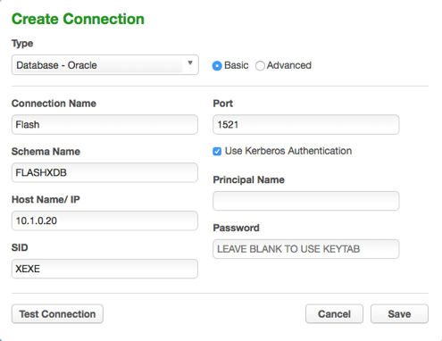
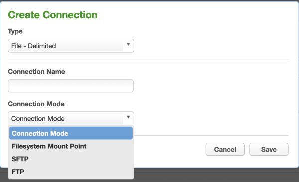

# Managing Connectors

This section describes how you can create and manage your connectors.

As a reminder, connectors are the way users define the data sources to which
the masking engine should connect. Connectors are grouped within
environments. In order to navigate to the **connectors** screen, click on an
environment and then click the **Connector** tab.

The **connectors** screen contains the following information and actions:

  - **Connector ID** — The numeric ID of the connector used to refer
    to the connector from the Masking API.

  - **Connector** — The name of the connector.

  - **Meta Data Source** — The type of connector. One of Database, File, or
    Mainframe.

  - **Type** — The specific type of connector.
  
  - **Edit** — Edit the connector. See more details below.

  - **Delete** — Delete the connector. See more details below.

The connectors on the screen can be sorted by the various informational
fields by clicking on the respective field.

## Creating a Connector

To create a new connector:

1.  In the upper right-hand corner of the **Connector** tab, click
    **Create Connection**. The **Create Connection** window appears,
    prompting you for connection information for the data source you
    would like to connect to. The required information will change
    depending on the **Type** of data source you select. For more
    details on what info is needed to connect to different types
    (Oracle, AWS RDS, etc) see sections below.

2.  Several of our connector types offer two different modes of
    connecting, **Basic** and **Advanced Mode**. Advanced Mode gives you
    the ability to specify the exact JDBC URL and add parameters that
    may not be available in Basic Mode.

    

    The fields that appear on the Connector screen are specific to the selected
    Connector Type (see Connector Types below).

3.  Click **Save**.

## Editing a Connector

To edit a connector:

1.  In the **Connector** tab, click the **Edit** icon for the
    connector you want to edit.

2.  Change any information necessary. To change the password:

    1.  Select the checkbox next to **Change Password**.

    2.  In the field that appears, enter the new **password**.

    

3.  Click **Save**.

## Deleting a Connector

To delete a connector, click the **Delete** icon to the far right of the
connector name.

**Warning:**
    When you delete a connector, you also delete its rule sets and inventory
    data.

## Connector Types

### **Database Connectors**

The fields that appear are specific to the DBMS Type you select. If you
need assistance determining these values, please contact your database
administrator.

You can only create connectors for the databases and/or files listed. If your
database or file type is not listed here, you cannot create a connector for it.

  - **Connection Type** — (Oracle, MS SQL Server, and Sybase only) Choose a
    connection type:

      - **Basic** — Basic connection information.

      - **Advanced** — The full JDBC connect string including any database parameters.

  - **Connection Name** — The name of the database connector (specific
    for your Delphix application).

  - **Schema Name** — The schema that contains the tables that this
    connector will access.

  - **Database Name** — The name of the database to which you are
    connecting.

  - **Host Name/ IP** — The network host name or IP
    address of the database server.

  - **Use Kerberos Authentication** - (Oracle only, optional) Whether to use
    kerberos to authenticate to the database. This box is clear by default.
    Before Kerberos may be used, the appliance must be properly configured -
    refer to these instructions (link to appliance kerberos configuration
    instructions[1]). If this box is checked, the application authenticates with
    the kerberos KDC before connecting to the database, then uses its kerberos
    credentials to authenticate to the database instead of a login/password.
    When kerberos is enabled, the "Login ID" field is treated as the kerberos
    user principal name. The password, if supplied, is used to authenticate the
    user principal with the KDC. The password field may be left blank if the
    keytab set during appliance configuration contains keys for the user
    principal.

  - **Login ID** — The user login this connector will use to connect to the database (not applicable
    to Kerberos Authentication).

  - **Password** — The password associated with the Login ID or
    Username. (This password is stored encrypted.)

  - **Principal Name** - (Kerberos Authentication only) The name of the Kerberos user principal
    to use when authenticating with the KDC. The realm portion of the principal may be omitted
    if it matches the configured default realm.

  - **Service Principal** - (Sybase with Use Kerberos Authentication only) The name of the
    Sybase service instance.

  - **Port** — The TCP port of the server.

  - **SID** — (Oracle only) Oracle System ID (SID).

  - **Instance Name** — (MS SQL Server only) The name of the instance.
    This is optional. If the instance name is specified, the connector
    ignores the specified "Port" and attempts to connect to the "SQL
    Server Browser Service" on port 1434 to retrieve the connection
    information for the SQL Server instance. If the instance name is
    provided, be sure to make exceptions in the firewall for port 1434
    as well as the particular port that the SQL Server instance
    listens to.

  - **Custom Driver Name** — (Generic only) The name of the
    JDBC driver class, including Java package name.

  - **JDBC URL** — (Generic and Advanced connector mode for
    Oracle, MS SQL Server, and Sybase only) The custom
    JDBC URL, typically including hostname/IP and port number.

All database types have a **Test Connection** button at the bottom left
of the New Connector window. We highly recommend that you test your
connection before you save it. Do so before you leave this window. When
you click **Test Connection**, Delphix uses the information in the form
to attempt a database connection. When finished, a status message
appears indicating success or failure.

### **File Connectors**

Following values appear when any of the file connector types are selected:

  - **Connector Name** — The name of the file connector (specific to
    your Delphix application and unrelated to the file itself).

  - **Connection Mode** —  Filesystem Mount Point, SFTP and FTP

Rest of the values appear based on the selected **Connection Mode** value. For **Filesystem Mount Point** connection mode, refer to the corresponding section in the [Managing Remote Mounts](./Managing_Remote_Mounts/#file-connector) page. For other connection modes, following values appear:

  - **Path** — The path to the directory where the file(s) are
    located.

  - **Server Name** — The name of the server used to connect to the
    file.

  - **Port** — The port used to connect to the
server.

  - **User Name** — The user name to connect to the server.

  - **Password** — (non-Public Key Authentication only) The associated password
    for the server.

  - **Public Key Authentication** — (Optional) (Only appears for
    SFTP.) Check this box to specify a public key. When you check this box, the
    **Available Keys** dropdown appears. Choose a key from the dropdown. See
    Delphix Masking APIs for information on uploading public keys to the masking
    engine.

    **Note:**
    If you plan to do on-the-fly masking then you will need to create a separate environment and connector to be the source for the files to be masked. The masked files will get put into the directory pointed to by the connector you created previously (the target). However, the file path specified in the connector of the target rule set must point to an existing file the target directory. It does not have to be a copy of the file, just an entry in the directory with the same name. It will be replaced by the masked file.
