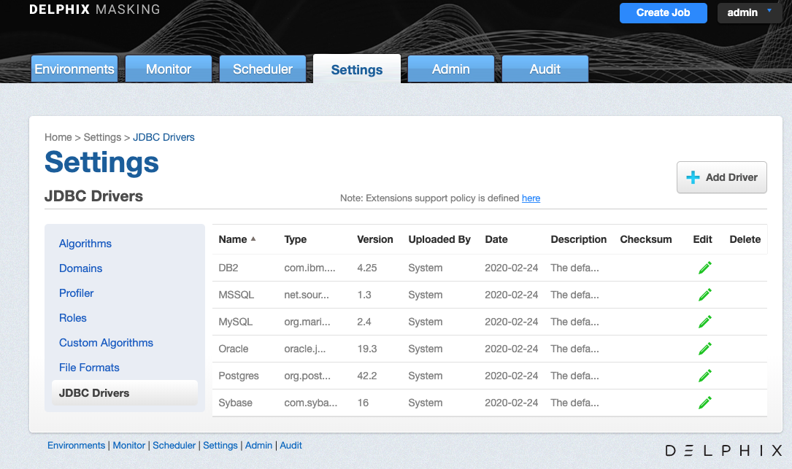
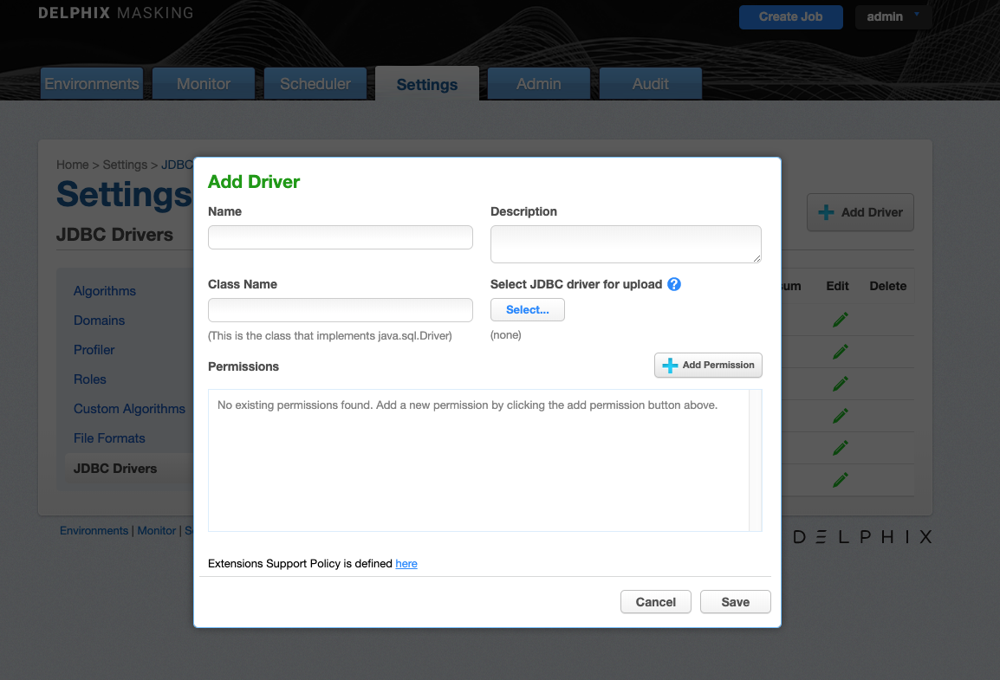
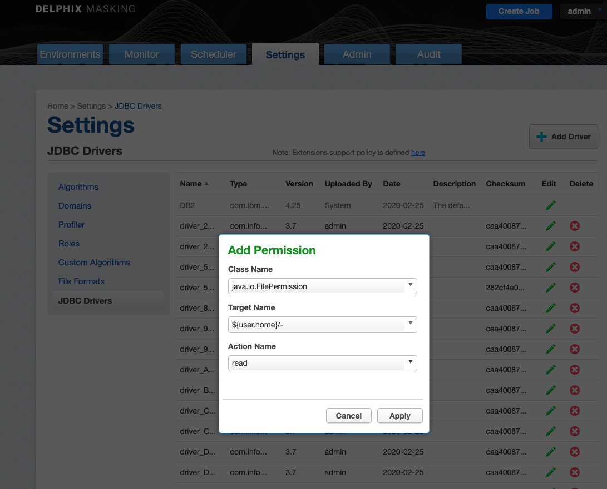
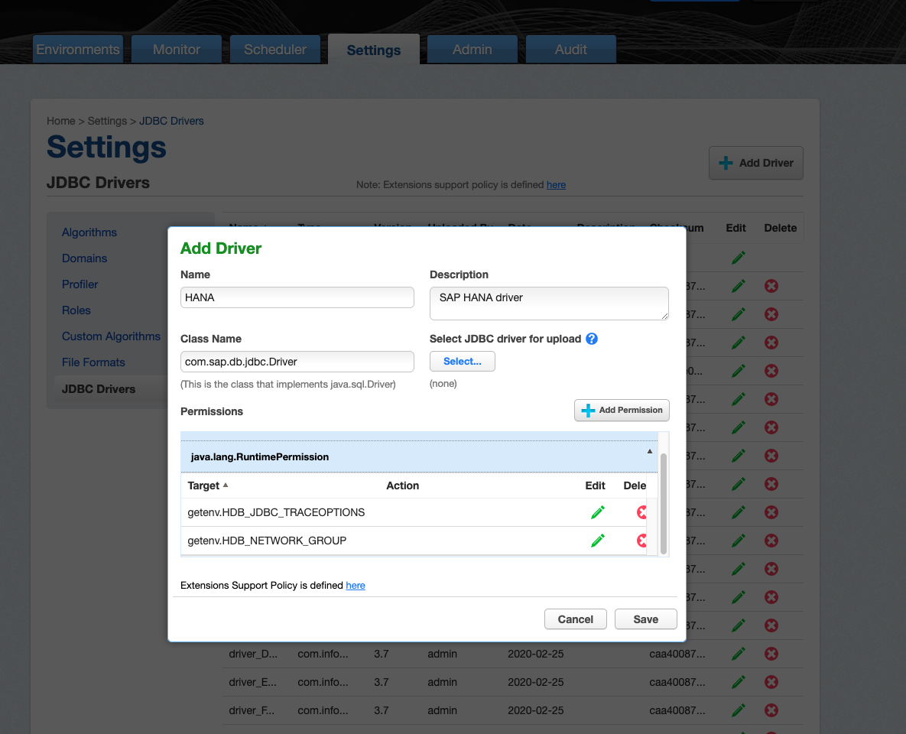
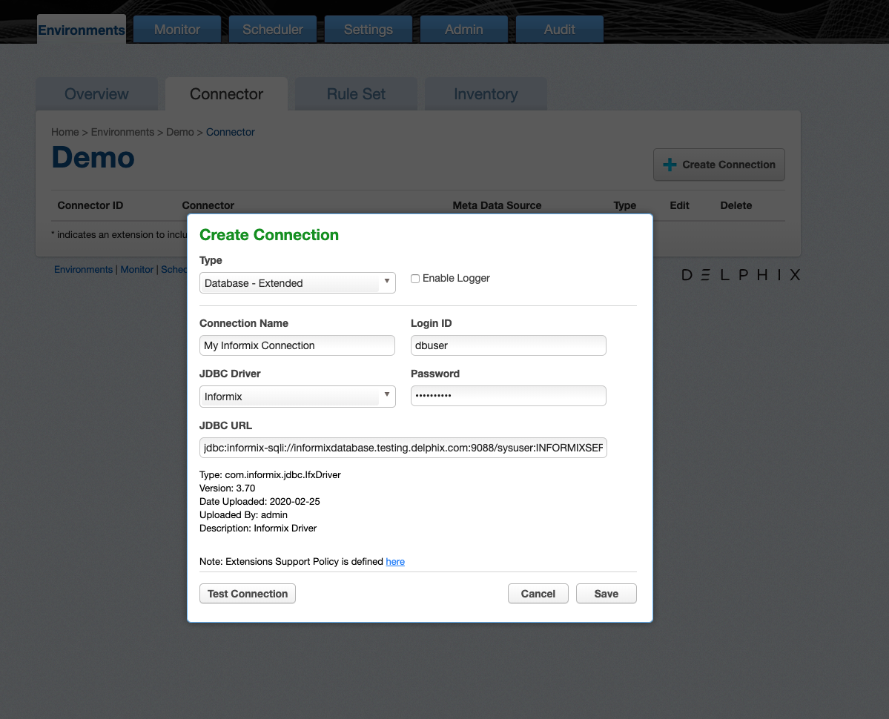

# Managing Extended Connectors

Extended Connectors allow you to upload additional JDBC Drivers to the Delphix Masking engine to enable masking
of data sources not natively supported by Delphix Masking.

## Limitations

Delphix supports type 4 JDBC Drivers. These must be a pure-java .jar file that can be used simply by uploading it (or it’s zip file) to the engine. Anything that requires compilation on the engine, or execution of any kind of install or licensing script, is not supported.

Extended Connectors don't support all of the features available for built in connectors like Oracle. The "Disable Constraint", "Disable Trigger" and "Drop Indexes" options are not available on jobs using extended connectors. Delphix provides support for Extended Connectors in accordance with our [Support Policy](https://www.delphix.com/masking-help/jdbc-drivers-support)

Drivers that require a Java version higher than 8 are not supported.

## Installing a new driver

To use a new JDBC driver, first you need to upload it to your masking engine. Since some drivers require multiple files, the driver and any additional files it needs to function should be put together in a single zip file. Even if a driver doesn't require additional files, it still needs to be zipped.

For example, to package the Informix JDBC driver for use with Delphix masking take all three files provided for Informix and zip them together:

	$ ls
	LICENSE.txt	ifxjdbc.jar	ifxlang.jar
	$ zip informix.zip *
	  adding: LICENSE.txt (deflated 70%)
	  adding: ifxjdbc.jar (deflated 4%)
	  adding: ifxlang.jar (deflated 4%)
	$ ls
	LICENSE.txt	ifxjdbc.jar	ifxlang.jar	informix.zip
	$

To upload the driver package to the engine, navigate to the **JDBC Drivers** under **Settings**

Clicking **Add Driver** will bring up a dialog box to upload the driver zip file and enter the driver's configuration details.

The **Add Driver** screen lets you set the following information.

 - **Name** A human-readable name for the driver. Name it whatever is convenient for you. **Note:** Special Characters are not allowed in the Name field.
 - **Description** A human-readable description of the driver.
 - **Class Name** The Fully Qualified Class Name of the class in the JDBC driver that implements the java.sql.Driver interface. The class name will be in the documentation for the driver itself.
 - **Select JDBC driver for upload** Lets you select the zip file containing the driver and upload it.
 - **Permissions** Additional permissions required by the driver. See the [Driver Permissions](#driver-permissions) section

To remove an uploaded driver, click the **Delete** button to the right of the connector on the **JDBC Drivers** tab. Note that the delete will fail if any Connectors exist that use the driver you're trying to delete.

If you find you need to edit a driver's configuration options later, click the pencil icon next to the driver's listing on the **JDBC Drivers** tab.

## Driver Permissions

The Delphix Masking Engine uses the Java Security Manager to prevent uploaded JDBC drivers from performing certain actions without your permission. The default set of permissions is enough for many JDBC drivers to work. However some drivers require additional permissions. Each permission has a Class Name and a Target Name. Some permissions also require an Action Name. These are defined in the [Java Security Manager specification](https://docs.oracle.com/javase/8/docs/technotes/guides/security/permissions.html). Make sure you understand what a permission allows before granting it.

You can grant a driver additional permissions by clicking **Add Permission** in the **Add Driver** or **Edit Driver** dialogs. Select the permission Class Name, Target Name and Action Name from the respective drop down menus and click **Apply**

The permissions you have granted are listed in the **Permissions** box in the **Add Driver** dialog.

You can edit or remove permissions by clicking the edit or delete button for given permission.

By default, all uploaded drivers are granted the following permissions. These permissions can be edited or removed in the same way as permissions you grant yourself.

| Class Name | Target Name | Action Name | Purpose |
|------------|-------------|-------------|---------|
| java.net.SocketPermission | * | connect | Allows the driver to initiate network connections, such as to the database being masked|
| java.net.SocketPermission | * | resolve | Allows the driver to resolve DNS names, such as the hostname of the database server being masked |
| java.util.PropertyPermission | * | read | Allows the driver to read Java configuration parameters|

### Permissions for Specific Drivers

#### SAP HANA

SAP HANA requires the following permissions to be enabled in addition to the defaults documented above.

| Class Name | Target Name | Action Name | Notes |
|------------|-------------|-------------|---------|
| java.io.FilePermission | ${user.name}/- | read |  |
| java.io.FilePermission | ${user.name}/- | write |  |
| java.lang.RuntimePermission | getenv.HDB_NETWORK_GROUP | | required for HANA driver v 2.4+ |
| java.lang.RuntimePermission | getenv.HDB_JDBC_TRACEOPTIONS | | required for HANA driver v 2.4+ |

## Extended Logging

The Delphix Masking Engine provides enhanced logging for extended connectors to assist in debugging connection problems. Enhanced logging can be enabled when the connector is created by checking the 'Enable Logger' box. Enhanced logging may have an impact on performance so you should enable it only when debugging connection problems.

Note that extended logging will not work with signed drivers such as MSSQL.

Enhanced Logging requires some additional permissions to be granted.

| Class Name | Target Name | Action Name | Purpose |
|------------|-------------|-------------|---------|
| java.io.RuntimePermission | getClassLoader | | Allows the driver to load the classes implementing the logging feature |

## Creating an Extended Connector

Creating a connector using an Extended Driver is very similar to creating a connector with built-in support. Choose **Database - Extended** as the Type. The following fields will be available:

- **Connection Name** A name for this connection
- **JDBC Driver** Select the JDBC Driver you want to use for this connection
- **Login ID** The username the Masking Engine should connect to the target database with.
- **Password** The password to use to connect to the database
- **JDBC URL** You must provide the JDBC URL for the database to connect to. The exact format and available parameters are specific to the database you're connecting to. Consult your database vendors documentation for details.

!!! note

    Some databases allow you to specify usernames and passwords in the JDBC URL. It's best not to do this. The Delphix Masking Engine is careful not to log the Login ID and Password in the Masking Engine's logs, but JDBC URLs may be logged unmodified. 

Once the connector is created, you can create rulesets, inventories and jobs to profile and mask your data as with other types of connectors.

Extended Connectors can be edited and deleted in the same way as [Built In Connectors](Managing_Connectors.md)

## Synchronization

Connectors using extended JDBC Drivers can be synchronized similar to other connectors. See [Working with Multiple Masking Engines](../Managing_Multiple_Engines_for_Masking/Working_with_Multiple_Masking_Engines) for details. When a job or connector requires an uploaded JDBC Driver, the driver will be exported along with the connector or job. JDBC Drivers are part of the **Global Object** and so will be synchronized whenever the Global Object is synchronized. They can also be synchronized individually.
