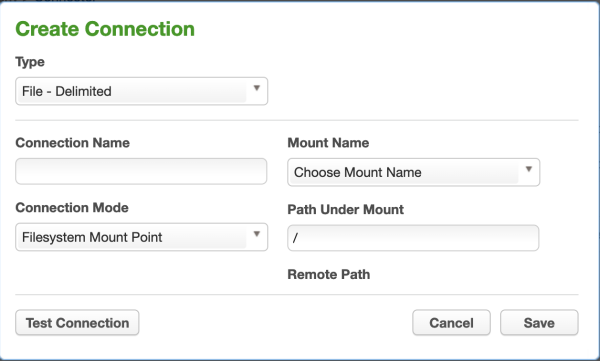
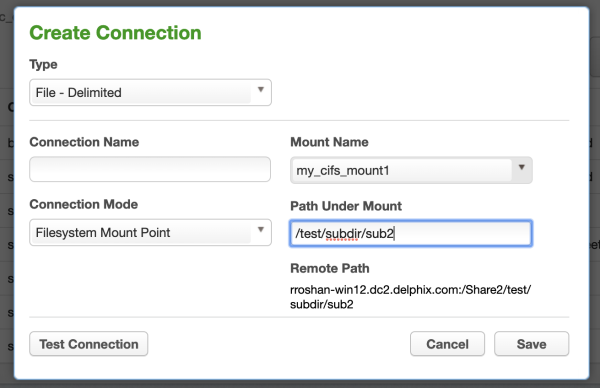
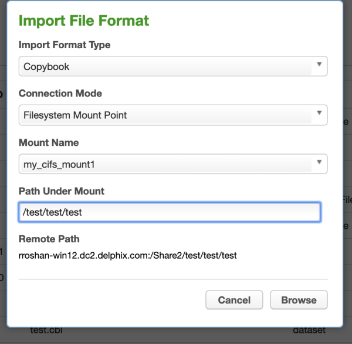

# Managing Remote Mounts
This section describes how you can mount a NFS/CIFS location inside the masking engine and use it in a masking job.

In order to access the files shared over NFS/CIFS server from the masking engine, complete the following two steps:

1. Create and connect a mount using [Mount Filesystem API](#mount-filesystem-api) endpoint.
2. [Create a file connector](#file-connector) with Filesystem Mount Point mode. Or,
   [Upload a XML/Copybook file format](#file-format) using Filesystem Mount Point mode.

## Mount Filesystem API
The **Mount Filesystem** APIs are used to perform normal CRUD operations(Create, Read, Update and Delete) along with three mount operations connect(mount), disconnect(unmount) and remount on a mount object.

### Mount Information
To create a mount entry, information about the mount are passed. Some of them are required and some are optional.

* Require Information:
    * *mountName*: The name of the mount. This name is used to refer this mount in the connector creation and file format upload UIs.
    * *hostAddress*: The NFS/CIFS server address.
    * *mountPath*: The remote path shared by the NFS/CIFS servers.
    * *type*: The type of the server. CIFS, NFS3 or NFS4.
* Optional Information:
    * *options*: The mount options.
    * *connectOnStartup*: Whether this mount should be connected or not when the server starts.

!!! Note
    When a server shuts down, all the mounts are disconnected.

### Mount Options
The API supports passing many mount options. Not all of them are supported by a server. After a mount is connected, you might see the options field has many options which were not passed by you or some options have been eliminated that were passed by you. The options field shows the effective options only. The applied options are gathered after a mount is connected.

The API also restricts usage of some mount options.
#### Enforced Options
Following mount options are enforced and added to the list of options for all mounts:

* *nosuid*: The filesystem cannot contain set userid files.
* *noexec*: No executable script can be run from the mount.
* *nodev*: The filesystem cannot contain special devices.

#### Minimal Options
Although `options` is an optional field, it is required for CIFS mounts to pass credentials. Following options are required for CIFS mounts:

* *username*: The username to connect to the CIFS server.
* *password*: The password of the user.
* *domain*: The domain of the user.

For example, `"options": "username=abc,password=pass,domain=DOMAIN"`

For NFS mounts, `options` is not required. It can be `null`.

#### Version Options

The version information is passed using *vers* option. The supported versions based on mount types are

| Mount Type | Supported Versions|
| ---------- | ----------------- |
|CIFS   | 2.0, 2.1, 3.0   |
|NFS3   | 3, 3.0  |
|NFS4   | 4, 4.0, 4.1, 4.2   |

#### Generic Options
Some mount options are generic which can be applied to all the mount types while some are mount specific options. In case of *remount* operation, only generic options can be modified. The list of allowed generic options are:

async,  atime,  auto,  context,  defaults,  defcontext,  diratime,  dirsync,  fscontext,  group,  iversion,  lazytime,  loud,  mand,  _netdev,  noatime,  noauto,  nodev,  nodiratime,  noexec,  nofail,  noiversion,  nolazytime,  nomand,  norelatime,  nostrictatime,  nosuid,  nouser,  owner,  relatime,  _rnetdev,  ro,  rootcontext,  rw,  silent,  strictatime,  sync and  user.

### CRUD Operations

#### Create
The *create* endpoint is used to create a mount entry. It takes all the information about a mount as its input and creates a mount entry. It doesn't do any kind of validation about the mount's accessibility. The validation is done during the *connect* operation.

#### Read
The *read* endpoints are used to retrieve information about a mount. There are two *read* endpoints.
1. *get all*: To get information about all mounts.
2. *get*: To get information about any particular mount identified by its id.

#### Update
The *update* endpoint is used to modify any information of a mount. Update operation can be performed only on a disconnected mount.

#### Delete
The *delete* endpoint is used to delete a mount entry. A mount can be deleted only if it is not being used in any of the connectors.


### Mount Operations
Apart from normal CRUD operations, there are three special mount related operations exposed through the API.

#### Connect
The *connect* endpoint is used to mount a remote mount inside the masking engine. If connect operation succeeds then, the options field is updated with the applied mount options.

#### Disconnect
The *disconnect* endpoint is used to unmount a remote mount from the masking engine.

#### Remount
The API supports the **remount** operation. This can be used to remount an active or to connect a disconnected mount and also to update some mount information. This can update  *mountName*, *connectOnStartup* and generic *options* only. For other updates, use the normal update API.

### Resolve Mount Consistency
A script runs in the background to keep the data in mount_information table and mounts in sync. If for some reason, the data for a mount mounted inside the mount engine and data corresponding to that mount in mount_information table becomes inconsistent, the mount is unmounted. For example, if a mount is in disconnected state in DB but it is mounted in the engine, then it will be unmounted.

## Using Mounts
A mount can be used at two places:

* File connectors
* File formats

### File Connector
While creating a connector, when any file connector option is selected, the UI shows a dropdown to select how a file will be accessed. There are three options

* Filesystem Mount Point
* SFTP
* FTP


On selecting the Filesystem Mount Point option, the mount name and a path inside the mount needs to be specified.



* Mount Name: Is a list of mount names created in the engine.
* Path Under Mount: A path relative to the path mounted. By default it is at the root of the remote Mount path.
* Remote Path: The complete remote path. On selecting a mount name and typing a path in the above input box, this gets updated.



!!! note
    A connector can be created even if a mount is in disconnected state but it should be in active state when a ruleset is being created or when a job is run.
### File Format
The XML and Copybook file formats can be uploaded from a remote location. To upload a file format from a NFS/CIFS location, select the Filesystem Mount Point option.



### Sync Mounts
A mount can be synced from a source engine to target engine using [Sync APIs](../Managing_Multiple_Engines_for_Masking/Endpoints). Syncing a file connector using a mount also syncs the related mounts. The following mount information fields are synced:

* mountName
* hostAddress
* mountPath
* options
* connectOnStartup
* type

In case of CIFS mounts, the password is not synced. In order to set the password in the target engine, update the mount's options and ensure to include the password in the options.

## Recommended Mount Server Configuration
The NFS and CIFS servers should be configured in such a way that the files are readable and writeable by the masking engine.

### CIFS Server
The user provided to connect to the mount should have read and write permission on the mount.


### NFS Server

1. The masking engine's server IP should have read and write permission on the mount.
2. For NFS, the access to a file is controlled based on the UID and GID. In order to give read & write permission to the masking engine on the share path, the path should be shared with following options:
```
<mount path> <masking engine ip>(rw,all_squash,anonuid=<uid>,anongid=<gid>)
# uid and gid is of the owner of the shared path on the server
```
