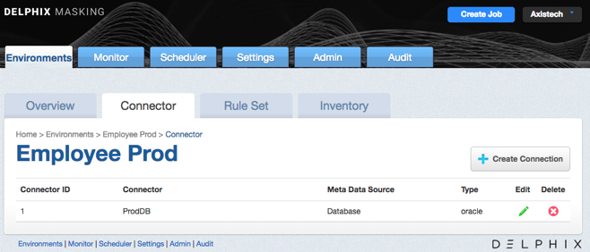
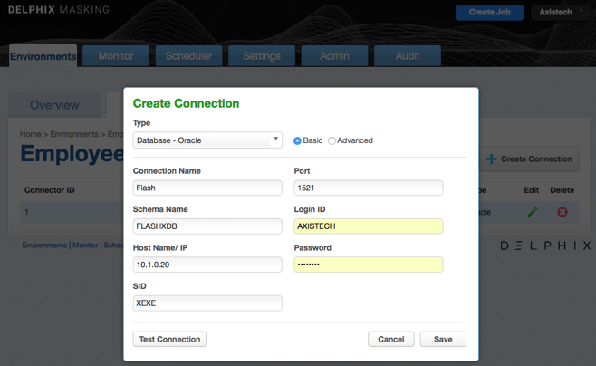
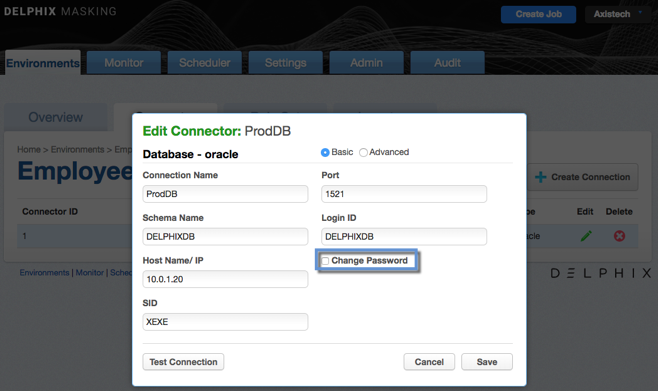

# Managing Connectors

This section describes how you can create and manage your connectors.

As a reminder connectors are the way users can define data sources that
the masking engine should connect to. Connectors are grouped within
environments. In order to navigate to the connectors screen, click on an
environment and then click the connectors tab.

## Creating a Connector

To create a new connector:

1.  In the upper right-hand corner of the **Connector** tab, click
    **Create Connection**. The **Create Connection** window appears,
    prompting you for connection information for the data source you
    would like to connect to. The required information will change
    depending on the **Type** of data source you select. For more
    details on what info is needed to connect to different types
    (Oracle, AWS RDS, etc) see sections below.

2.  Several of our connector types offer two different modes of
    connecting, **Basic** and **Advanced Mode**. Advanced Mode gives you
    the ability to specify the exact JDBC URL & add parameters that
    may not be available in Basic Mode.

    

3.  Click **Save**.

## Editing a Connector

To edit a connector:

1.  In the **Connector** tab, click the **Edit** icon for the
    connector you want to edit.

2.  Change any information necessary. To change the password:
    
    1.  Select the checkbox next to **Change Password**.
    
    2.  In the field that appears, enter the new **password**.

    

3.  Click **Save**.

## Deleting a Connector

To delete a connector, click the **Delete** icon to the far right of the
connector name.

!!! warning 
    When you delete a connector, you also delete its rule sets and inventory data.

**Database Connectors**

The fields that appear are specific to the DBMS Type you select. If you
need assistance determining these values, please contact your database
administrator. All required fields are marked with an asterisk on the
screen.

You can only create connectors for the databases and/or files listed. If
your database or file type is not listed here, you cannot create a
connector for it.

  - **Connection Type** — (Oracle or MS SQL Server only) Choose a
    connection type:
    
      - **Basic** — Basic connection information.
    
      - **Advanced** — The full JDBC connect string.

  - **Connection Name** — The name of the database connector (specific
    for your Delphix application).
    
      - For each Connection Name, you must manually define a
        corresponding connector with the same name.

  - **Schema Name** — The schema that contains the tables that this
    connector will access.

  - **Database Name** — The name of the database to which you are
    connecting.

  - **Host Name / IP** or **Hostname/IP**—The network host name or IP
    address of the database server.

  - **Username** — (Oracle only)

  - **ODBC DNS Name** — (ODBC and Microsoft Access only)

  - **Login ID** — The user login this connector will use to connect
    to the database.

  - **Password** — The password associated with the Login ID or
    Username. (This password is stored encrypted.)

  - **Port** — The TCP port of the server.

  - **SID** — (Oracle only) Oracle System ID (SID).

  - **Instance Name** — (MS SQL Server only) The name of the instance.
    This is optional. If the instance name is specified, the connector
    ignores the specified "Port" and attempts to connect to the "SQL
    Server Browser Service" on port 1434 to retrieve the connection
    information for the SQL Server instance. If the instance name is
    provided, be sure to make exceptions in the firewall for port 1434
    as well as the particular port that the SQL Server instance
    listens to.

  - **Server Name** — (Informix only) The name of the Informix server.

  - **Custom Driver Name** — (SQL Anywhere only) The name of the
    custom driver.

  - **JDBC URL** — (SQL Anywhere and Advanced connector mode for
    Oracle, MS SQL Server, and Sybase only) The name of the custom
    JDBC URL.

All database types have a **Test Connection** button at the bottom left
of the New Connector window. We highly recommend that you test your
connection before you save it. Do so before you leave this window. When
you click **Test Connection**, Delphix uses the information in the form
to attempt a database connection. When finished, a status message
appears indicating success or failure.

**File Connectors**

The values that appear correlate to the **File Type** you select. All
required fields are marked with an asterisk on the screen.

  - **Connector Name** — The name of the file connector (specific to
    your Delphix application and unrelated to the file itself).

  - **Connection Mode** — Local Files, SFTP, FTP, HTTP & HTTPS.

  - **Path** — The path to the directory where the file(s) are
    located.

  - **Operating System** — Choose the operating system on which the
    file resides: **Windows** or **Linux**. (This value does not
    appear for Mainframe Copybooks.)

If you select **SFTP** or **FTP** for **Connection Mode**, the following
additional values appear:

  - **Server Name** — The name of the server used to connect to the
    file.

  - **User Name** — The User Name to connect to the server.

  - **Public Key Authentication** — (Optional) (Only appears for
    SFTP.) Check this box to specify a public key.

When you check this box, the Available Keys dropdown appears. Choose a
key from the dropdown. (The path on the server to the location that
contains the keys is configured in a Delphix property files.)

  - **Password** — The associated Password for the server.

  - **Port** — The Port used to connect to the
server.

!!! info
    "Local" File Connectors have restricted access to the local (Masking Engine) file system. By default, the Path for "Local" File Connectors is automatically prepended with /mnt/; in other words, they are restricted to /mnt and its sub-directories.
