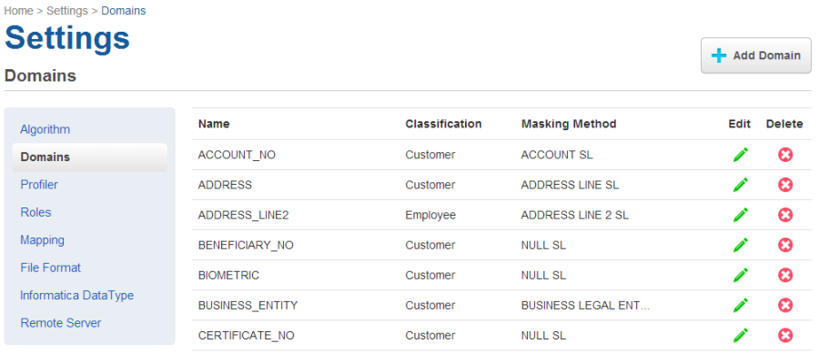

# Managing Domains

This section describes how you can create and manage your domains.

Domains specify certain data to be masked with a certain algorithm. From the **Settings** tab, if you click **Domains** to the left, the list of domains will be displayed. From here, you can add, edit, or delete domains.

Delphix Agile Data Masking includes several default domains and algorithms. These appear the first time you display the Masking Settings tab. Each domain has a classification and masking method assigned to it. You might choose to assign a different algorithm to a domain, but each domain name is unique and can only be associated with one algorithm. If you create additional algorithms, they will appear in the **Algorithms** drop-down menu. Because each algorithm you use must have a unique domain, you must add a domain (or reassign an existing domain) to use any other algorithms.

The **Domains** tab is where you define domains, along with their classification and the default Masking Algorithm.

##Adding a New Domain
1. At the top of the **Domains** tab, click **Add Domain**.
2. Enter the new **Domain Name**. The domain name you specify will appear as a menu option on the **Inventory** screen elsewhere in the Delphix Masking Engine. Domain names must be unique.
3. Select the **Classification** (informational only). For example, customer-facing data, employee data, or company data.
4. Select a default **Masking Algorithm** for the new domain. 
5. Click **Save**.
To delete any domain, click the Delete icon to the far right of the domain name.