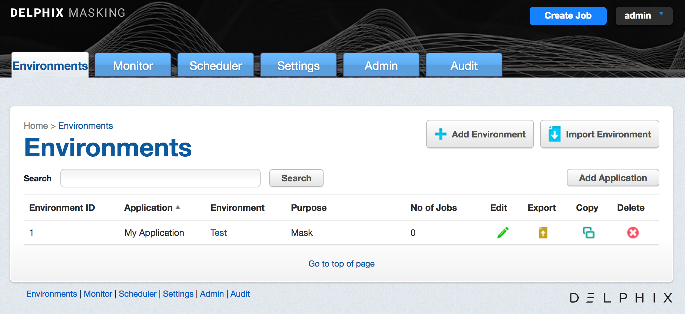

# Managing Environments

This section describes how you can create and manage your environments
in the masking service.

As a reminder, environments are used to group certain sets of objects
within the masking engine. They can be thought of as folders/containers
where a specified user can create manage connectors, rulesets and jobs.

The main environment screen lists all the environments the logged in
user has access to. It is the first screen that appears when a user logs
in to Delphix.

The main **environments** screen contains the following information and
actions:

  - **Environment ID** — The numeric ID of the environment used to refer
    to the environment from the Masking API.

  - **Application** — A way to indicate the name of the application
    whose data will be managed within this environment.

  - **Environment** — The name of the environment.

  - **Purpose** — The purpose of the environment.

  - **Jobs** — The number of jobs contained within the environment.

  - **Edit** — Edit the environment. See more details below.

  - **Export** — Export the environment. See more details below.

  - **Copy** — Copy the environment. See more details below.

  - **Delete** — Delete the environment. See more details below.

The environments on the screen can be sorted by the various informational
fields by clicking on the respective field. In addition, the environments
listed can be filtered using the **Search** field. See more details below.

## Adding An Application

For an environment to be created, an application needs to be specified. Here
are the steps to add an application:

1. On the main environments page, near the upper right-hand
corner of the screen, click **Add Application**.

2. The screen prompts you for the following items:

    a.  Application Name

3. Click **Save** to return to the **Environments
List/Summary** screen.

## Creating An Environment

Here are the steps you need to take to create an environment:

1. On the main environments page, in the upper right-hand
corner of the screen, click **Add Environment**.

2. The screen prompts you for the following items:

  - **Application Name** – The name of the application to associate with
    the environment, for informational purposes.

  - **Environment Name** – The display name of the new environment.

  - **Purpose** – The type of masking workflow for the environment: Mask
    or Tokenize/Re-Identify.

  - **Enable Approval Workflow** – Whether or not to require approvals
    of inventories before masking jobs can be run in the environment.

3. Either click **Save** to return to the **Environments
List/Summary** screen, or click **Save & View** to display the
**Environment Overview** screen.

## Editing an Environment

To change the properties of an environment, do the following

1.  Click the **Edit** icon to the right of the environment status.

2.  The popup prompts you for the following information:

    a.  Environment Name

    b.  Purpose

    c.  Application Name

    d.  Enable Approval Workflow

3.  Click **Save**.

## Exporting an Environment

For a variety of different reasons (the main one being moving
environments between masking engines), you may want to export all the
objects within an environment (connectors, rulesets, masking jobs, etc).

To export an environment, you have 2 different options. The first is to
use Delphix’s open source [Masking
Initializer](https://github.com/delphix/masking-initializer)
command line tool that can be used to backup and restore a masking
engine using the APIv5 endpoints. This tool is recommended when you are
trying to backup/export all objects on the engine.

The second option, which will be outlined here, is to use the Export
Environment option available in the Masking UI. To export an individual
environment:

1.  Click the **Export** icon.

2.  The popup fills in the following items:

    a.  Environment Name

    b.  File Name.

3.  Click **Export**.

All the information for the specified environment (connectors, rule
sets, inventory, jobs, and so on) is exported to an XML file.

A status popup appears. When the export operation is complete, you can
click on the **Download file** name to access the XML file.

## Importing An Environment

Once you have exported your environment, you can easily import it into
another masking engine. To import an environment:

1. In the upper right-hand corner of the screen, click **Import
Environment**.

2. The screen prompts you for the following items:

  - **Application Name** – The name of the application associated with
    this environment, for informational purposes. (An integrated test
    environment can have multiple applications.

  - **Environment Name** – The name of the environment that you want
    to import.

  - **Purpose** – The way the environment is used in the development
    process: Development, Gold Copy, QA, Training, and so on.

  - **Enable Approval Workflow** – Whether or not to require approvals
    of inventories before masking jobs can be run.

  - **Select…** – Use to browse for the XML file that contains the
    information you want to import. (This file must be a previously
    exported Delphix Agile Data Masking environment.)

3. Either click **Save** to return to the **Environments
List/Summary** screen, or click **Save & View** to display the
**Environment Overview** screen.

## Copying An Environment

A user can also easily create an exact copy of a certain environment.
This is a very powerful feature when wanting to have several similar but
not exact environments but don't want to start from scratch. To copy an
environment do the following:

1.  Click the **Copy** icon to the right of the environment status.

2.  The popup prompts you for the following information:

    a.  Environment Name

    b.  Purpose

    c.  Application Name

    d.  Enable Approval Workflow

3.  Click **Save**.

## Deleting An Environments

To delete an environment:

  - Click the **Delete** icon to the right of the environment status
    and copy
icon.

!!! warning
    Clicking the **Delete** icon deletes EVERYTHING for that environment: connections, inventory, rule sets, and so on. It does not delete universal settings like algorithms, domains, etc.

## Searching For Environments

When a large number of environments have been created on a masking engine, it may be useful to filter
the **Environments List/Summary** screen. To filter the environment list, do the following:

1.  In the **Search** field in the upper left side of the screen, enter the characters to search by.

2.  Click the adjacent **Search** button.

3.  The screen will display only the environments whose name match the specified search characters.

To re-display the entire list of environments, clear the **Search** field of characters and click the
**Search** button again.
