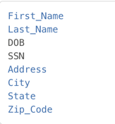
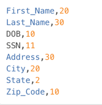

# Managing File Formats

##File formats

Unlike databases files for the most part do not have built in metadata to describe the format of the fields in the file. You must provide this to Delphix so it can update the file appropriately. This is done through the settings tab where you will see a menu item on the left for File Format. Select File Format and you will see options to create a file format or input a file format. This will depend on the type of file and how you want to let Delphix know the format of the file.

##Mainframe data sets and XML files

For Mainframe data sets, you can specify the file format via Input Format option which will import the copybook directly into Delphix. You can input this file from SFTP or FTP. Please select Copybook as the Import Format Type.
For XML files you can also input the file format with the input format option. You can use the file you want to mask as the format. Delphix will input the format of the file directly. You can input this file from SFTP or FTP. Please select XML as the Import Format Type.

##Delimited, Excel, Fixed files

For Delimited, Excel, and Fixed files you can either manually create the format of the file yourself, or you can input a text file which describes the structure of the file to Delphix. To input the file format for delimited or Excel files create a text document with the column names each on its own line. For example:

- Name
- Address
- City
- State

To input the file format for fixed files create a text document with the column names and the length of each column on its own line. For example:

- Name,25
- Address,40
- City,20
- State,2

Then input this file as the file format. The name of the text file will be the name of the file format.

## To Create a New File Format

To create a format manually, you can just click the create format button and give the format a name. We will input the details of the format a little later in this document.

 1. Click **Create Format** in the upper right. The Create File Format window appears.
 2. Enter a **File Format Name**.
 3. Choose a **File Format Type**:
    - Delimited File
    - Excel Sheet
    - Fixed Width File

     **Note**:
     Creating a Copybook or XML file format is not supported. These formats must be imported instead.

 4. Optionally, enter a **Description**.
 5. Click **Submit**.

    

## To Import a New File Format

 1. Click **Import Format** at the upper right. The Import File Format window appears.
 2. Select an **Import File Type**.

### For a Format Type of Copybook or XML

 1. Select a **Connection Mode**.
 2. Fill out the required fields of the selected **Connection Mode**.
 3. Click **Browse**.
 4. Click the **Select** button to the right of the desired import file format.
 5. Enter a **Logical Name**.
 6. Click **Submit**.

### For a Format Type of Delimited File, Excel sheet, or Fixed Width File

 1. Click **Select**.
 2. Browse for the file from which to import fields.
 3. Click **Save**.

 **Note:**
     - The file must have NO header.
     - Make sure there are no spaces or returns at the end of the last line in the file.
     - To be masked, the field names must be in the same order as they are in the file.

### Removing a Selected File

If you accidentally selected an incorrect file, simply click Remove button to the right of the file and repeat selection steps above.

## Samples
The following is sample file content for Delimited or Excel file formats. With these formats just the field name is provided. Notice there is no header and only a list of values.

The following is sample file content for Fixed Width format. In this format the field name is followed by the length of the field, separated by a comma. Notice there is no header and only a list of values.

## To Delete a File Format

 1. Click the **Delete** icon to the right of the File Format name.
 2. File inventory is based on file format. Therefore, if you make a change to a file inventory, that change applies to *all* files that use that format.
 3. You can only add or delete a file format; you cannot edit one.

## Assigning a File Format to a files

Once you create a ruleset with a file or set of files, you will need to assign those files to their appropriate file format. This is accomplished by editing the ruleset. When you click on the edit button for the file a popup screen called edit file will appear with the file name. There will be a dropdown for the format so you can select the proper format for the file. If the file is a Mainframe data sets file with a copybook you will see a checkbox to signify if the file is variable length. For all other file types, select the end-of-record to let Delphix know whether the file is in windows/dos format (CR+LF) or Linux format (LF). If the file is a delimited file you will have a space to put in the delimiter. If there are multiple files in the ruleset you will have to edit each one individually and assign it to the appropriate file format.
