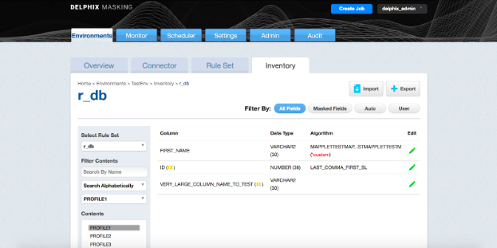
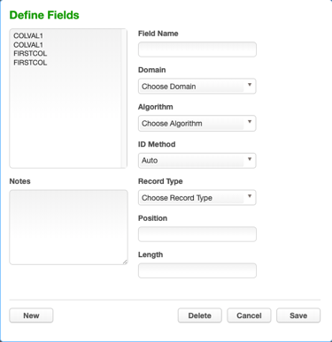
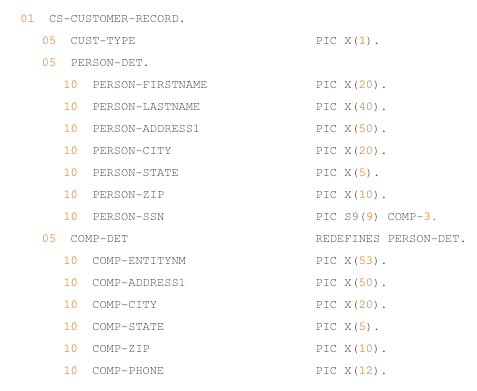
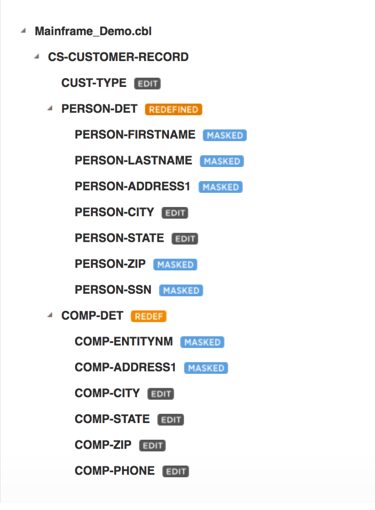
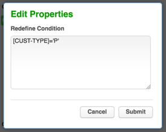

## Managing Inventories

An inventory describes all of the data present in a particular data source and defines the methods which will be used to secure it. Inventories typically include the table or file name, column/field name, the data classification, and the chosen algorithm.

## The Inventory Screen

From anywhere within an environment, click the **Inventory** tab to see the Inventory Screen. This displays the inventory for the environment's rule sets.

## Inventory Settings

To specify your inventory settings:

1. On the left-hand side of the screen, select a **Rule Set** from the drop-down menu.
2. Below this, **Contents** lists all the tables or files defined for the rule set.
  
3. Select a **table** or **file** for which you want to create or edit the inventory of sensitive data.
The **Columns** or **Fields** for that specific table or file appear.
4. If a column is a primary key (PK), Foreign Key (FK), or index (IDX), an icon indicating this will appear to the Right of the column name. If there is a note for the column, a Note icon will appear. To read the note, click the icon.
5. If an algorithm associated with a column is a custom algorithm (formerly known as Mapplet) then **(*custom)** in red text will appear after the algorithm name.
6. If you selected a table, metadata for the column appears: **Data Type** and **Length** (in parentheses). This information is read-only.
7. Choose how you would like to view the inventory:
    * **All Fields** — Displays all columns in the table or all fields in the file (allowing you to mark new columns or fields to be masked).
    * **Masked Fields** — Filters the list to just those columns or fields that are already marked for masking.
    * **Auto** — The default value. The profiling job can determine or update the algorithm assigned to a column and whether to mask the column.
    * **User** — The user's choice overrides the profiling job. The user manually updates the algorithm assignment, mask/unmask option of the column. The Profiler will ignore the column, so it will not be updated as part of the Profiling job.

## Assigning Algorithms

To set criteria for sensitive columns or fields:

1. Click the green edit icon to the right of a column or field name.
2. From the Domain drop-down menu, select the appropriate sensitive data element type.
3. The Delphix masking engine defaults to a **Masking Algorithm** as specified in the Settings screen. If necessary, you can override the default algorithm.
     * To select a different masking algorithm, choose one from the Algorithm dropdown.
     * In the algorithm pulldown, any custom algorithms will appear with **(*custom)** after their name to make them easier to identify.
     For detailed descriptions of these algorithms, please see [Configuring Your Own Algorithms](/Securing_Sensitive_Data/Configuring_Your_Own_Algorithms/).
4. Select an ID Method:
     * **Auto** — The default value. The profiling job can determine or update whether to mask a column.
     * **User** — The user decides whether to mask/unmask a column. The user's choice overrides the profiling job. (The user masking is done after the profiling job is finished.)
5. You can add/remove notes in the **Notes** text field.
6. When you are finished, click **Save**.
 You must click Save for any edits to take effect.

!!! note
    If you select a DATESHIFT algorithm and you are not masking a datetime or timestamp column, you must specify a **Date Format**. (This field only appears if you select a DATESHIFT algorithm from the Masking Algorithm dropdown.) For a list of acceptable formats, click the **Help** link for Date Format. The default format is yyyy-MM-dd.

## Managing a File Inventory

### Defining fields

To create new fields:

1. From an Environment's Inventory tab, click **Define fields** to the far right. The Edit Fields window appears.

    

2. Edit the fields as described in **Setting Field Criteria for a File**.
3. When you are finished, click **New** to create a new field, or click **Save** to update an existing field.

### Adding Record Types for files

To add a new Record Format:

1. In the upper right-hand corner of an environment's **Inventory** tab, click **Record Types**. The Record Type window appears.
2. Click **+Add a Record Type** towards the bottom of the window. The Add Record Type window appears.
3. Enter values for the following fields:
     * **Record Type Name** — A free-form name for this record format.
     * **Header/Body/Trailer** — If the file has header or trailer records, you will need to create file formats for them. Select the appropriate type. Delphix allows for masking of multiple headers, multiple trailers, and multiple types of body records.
     * **Record Type ID** — (optional) For body records, specify the value of the record type code or other identifier that allows Delphix to identify records that qualify as this record type.
     * **Position #** — (optional) Specify the field number (for delimited files) or the character position number (for fixed files) of the beginning of the Record Type Identifier within the data record.
     * **Length #** — (optional) For fixed files, specify the length of the Record Type Identifier within the data record.
4. Click **Save** when you are finished.

## Managing a Mainframe Inventory

### Redefine Conditions

For Mainframe data sets, the inventory also allows for the entry of Redefine Conditions, which are used to handle any occurrences of COBOL's REDEFINES construct that might appear in the Copybook. In COBOL, the REDEFINES keyword allows an area of a record to be interpreted in multiple different ways. In the example below, for instance, each record can hold either the details of a person (PERSON-DET) or the details of a company (COMP-DET).



Depending on which group is present, different masking algorithms may need to be applied. Below is the inventory corresponding to this copybook, which allows algorithms to be selected separately for each group.



In order to do any masking however, the masking engine must be able to determine, for each record, which fields should be read, so that the correct algorithms can be applied. In order to do this, the masking engine uses Redefine Conditions, which are specified in the inventory. Redefine Conditions are boolean expressions which can reference any fields in the record when they are evaluated.

In the example copybook above, the field CUST-TYPE is used to indicate which group is present. If CUST-TYPE holds a 'P', a PERSON-DET group is present, and if it holds a 'C', COMP-DET is present. This can be expressed in the inventory by specifying a Redefine Condition with the value [CUST-TYPE]='P' . This expression indicates that, for each record read from the source file during the masking job, the value of the field CUST-TYPE should be read and compared against the string 'P'. If it is equal, the masking engine will read from the record the fields subordinate to PERSON-DET, and will apply any masking algorithms specified on those fields. Similarly, a Redefine Condition with the value [CUST-TYPE]='C' should be applied to the COMP-DET field.
Exactly one of the conditions should evaluate to 'true' for each group of redefined fields. For example, a copybook might have fields A, B REDEFINES A, and C REDEFINES A. Of the Redefine Conditions attached to A, B, and C, one and only one should evaluate to true for each record.

### Entering a Redefine Condition

1. Click on the orange **REDEFINED** or **REDEF** button next to the redefined or redefining field
2. Enter a condition in the dialog box which appears. This is the expression, which, when it evaluates to true, causes the subordinate fields to be read and, if they have algorithms assigned, masked.

    

3. Click **Submit**.

### Format of Redefine Conditions

Redefine Conditions allow fields to be compared against either number or string literals. Square brackets enclosing a field name indicate a variable, which takes on the value of the named field:

```
[Field1] = 'An example String'
```

String literals can be enclosed in either single or double quotes. For fields that are numeric (e.g. PIC S99V9), the operators <, <=, >, and >= can be used in addition to the =operator, e.g.

```
[Field2] <= -10.5
```
Also, conditions can be joined using AND, OR, and NOT to form more complex conditions:

```
([Field3] > 2.5 AND [Field3] < 10) OR NOT [FIELD4] = 'Z'
```

## Importing and Exporting an Inventory

**To export an inventory**:

1. Click the **Export** icon at the upper right. The Export Inventory popup appears with the name of the currently selected Rule Set as the Inventory Name and a corresponding .csv **File Name**.
2. Click **Save**.

A status popup appears. When the export operation is complete, you can click on the **Download file** name to access the inventory file

**To import an inventory**:

1. In the upper right-hand corner, click the **Import** icon. The Import Inventory popup appears.
2. Click **Select** to browse for the name of a comma-separated (.csv) file.
3. Click **Save**.

The inventory you imported appears in the Rule Set list for this environment.

!!! info
    The format of an imported.csv file must exactly match the format of the exported inventory. If you plan to import an inventory, before importing the inventory, you should export it and then update the exported file as needed before you import it.
