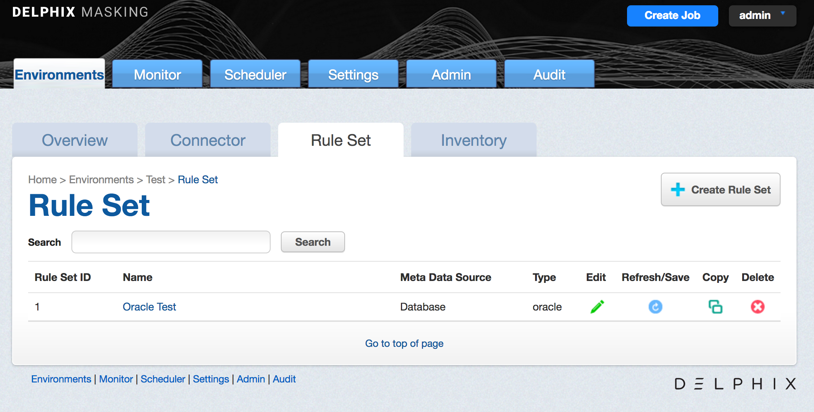
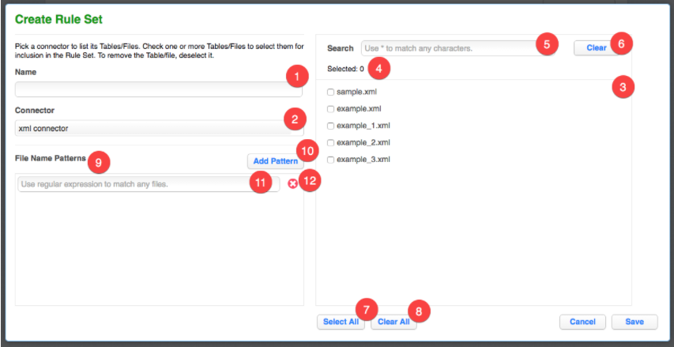

# Managing Rule Sets

This section describes how Rule Sets can be created, edited, and
removed.

## The Rule Sets Screen

From anywhere within an Environment, click the **Rule Set** tab to
display the Rule Sets associated with that environment. The **Rule Sets**
screen appears. If you have not yet created any rule sets, the Rule Set
list is empty.

The **Rule Sets** screen contains the following information and actions:

  - **Rule Set ID** — The numeric ID of the rule set used to refer
    to the rule set from the Masking API.

  - **Name** — The name of the rule set.

  - **Meta Data Source** — The type of rule set. One of Database, File, or
    Mainframe.

  - **Type** — The specific type of rule set.

  - **Edit** — Edit the rule set. See more details below.

  - **Refresh/Save** — Refresh the rule set. Only applies to Database rule sets.
    See more details below.

  - **Copy** — Copy the rule set. See more details below.

  - **Delete** — Delete the rule set. See more details below.

The rule sets on the screen can be sorted by the various informational
fields by clicking on the respective field.

## The Create/Edit Rule Set Window

In the upper right-hand corner, click the **Create Rule Set** button.

The **Create Rule Set** window appears.

<table>
<tbody>
<tr class="even">
<td>
1
</td>
<td>
<strong>Rule Set Name Input Field</strong>

When editing an existing rule set, this field will be filled with the existing rule set name by default.
</td>
</tr>
<tr class="odd">
<td>
2
</td>
<td>
<strong>Connector List</strong>

When creating a new rule set, all available connectors will be listed here. When editing an existing rule set, only the connector currently in use will appear.
</td>
</tr>
<tr class="even">
<td>
3
</td>
<td>
<strong>Table or File List</strong>

If a database connector is selected in the connector list, all available tables in the database schema associated with the connector will appear in this list. If a file connector is selected, all available files in the directory associated with the connector will appear in this list.
</td>
</tr>
<tr class="odd">
<td>
4
</td>
<td>
<strong>Selected Table or File Number</strong>

Displays how many tables or files you have selected.
</td>
</tr>
<tr class="even">
<td>
5
</td>
<td>
<strong>Search Query Input Field</strong>

You can enter a search query here. After typing the search query, press <strong>ENTER</strong> to execute the search query.

<strong>INFO: search query</strong>

<ul>
<li>

Use * to match any characters in the names of tables or files.

</li>
<li>

If you have selected a table or file before searching and it is not in the search results, it will not be included in the rule set. You can add back the table or file by removing the search query.

</li>
</ul></td>
</tr>
<tr class="odd">
<td>
6
</td>
<td>
<strong>Clear Search Button</strong>

Click to remove any search query.
</td>
</tr>
<tr class="even">
<td>
7
</td>
<td>
<strong>Select All Button</strong>

Click to select all tables or files in the table or file list.
</td>
</tr>
<tr class="odd">
<td>
8
</td>
<td>
<strong>Clear All Button</strong>

Click to deselect all tables or files in the table or file list.
</td>
</tr>
<tr class="even">
<td>
9
</td>
<td>
<strong>File Name Patterns Editor</strong>

This editor will appear only when the selected connector is a file connector.
</td>
</tr>
<tr class="odd">
<td>
10
</td>
<td>
<strong>Add File Pattern Button</strong>

Click to add a new file pattern entry below.
</td>
</tr>
<tr class="even">
<td>
11
</td>
<td>
<strong>File Pattern Input Field</strong>

Enter the file pattern here.
</td>
</tr>
<tr class="odd">
<td>
12
</td>
<td>
<strong>Remove File Pattern Button</strong>

Click to remove a file pattern.
</td>
</tr>
</tbody>
</table>

## Creating a Rule Set

To create a new rule set:

1.  Click on the name of an Environment, and then click the **Rule
    Set** tab.

2.  In the upper right-hand corner of the **Rule Set** screen, click
    **Create Rule Set**.

3.  The **Create Rule Set** screen lets you specify which tables
    belong in the rule set.

4.  Enter a **name** for the new Rule Set.

5.  Select a **Connector** name from the drop-down menu.

6.  The list of tables for that connector appears. If you have not yet
    created any connectors, the list is empty. Click individual table
    names to select them, or click **Select All** to select all the
    tables in the connector. See "Create/Edit Rule Set Window" for
    a description of the screen and other options.

7.  Click **Save**.

You may then need to define the Rule Set by modifying the table settings
as described in "Modifying Tables in a Rule Set" below.

For example:

  - For a table in a database rule set, you may want to filter data from the table.

  - For a file in a file or mainframe rule set, you must select a File Format to use.

## Refreshing a Rule Set

Refreshing a rule set will result in the columns in the tables in the rule set
being rescanned. As a result, the inventory associated with the rule set
will also be refreshed, but any pre-existing algorithm assignments will be
retained.

To refresh a rule set:

1.  Click the **Refresh/Save** icon to the right of the rule set on the **Rule
    Set** screen.

2.  The **Refresh/Savet** icon will turn to an hour glass as the the associated
    tables are rescanned.

3.  After the refresh is complete, the **Refresh/Savet** icon will return to the
    circular arrow.

## Copying a Rule Set

If you copy a Rule Set, the inventory associated with that Rule Set
will also be copied. Also, any filter conditions defined for that
Rule Set will be copied.

To copy a rule set:

1.  Click the **Copy** icon to the right of the rule set on the **Rule
    Set** screen.

2.  The **Copy Rule Set** window appears.

3.  Enter a **Name** for the new rule set.

4.  Click **Save**.

5.  Modify the rule set as you want, using the procedures described
    above.

## Deleting a Rule Set

If you delete a Rule Set, the inventory associated with that Rule Set
will also be deleted. Also, any filter conditions defined for that Rule
Set will be deleted.

To delete a rule set, click the **Delete** icon to the right of the rule
set on the **Rule Set** screen.

## The Rule Set Screen

From the **Rule Set** tab, click on a rule set to display the tables or
files in the rule set. The **Rule Set** screen appears.

The **Rule Set** screen contains the following information and actions:

  - **Table** or **File or Pattern**  — The name of the table or file/file pattern
    in the rule set.

  - **Edit** — Edit the table or file in the rule set. See more details below.

  - **Delete** — Delete the table or file from the rule set.

For rule sets with a large number of tables or files, the **Rule Set** screen will
be displayed on pages which can be navigated by the controls at the bottom of the list
on the page. The tables or files displayed may also be filtered using the **Search**
field and button.

## Editing/Modifying a Rule Set

To edit a rule set:

1.  Click the **Edit** icon to the right of the rule set on the Rule
    Set screen.

2.  Click the **Edit Rule Set** button towards the top.

3.  The **Create Rule Set** screen appears. This screen lets you
    specify which tables belong in the rule set.

4.  Modify the rule set as you want, using the preceding procedures.

## Removing a Table or File

To remove a table or file from a rule set:

1.  From the **Rule Set** screen, click the **name** of the desired
    rule set.

2.  Click the red **delete** icon to the right of the table or file
    you want to remove.

!!! note "INFO"
    If you remove a table/file from a rule set and that table/file has an inventory,
    that inventory will also be removed.

## Modifying Tables in a Rule Set

The features in this section are disabled for file and mainframe
rule sets.

You can modify tables in a rule set as follows:

### **Logical Key**

If your table has no primary keys defined in the database, and you are
using an In-Place strategy, you must specify an existing column or
columns to be a logical key. This logical key does not change the target
database; it only provides information to Delphix. For multiple columns,
separate each column using a comma. Note: If no primary key is defined
and a logical key is not defined an identify column will be created.

To enter a logical key:

1.  From the **Rule Set** screen, click the **name** of the desired
    rule set.

2.  Click the green **edit** icon to the right of the table whose
    filter you wish to edit.

3.  On the left, select **Logical Key**.

4.  Edit the text for this property.

5.  To remove any existing code, click **Delete**.

6.  Click **Save**.

### **Edit Filter**

Use this function to specify a filter to run on the data before loading
it to the target database.

To add a filter to a database rule set table or edit a filter:

1.  From the **Rule Set** screen, click the **name** of the desired
    rule set.

2.  Click the green **edit** icon to the right of the table you want.

3.  On the left, select **Edit Filter**.

4.  Edit the properties of this filter by entering or changing values
    in the **Where** field.

Be sure to specify column name with table name prefix (for example,
customer.cust\_id \<1000).

1.  To remove an existing filter, click **Delete**.

2.  Click **Save**.

### **Custom SQL**

Use this function to use SQL statements to filter data for a table.

To add or edit SQL code:

1.  From the **Rule Set** screen, click the **name** of the desired
    rule set.

2.  Click the green **edit** icon to the right of the table you want.

3.  On the left, select **Custom SQL**.

4.  Enter custom SQL code for this table.

Delphix will run the query to subset the table based on the SQL you
specify.

1.  To remove any existing code, click **Delete**.

2.  Click **Save**.

### **Table Suffix**

If you have tables with names that change monthly, for example tables
that are appended with the current date, you can set a table suffix for
a rule set.

To set a table suffix for a rule set:

1.  In the **Rule Set** screen, click the **name** of the desired rule
    set.

2.  Click the green **edit** icon to the right of the table for which
    you wish to set the suffix.

3.  On the left, select **Table Suffix**.

4.  The **Original Table Name** will already be filled in.

5.  (Optional) Enter a **Suffix date** **Pattern** (for example,
    mmyy).

6.  (Optional) Enter a **Suffix Value**, if you want to append a
    specific value.

7.  (Optional) Enter a **Separator** (for example, \_). This value
    will be inserted before the suffix value (for example,
    tablename\_0131).

8.  Click **Save**.

### **Add Column**

Use this function to select a column or columns from a table when you
don't want to load data to all the columns in a table.

To add a column to a database rule set table or edit a column:

1.  From the **Rule Set** screen, click the **name** of the desired
    rule set.

2.  Click the green **edit** icon to the right of the table you want.

3.  On the left, select **Add Column**.

4.  Select one or more **column names** to include in the table. To
    remove a column, deselect it.

5.  You can also choose **Select All** or **Select None**.

6.  Select **Save**.

### **Join Table**

Use this function to specify a SQL join condition so that you can define
primary key/foreign key relationships between tables.

To define or edit the join condition for a table:

1.  From the **Rule Set** screen, click the **name** of the desired
    rule set.

2.  Click the green **edit** icon to the right of the table you want.

3.  On the left, select **Join Table**.

4.  Edit the properties for this join condition.

5.  To remove an existing join condition, click **Delete**.

6.  Click **Save**.

### **List**

Use this function to select a list to use for filtering data in a table.

To add or edit a list:

1.  From the **Rule Set** screen, click the **name** of the desired
    rule set.

2.  Click the green **edit** icon to the right of the table you want.

3.  On the left, select **List**.

4.  Edit the text file properties for this list.

    1.  Select a **column**.

    2.  Enter or browse for a **filename**.

    3.  Files that have already been specified appear next to
        **Existing File**.

5.  To remove an existing list file, click **Delete**.

6.  Click **Save**.

## Creating a Ruleset For File Formats

Once you create a ruleset with a file or set of files, you will need to assign those files to their appropriate file format.

This is accomplished by editing the ruleset. Click on the edit button for the file the Edit File window will appear with the file name. From the format drop-down select the proper format for the file.

 - If the file is a Mainframe data sets file with a copybook you will see a checkbox to signify if the file is variable length.
 - For all other file types, select the end-of-record to let Delphix know whether the file is in windows/dos format (CR+LF) or Linux format (LF).
 - If the file is a delimited file you will have a space to put in the delimiter.
 - If there are multiple files in the ruleset you will have to edit each one individually and assign it to the appropriate file format.
