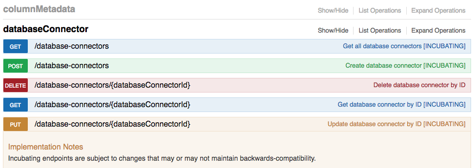

# Incubating API Endpoints

## Context

APIs that are released across the industry are expected to have a stable
specification that consumers can depend on when writing scripts and
automation. This notion of a stable API specification is at odds with
the natural process of iteration and refinement that a newly released
feature is expected to undergo. As such, in order to accommodate the
anticipated iteration and refinement of this newly released Masking API,
Delphix is introducing the notion of Incubating API endpoints.

## Definition

An Incubating API endpoint is available for immediate use, but the
specification of an Incubating API endpoint is subject to change in the
future *(i.e. the specification is not stable)*.

## Backwards-Compatibility of Incubating API Endpoints

There are no backwards-compatibility guarantees when using Incubating
API endpoints, even when [pinning down the API
version number](Backwards_Compatibility_API_Usage).

That said, it is not the case that an Incubating API will *always*
change in a future release, but rather that it *might* change in a
future release such that any scripts that were developed to use an
Incubating API would need to be updated to work against a future release
of the
API.

!!! note
    All changes to the API *(not just backwards-incompatible changes)* will be documented and distributed with future releases of the API.

Backwards-incompatible changes to the API are known to be disruptive to
automation built around the API, and therefore changes to Incubating
APIs will be carefully considered and minimized.

## List of Incubating API Endpoints

Refer to the The Masking API Client \[Need to add link\] to see the list
of Incubating API endpoints.

All Incubating API endpoints are labeled with **INCUBATING** in their
description, and they are also accompanied by an **Implementation Note**
explaining the implications of an Incubating endpoint with respect to
backwards-compatibility.

