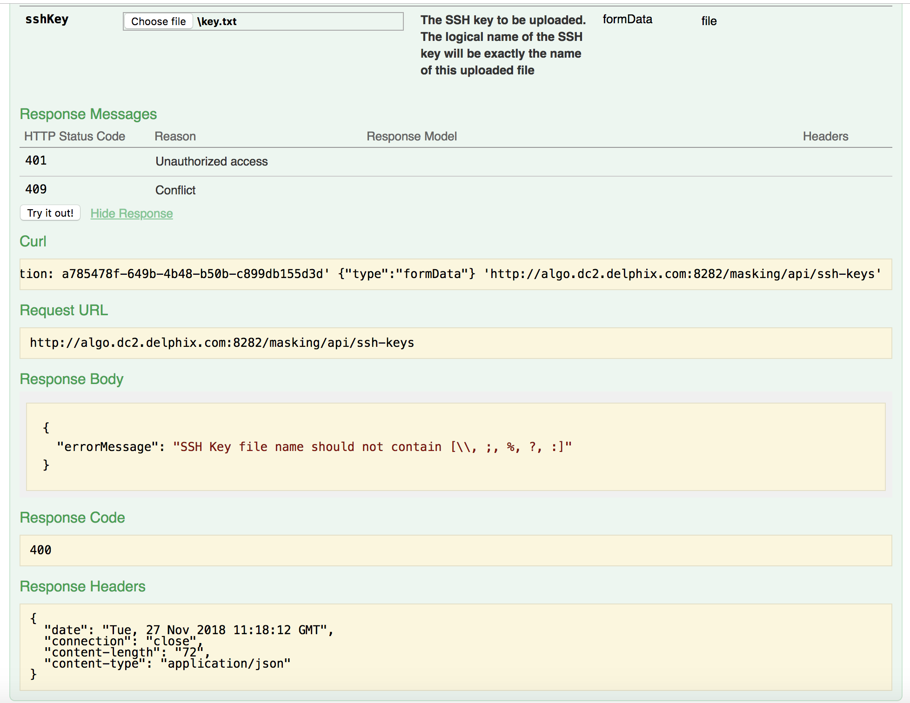

# Swagger API convert single backslash to double backslash in API response

## Context

Swagger API response is escaping the ```\``` to ```\\``` at the time of response.

Tested with Swagger API client and other Rest API clients and found every client is returning same response.

For example we can consider below sshKey endpoint,

```
http://<host>:<port>/masking/api-client/#!/sshKey/createSshKey
```

While user upload a file which contain \ in the file name. eg. file name:  \key.txt

## Expected Response Body:

```
{
  "errorMessage": "SSH Key file name should not contain [\, ;, %, ?, :]"
}
```
## Actual Response Body:

```
{
  "errorMessage": "SSH Key file name should not contain [\\, ;, %, ?, :]"
}
```

Please refer the below screenshots.



In above screenshot \ is converted by \\ by Swagger API.
