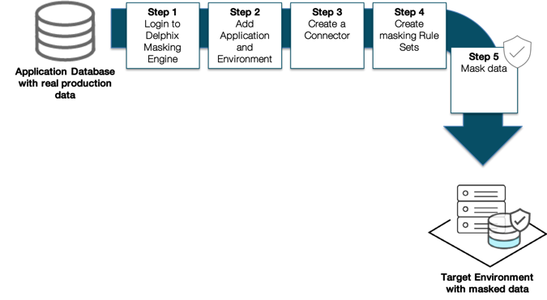

# Delphix Masking Engine Activities
Once you have provisioned a virtual database (VDB) for masking use in the Delphix Engine, you will need to complete the following activities in the Delphix Masking Engine. The five primary tasks to be completed are:

1. Add a masking application.
2. Add a masking environment.
3. Add a connector to the newly provisioned VDB.
4. Create masking rule sets to identify, select, and configure which tables you want to mask.
5. Run a masking job to mask the data.
Below is a visualization of this data masking user workflow:

