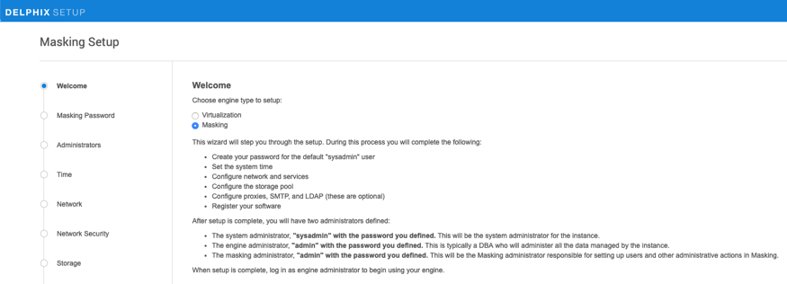

# Installation/First Time Setup

This section walks you step by step on how to download and install the
Delphix Engine software onto your infrastructure (VMware, AWS EC2, or
Azure).

## Installing OVA on VMware

For detailed recommendations on hardware prerequisites for VMware,
please see [Getting Started - Prerequisites](Prerequisites/). Here are the steps to
getting your OVA installed:

  1. Download the OVA file from Delphix’s Download site.
    Note, you will need a support login from your sales team or
    welcome letter. Navigate to “Virtual Appliance” and download the
    appropriate OVA. If unsure, use the HWv8\_Standard type.

  2. Login using the vSphere client to the vSphere server
    (or vCenter Server) where you want to install the Delphix Engine.

  3. In the vSphere Client, click File.

  4. Select Deploy OVA Template and then browse to the OVA
    file. Click Next.

  5. Select a hostname for the Delphix Engine. This
    hostname will be used in configuring the Delphix Engine network.

  6. Select the data center where the Delphix Engine will
    be located.

  7. Select the cluster and the ESX host.

  8. Select one (1) data store for the Delphix OS. This
    datastore can be thin-provisioned and must have enough free space
    to accommodate the 300GB comprising the Delphix operating system.

  9. The Delphix VM Configuration Storage requires a minimum of 10GB. The VMFS volume should have enough available space to hold all ESX configuration and log files associated with the Delphix Engine.

      The Delphix Engine system disk should be stored in a VMDK system drive. The VMFS volume where the .ova is deployed should therefore have at least 300GB of free space prior to deploying the .ova. The VMFS volume must be located on shared storage in order to use vMotion and HA features.

  10. Select the virtual network you want to use. If using
    multiple physical NICs for link aggregation, you must use vSphere
    NIC teaming. Do not add multiple virtual NICs to the Delphix
    Engine itself. The Delphix Engine should use a single virtual
    network. For more information, see Optimal Network Architecture
    for the Delphix Engine.

  11. Click Finish. The installation will begin and the
    Delphix Engine will be created in the location you specified.

  12. Jump to “Setting up the Delphix Engine” section
    below to learn how to activate the masking service now that you
    have the software installed.

## Installing AMI on AWS EC2

For detailed recommendations on hardware prerequisites for AWS EC2,
please see [Getting Started - Prerequisites](Prerequisites/).
The following two methods can be used to install/deploy Delphix Masking in AWS:

   - Access Delphix provided AMI through the Delphix download site

   - Subscribe to Delphix Masking through the Amazon Marketplace

### Using the Delphix Dowload site to Deploy Masking

  1. On the Delphix download site, click the AMI you would
    like to share and accept the Delphix License agreement.
    Alternatively, follow a link given by your Delphix solutions
    architect.

  2. On the Amazon Web Services Account Details form
    presented:

    - Enter your AWS Account Identifier, which can be found here:
        https://console.aws.amazon.com/billing/home?\#/account. If you
        want to use the GovCloud AWS Region, be sure to enter the ID
        for the AWS Account which has GovCloud enabled.

    - Select which AWS Region you would like the AMI to be shared
        in. If you would like the AMI shared in a different region,
        contact your Delphix account representative to make the proper
        arrangements.

  3. Click **Share**. The Delphix Engine will appear in your
    list of AMIs in AWS momentarily.

  4. Reference the Installation and Configuration
    Requirements for AWS/EC2 when deploying the AMI.

  5. Once you have launched your Delphix Masking EC2 instance and it is accessible via web browser (port 80), proceed to *Setting up the Delphix Engine* section below
    to configure the system.

### Subscribing to Delphix Masking through Amazon Marketplace

  1. Sign into the AWS Console.

  2. Navigate to AWS Marketplace.

  3. Typing Delphix in the search bar will find several Delphix Product offerings. Select **Delphix Masking for AWS (3TB)**.

  4. Click **Continue to Subscribe**.

  5. Click **Accept Terms**.

  6. Wait for the subscription to be confirmed, then click **Continue to Configuration**.

  7. Select or verify the correct **Region** for launch/deployment.

  8. Then click **Continue to Launch**.

  9. Select either to **Launch from Website** or **Launch through EC2**.

  10. For either option you will need to enter the following:

       a. VPC in which to launch the instance.

       b. Subnet on which the instance will reside.

       c. Instance Type (Recommended: r4.2xlarge).

       d. Security Group (Minimal access required: 22, 80 or 443).

  11. Once the Delphix EC2 instance is launched proceed to *Setting up the Delphix Engine* section below
    to configure the system.

## Installing VHD on AZURE

For detailed recommendations on hardware prerequisites for Azure, please
see [Getting Started - Prerequisites](Prerequisites/). Here are the steps to getting your
VHD installed:

  1. On the [Microsoft Azure
    Marketplace](https://azuremarketplace.microsoft.com/en-us/marketplace/apps/delphix.delphix_dynamic_data_platform?tab=Overview),
    search for Delphix. Click **GET IT NOW**.

  2. Reference the Installation and Configuration
    Requirements for the Delphix Engine in Azure when deploying the
    VHD.

  3. Jump to “Setting up the Delphix Engine” section below
    to learn how to activate the masking service now that you have the
    software installed.

## Installing on Google Cloud Platform

This section covers the requirements, including memory and data storage, for the deploymenting the Delphix Engine on Google Cloud Platform (GCP).

### Prerequisites to Deploying in GCP

 - A license is required to use the Delphix software. If you are a new customer contact Delphix to get started.

### Deploying a Delphix Engine in GCP

1. Log into Google Cloud Marketplace with your account.
2. Search for **Delphix**.
3. Click **Launch on Compute Engine**.
   - Machine Type: See the table below for supported configurations.
   - Boot disk type: SSD Persistent Disk
   - Boot disk size in GB:  127
   - Networking interfaces: Configure as appropriate for your environment
   - IP forwarding: Configure as appropriate for your environment
4. Click on **Deploy**.
5. Once deployed, go the Site address URL and follow the instructions for “Setting up the Delphix Engine”

## Setting up the Delphix Engine

Once you setup the network access for your Delphix Engine, enter the Delphix Engine URL in your browser for server setup. The Unified Setup wizard Welcome screen below will appear for you to begin your Delphix Engine setup.

The Welcome page allows you to to setup Masking-specific settings such as Masking admin user’s email and password as well as Masking SMTP settings directly from the setup wizard. It will then redirect the customer to the corresponding login page based on the engine type selected.

When Masking is selected, the following will be added to the Welcome screen; "admin" with the password you defined. This will be the Masking administrator responsible for setting up users and other administrative actions in Masking.

There are limitations to this feature:

  - Only Masking user settings (email and password) and SMTP settings are supported. Customers will need to use the API to setup LDAP.
  - Once set, these settings can only be updated via the Masking API. There are no corresponding sections in the system dashboard.
  - Engine Type cannot be modified once set in the Setup Wizard because it has other dependencies such as SSO.

!!! note

    If the wrong password is entered, after 3 times the user will be locked out of the Masking service.

1. On the **Welcome** tab select **Masking** and then click **Next**.
2. In the Masking Password tab enter the current default (out-of-box) password for Masking. (Currently the default is **Admin-12**.)
3. Click **Validate** or **Next**. This causes the engine to validate the entered password with the masking service.
4. In the Administrators tab enter **System Administrator**, **Masking Administrator**, and **Engine Administrator** credentials. Then click **Next**.
5. Select an option for maintaining system time. Then click **Next**.
6. Configure your network interfaces and services and then select **Next**.
7.  Delphix installs certificates signed by the Engines Certificate Authority. You can replace any certificate. Once you are ready click **Next**.
8. The Delphix Engine automatically discovers and displays storage devices. For each device, set the Usage Assignment to Data and set the Storage Profile to Striped. Then click **Next**.
9. Enter the **Masking SMTP** settings and then click **Next**.
10. The Authentication tab allows users to configure Virtualization LDAP settings. But Masking LDAP settings must be configured via the Masking API.
11. To enable SAML/SSO, set the Audience Restriction (SP entity ID, Partner’s Entity ID) in the identity provider to be the Engine UUID. Select **Use SAML/SSO**.IdP metadata is an XML document which must be exported from the application created in your IdPCopy and pasted in the IdP Metadata field. Click **Next**.
12. If using Kerberos authentication select **Use Kerberos authentication** and complete all fields. Then enter **Next**.
13. If the Delphix Engine has access to the external Internet (either directly or through a web proxy), then you can auto-register the Delphix Engine. If external connectivity is not immediately available, you must perform manual registration. Copy the Delphix Engine registration code.
14. Click **Next**.
15. The final Summary tab will enable you to review your configuration. Click **Submit** to acknowledge the configuration.

## Logging in to the Delphix Masking Engine

1. Login to a web browser that points to  http://masking-engine.example.com/masking.
2. Enter default username: admin.
3. Enter default user password:  Admin-12
