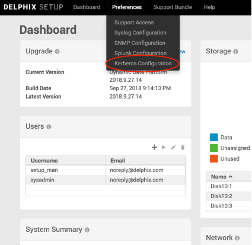
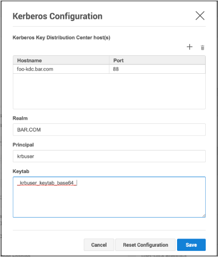
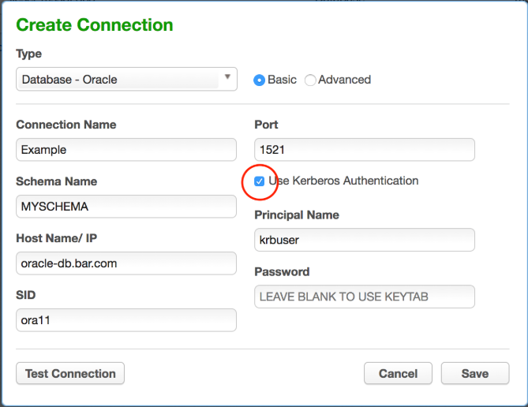
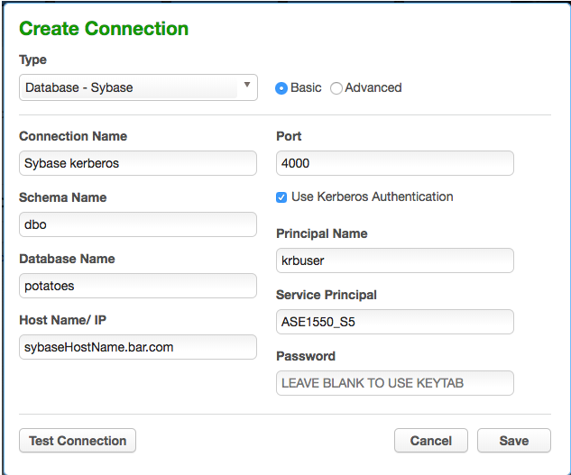

# Kerberos Configuration

## Introduction

As of 5.3.0.0, the Delphix Masking Engine supports Kerberos authentication for
Oracle, MS SQL Server, and Sybase connections. Utilizing this service requires
the presence of a Kerberos Key Distribution Center (KDC) server as well as
additional configuration actions to be done on both the the Masking Engine and
the database. This document presents configuration instructions for enabling
and using Kerberos on the Delphix Masking Engine, as well as reference
configurations for enabling Kerberos on the Databases. Although other
configurations are possible, the configurations in this document have been
validated by Delphix.

## Terminology

Throughout this document, the following example values are used. To recreate
these reference environments, these values must be replaced with real values
appropriate for your network environment:
- .bar.com - the DNS domain of then network
- BAR.COM - the Kerberos domain
- me-host - the hostname of the masking engine
- foo-kcd - the hostname KDC server
- krbuser - the kerberos principal to be granted access to the database for masking

## Configuring Kerberos on the Appliance

This section details the steps required to configure Kerberos on your appliance.

**Step 1** On the Delphix System Setup CLI, enable the Kerberos feature.

**Note**
You may see a warning indicating that special permission is required to enable Kerberos.
This warning can be ignored when enabling Kerberos for use with Masking only.
In the following examples, `me-hosts` is the hostname of your masking engine.

`$ ssh sysadmin@me-host.bar.com
me-host> system
me-host system> enableFeatureFlag
me-host system enableFeatureFlag *> set name=KERBEROS
me-host system enableFeatureFlag *> commit
me-host system> exit`

**Step 2** On the Delphix System Setup CLI, configure and enable Kerberos.

`$ ssh sysadmin@me-host.bar.com
me-host service> kerberos
me-host service kerberos> update
me-host service kerberos update *> set name=Kerberos_Conf
me-host service kerberos update *> edit kdcs
me-host service kerberos update kdcs *> edit 0
me-host service kerberos update kdcs 0 *> set hostname=foo-kcd.bar.com
me-host service kerberos update kdcs *> back
me-host service kerberos update *> set realm=BAR.COM
me-host service kerberos update *> set principal=krbuser
me-host service kerberos update *> set keytab=_krbuser_keytab_base64_
me-host service kerberos update *> commit`

In this case, **_krbuser_keytab_base64_** is the base64 encoded contents of the
 keytab file for krbuser. The kerberos keytab for a user is typically available
from your kerberos administrator.

To display a keytab file in base64 encoding use:

`$ base64 ~/krbuser.keytab`

**Step 2** Alternatively - On the Delphix Server Setup UI configure and enable
Kerberos:

a. From the Preferences menu select Kerberos Configuration.

b. Add record(s) for your KDCs, and populate other fields appropriately for your
   network environment. Upon pressing **Save**, your configuration will be tested.
   If the engine is able to authenticate to the KDC with the supplied
   configuration, the configuration is applied immediately.

## Creating Maskings Database Connectors using Kerberos

Once the Delphix Appliance is configured for Kerberos, creating Connectors
using Kerberos authentication is simple:

Assuming you are using the same user principal configured in Server Setup, the
keytab will be used and it is unnecessary to enter a password in the Connector
definition.

For Sybase database Connectors, it is necessary to supply the service principal
name as an additional configuration item. For Oracle DB, this value is
determined automatically.  For MS SQL Server it is determined based on the
reverse DNS mapping of the Server Name (refer to the section on MS SQL
Server below).

## Reference Database Configurations

The following are a series of reference kerberos configuration procedures and
troubleshooting notes for the supported databases. These are meant to serve as
examples to be further customized according to the user's specific network
environment and security needs.

### Oracle Database

**Overview**

This document describes how to set up an Oracle DB instance for kerberized
connections. The following steps are described:
- Creating a service principal and adding it to the DB system
- Configuring the database to use kerberos authentication
- Creating DB users identified via kerberos
- Troubleshooting tips

**Prerequisites**

This document assumes you already have a kerberized network environment with
an MIT Kerberos KDC. These procedures have been tested successfully with Oracle
database versions 11.2.0.2, 11.2.0.4 and 12.2.1. Oracle database version
12.1.0.1 did not work in our testing.

You will need the following from your kerberos environment:
- The krb5.conf file
- A user principal and associated password or keytab you'd like to use to log
  into the database
- The ability to create a service principal for the Oracle DB and retrieve the associated keytab

This section of the document uses these example values in addition to those
mentioned above:
- The oracle database is: ora-db.bar.com.
- The oracle service name is: oracle

**Creating the Oracle Service Principal**

The service principal will be named:
<service_name>/<hostname>@<domain>
Given our default values above, this works out to:
oracle/ora-db@bar.com

Notice that the hostname is whatever the database system thinks its hostname
is - that is, the output of "uname -n" on the database system, rather than the
actual DNS name of the database system. Typically, these values would be the
same, but this is not always the case.

On the KDC, run:

`# kadmin.local
kadmin.local: addprinc -randkey oracle/ora-db@bar.com
kadmin.local: ktadd -norandkey -k /var/tmp/ora-db.keytab oracle/ora-db@bar.com`

Copy the resulting keytab file (/var/tmp/ora-db.keytab) to the Oracle DB system
at this location:  /etc/v5srvtab

As root on the Oracle DB system, ensure that the keytab has the correct
permissions:

`# chown root:oinstall /etc/v5srvtab`

`# chmod 440 /etc/v5srvtab`

Finally, this is a good opportunity to copy /etc/krb5.conf from the KDC to
/etc/krb5.conf on the Oracle DB system. This file should be readable by all users.

**Configuring the Oracle Database for Kerberos**

Log into the Oracle DB system as the appropriate use for the database in question.

`$ cd $ORACLE_HOME
$ vi network/admin/sqlnet.ora`

Add the following for Oracle 11:

`SQLNET.KERBEROS5_CONF=/etc/krb5.conf
SQLNET.AUTHENTICATION_SERVICES=(BEQ,KERBEROS5)
SQLNET.KERBEROS5_CONF_MIT=true
SQLNET.AUTHENTICATION_KERBEROS5_SERVICE=oracle`

Or the following for Oracle 12:

`NAMES.DIRECTORY_PATH=(TNSNAMES, EZCONNECT, HOSTNAME)
SQLNET.KERBEROS5_CONF=/etc/krb5.conf
SQLNET.AUTHENTICATION_SERVICES=(BEQ,KERBEROS5PRE,KERBEROS5)
SQLNET.KERBEROS5_CONF_MIT=true
SQLNET.AUTHENTICATION_KERBEROS5_SERVICE=oracle`

If the database is Oracle 11 (not necessary on Oracle 12):
`$ vi dbs/init.ora`
Add this line at the end: `OS_AUTHENT_PREFIX=""`

**Creating a DB User Identified via Kerberos**

Log into the Oracle DB system as the appropriate database user and open a
database session as the DBA:

`$ sqlplus / as sysdba`

On Oracle 12, you may wish to alter your session to create the user in one of
the PDBs:
`SQL> alter session set container=MYPDB;`

Create the user that will connect to the DB using kerberos:

`SQL> create user krbdbuser identified externally as 'krbuser@BAR.COM';`

Grant the user privileges necessary for masking.

This example grants all privileges for the sake of simplicity:

Oracle 11:

`SQL> grant all privilege to krbdbuser;`

Oracle 12: (Customize permissions as necessary for your environment).

`SQL> grant connect,resource to krbdbuser;

SQL> grant create tablespace, drop tablespace to krbdbuser;

SQL> grant create table to krbdbuser;

SQL> grant create sequence to krbdbuser;

SQL> grant select_catalog_role to krbdbuser;

SQL> grant unlimited tablespace to krbdbuser;

SQL> grant select_catalog_role to krbdbuser;

SQL> grant alter system to krbdbuser;

SQL> grant sysoper to krbdbuser;

SQL> grant dba to krbdbuser;`

**Troubleshooting Tips**

- Connecting via JDBC with kerberos authentication from Delphix Masking involves two steps - a kerberos login, followed by JDBC connect. A failure stack with an error in the login function indicates a misconfiguration on either the engine or KDC - the engine hasn't even attempted to communicate with the database at that point. Failure stacks are saved in the debugging log for masking.
- Login exceptions that mention a checksum error mean either the password or keytab supplied doesn't match the expected password/key on the KDC for the principal you're trying to use. Server Setup verifies that your keytab works at configuration time, but it could stop working if the key for your principal is updated on the KDC.
- Prior to version 12, Oracle databases instances assume they can create/write a particular temporary file to store kerberos credentials for the DB. This means if you attempt to run multiple kerberized instances of Oracle 11 on the same system or VM, and the databases run as different system users, the first Oracle instance that performs kerberos auth will create and own this file. Kerberos authentication will fail to function on all other instances.

### MS SQL Server

**Overview**

This is an overview of the step necessary to get your masking engine talking to
a MS SQL Server database using kerberos authentication. Since Active Directory
already uses Kerberos for authentication, little or no additional configuration
is need on the MS SQL Database server.

The following steps are described in this section:
- Create the necessary SPNs (Service Principal Names) for your MSSQL Database service in AD
- Create the DB Connector on the masking engine
- Creating a keytab for an AD User
- Troubleshooting tips

**Prerequisites**

Configuring cross-realm trust between Active Directory and an MIT KDC Server is
a complex topic, and will not be described here. In the absence of such a setup,
it is possible to make the Delphix Appliance a kerberos client of the Active
Directory (AD) Server. In this configuration, no additional KDC in necessary.
The example below assumes this kind of configuration.

This section of the document uses these example values in addition to or instead
of those mentioned above:
- The MSSQL server database is named mssql-db.bar.com.
- The AD user configured for masking access to the MSSQL database is aduser (rather than krbuser in other examples elsewhere in this document).
- The AD user that start the MS SQL Server service on the DB Server is dbuser.

**Creating SPNs for the Database Service**

MS SQL Server service will typically register several SPNs with AD upon startup.
However, there are several conditions which can cause these SPNs to not be
registered successfully, or to be registered with service names other than those
that are expected by the jTDS JDBC driver employed by Delphix Masking.

The service principal name for an MS SQL Server expected by Delphix Masking is:
MSSQLSvc/<FQDN>:<PORT>
For example, the SPN for our example MS SQL Server would be:
`MSSQLSvc/mssql-db.bar.com:1433`

In addition, it is **required** that a reverse mapping exist in DNS from the IP
address of the MS SQL Server system to the FQDN registered.

The following commands may be run in powershell on the MS SQL Server to assist
in debugging SPN related issues:

List all SPNs for dbuser:

`setspn -L -U dbuser`

Deleting an old SPN associated with dbuser:

`setspn -U -D MSSQLSvc/other-server.ad.bar.com:SQL2008R2 dbuser`

Here's how to create the SPN describe above:

`setspn -U -S MSSQLSvc/mssql-db.bar.com:1433 dbuser`

**Creating the Database Connector on the Masking Engine**

Once the above steps are complete, creating the database connector can be
performed using the procedure above. Enter the username and optionally, password
of the AD user in the Connector definition. Be sure that the AD user has the
sufficient access to the MS SQL Database for masking.

The password field can be left blank when creating the connector if the user
is the same user configured in Server Setup for the appliance. Since keytabs
are not typically used in an AD environment, it may be useful to create one
manually, to avoid having a password in the DB Connector.

**Creating a keytab file for an AD user**

On a unix or MAC system with MIT kerberos CLI utilities installed:

`# ktutil`

`ktutil: addent -password -p krbuser -k 1 -e arcfour-hmac`

`<type password for krbuser>`

`ktutil: addent -password -p krbuser -k 1 -e aes128-cts-hmac-sha1-96`

`<type password for krbuser>`

`ktutil: addent -password -p krbuser -k 1 -e aes256-cts-hmac-sha1-96`

`<type password for krbuser>`

`ktutil: write_kt /var/tmp/krbuser.keytab`

`ktutil: exit`

 `# base64 /var/tmp/krbuser.keytab ;# This is string to user for keytab in Server Setup kerberos configuration`

**Note**
kvno doesn't matter when using kerberos keytabs with AD. The password must match
the active password for the AD user in question.

**Troubleshooting Tips**

The client uses the incorrect service name
This will typically manifest an exception mentioning cred, like:

`Caused by: org.ietf.jgss.GSSException: No valid credentials provided (Mechanism level: Fail to create credential. (63) - No service creds)`

  `at sun.security.jgss.krb5.Krb5Context.initSecContext(Krb5Context.java:770)`

  `at sun.security.jgss.GSSContextImpl.initSecContext(GSSContextImpl.java:248)`

  `at sun.security.jgss.GSSContextImpl.initSecContext(GSSContextImpl.java:179)`

  `at com.microsoft.sqlserver.jdbc.KerbAuthentication.intAuthHandShake(KerbAuthentication.java:163)
        ... 101 common frames omitted`

`Caused by: sun.security.krb5.internal.KrbApErrException: Fail to create credential. (63) - No service creds`
  `at sun.security.krb5.internal.CredentialsUtil.acquireServiceCreds(CredentialsUtil.java:162)`

  `at sun.security.krb5.Credentials.acquireServiceCreds(Credentials.java:458)`

  ` at sun.security.jgss.krb5.Krb5Context.initSecContext(Krb5Context.java:693)
        ... 104 common frames omitted
`

Why might this happen:
- You're using the JTDS JDBC driver, and your MSSQL Server's IP address doesn't
 have a reverse mapping in DNS. In this case, the driver may construct a service
 name like: MSSQLSvc/<IP>:<PORT> and try to use that.  Either correct DNS to have
 a valid reverse mapping for the IP of your SQL server, or manually add an SPN to
 active directory for the name the JDBC client is trying to use:
 - Determine the user that starts MSSQL Server on your DB machine.
 - From powershell, do: setspn -AU MSSQLSvc/<IP>:1433 <USER>
   Example: setspn -AU MSSQLSvc/10.43.100.101:1433 AD\dbuser
- The database server has multiple DNS names (FQDNs). In this case, SPNs may be
registered only for some of them. It may be necessary to add SPNs for the other
FQDNs as above.
- The MS SQL Server didn't automatically register an SPN. There is a limit (in
the thousands) to the number of SPNs that may be registered for a given AD user.
It is quite possible to hit this limit in an environment where many MS SQL Server
VMs are actively created and destroyed with the same configuration.

**Note**
In Active Directory, setspn isn't creating a service principal with distinct key
as is typical for services on MIT KDCs - rather it's mapping the service principal
to the key for the AD user in question.

**The SPN for the SQL Server is registered to the incorrect AD account**

Manifests as an exception with this text:  GSS failure: Defective token detected
(Mechanism level: AP_REP token id does not match!)

Resolution: From powershell on the MS SQL Server:

`PS> setspn -Q <SPN>`

This will show what user has the SPN registered.

`PS> setspn -U -D <SPN> <WRONG_ACCT>`

This will unregister the SPN from that user

`PS> setspn -AU <SPN> <CORRECT_ACCT>`

### Sybase

**Creating a principal and corresponding keytab on the KDC**

1. SSH into the KDC as the user with sufficient privileges to run kadmin.local
2. Run the kerberos configuration CLI with kadmin.local
3. Add a new principal you want to authenticate as later with:
   `add_principal <principalName>`

	We’re going to continue to use **krbuser** as our example kerberos principal.

4. Once you’ve created the principal and provided it a password, we need to
generate a keytab for it. Do so via the following command:

  `ktadd -norandkey -k v5srvtab krbuser`

  In this case, v5srvtab is the keytab filename, and it will be placed into
  whatever directory you’ve invoked kadmin.local from. Presumably this will be
  the home directory of the machine.

5. You now have everything you need done on the KDC, but you will need your
keytab file later as well as the **krb5.conf** file that is located in the home
directory of the KDC, so consider moving them somewhere (probably your local
machine) that will be convenient for you to access later.

**Configuring the Sybase image for Kerberos**

1. Start up a Sybase database.
  - **Note**: Each sybase database machine may have multiple sybase instances running
  on it at a given point in time. In this case, I am configuring the ASE_1550_S5
  instance, but these steps can be done on any instance so long as you change the
  $SYBASE_HOME directories accordingly.
2. Connect to the particular sybase instance you are working on and invoke the
following sql statement:

  `sp_configure ‘use security services’, 1`

3. Continue to create a user with the same name as the principal name you created
previously on the KDC, in this case **krbuser**:

	 `sp_addlogin krbuser, <password>`

4. Change your **$SYBASE** environment variable to point to the sybase directory
for whichever instance you are configuring. In this case, we want to do:

  `export SYBASE=/opt/sybase/15-5`

5. Open the **$SYBASE/interfaces file**, and find the header for whichever Sybase
instance you are configuring. In our case, it is **ASE_1550_S5**. You should see
something that looks like this:

  `ASE1550_S5`

    `master tcp ether 10.43.89.241 5500`

    `master tcp ether localhost 5500`

    `query tcp ether 10.43.89.241 5500`

    `query tcp ether localhost 5500`

  You want to add the following line to this:

  `secmech 1.3.6.1.4.1.897.4.6.6`

	This line is static, while the other lines in this section are dynamically generated for your instance. So, your final result should look something like this:

  `ASE1550_S5`

  `master tcp ether 10.43.89.241 5500` **< your numbers will vary**

  `master tcp ether localhost 5500` **< your numbers will vary**

  `query tcp ether 10.43.89.241 5500` **< your numbers will vary**

  `query tcp ether localhost 5500` **< your numbers will vary**

6. Navigate to **$SYBASE/OCS-15_0/config**. You should see **libtcl64.cfg** and
**libtcl.cfg**

  a. Change the contents of **libtcl64.cfg** to be this:

    `[DIRECTORY]`

    `;ldap=libsybdldap.so ldap://ldaphost/dc=sybase,dc=com`

    `[SECURITY]`
    `csfkrb5=libsybskrb64.so secbase=@bar.com libgss=/lib64/libgssapi_krb5.so.2.2
`
    `[FILTERS]`
    `;ssl=libsybfssl.so`

  b. Change the contents of **libtcl.cfg** to be this:

      `[DIRECTORY]`

      `;ldap=libsybdldap.so ldap://ldaphost/dc=sybase,dc=com`

      `[SECURITY]`

      `csfkrb5=libsybskrb.so secbase=@bar.com libgss=/lib64/libgssapi_krb5.so.2.2`

      `[FILTERS]`

      `;ssl=libsybfssl.so`

  c. **Note** that the @bar.com value is our realm name that is determined by the KDC. Realistically, you should never have to deal with this, and it should never change, but if for some reason it does, that value needs to be updated.

7. Create a directory for those Kerberos config files you created on the KDC in
the previous set of steps:

  `sudo mkdir /krb`

  Copy into /krb your keytab file **v5srvtab** and config file **krb5.conf** that you
  took off of the KDC earlier.

8. Head to **$SYBASE/ASE-15_0/install** and open the **RUN_ASE1550_S5** file.
We’re going to add information so that Sybase knows where to find our
keytab and our krb5.conf file, so change the content to look like this:

  `#!/bin/sh`

  `#`

  `# ASE page size (KB) :    4096`

  `# Master device path:   /opt/sybase/devices/data5/S5_master.dat`

  `# Error log path:       /opt/sybase/errorlogs/ASE1550_S5.log`

  `# Configuration file path:      /opt/sybase/15-5/ASE-15_0/ASE1550_S5.cfg`

  `# Directory for shared memory files:    /opt/sybase/15-5/ASE-15_0`

  `# Adaptive Server name: ASE1550_S5`

  `#`

  `export **KRB5_KTNAME**=/krb/v5srvtab`

  `export **KRB5_CONFIG**=/krb/krb5.conf`

  `/opt/sybase/15-5/ASE-15_0/bin/dataserver \`

  `-kASE1550_S5@bar.com \`

  `-d/opt/sybase/devices/data5/S5_master.dat \`

  `-e/opt/sybase/errorlogs/ASE1550_S5.log \`

  `-c/opt/sybase/15-5/ASE-15_0/ASE1550_S5.cfg \`

  `-M/opt/sybase/15-5/ASE-15_0 \`

  `-sASE1550_S5 \`

9. Reboot the Sybase instance you’re working so that it reads in all of these
config changes.

10. Connect to the Sybase instance as the **dbo** user so that you may give dbo
privileges to your kerberos authentication login on a particular database within
the instance. Below is an example of doing so with the database **potatoes**:

  `>> sql5`

  `1> use potatoes`

  `2> go`

  `1> sp_addalias instructions, dbo`

  `2> go`

  `Alias user added.`

  `(return status = 0)`

11. Now, to access the Sybase instance via kerberos and confirm success, you
can do the following set of commands (I put these three lines into a script
called **connect.sh** for future convenience):

  `#!/bin/sh`

  `kinit -k -t /krb/v5srvtab <yourPrincipalName>`

  `export SYBASE='/opt/sybase/15-5'`

  `/opt/sybase/15-5/OCS-15_0/bin/isql64 -V -SASE1550_S5`

**Testing by creating a Kerberos Connector on the Delphix Engine**

1. Start by configuring your engine for kerberos. SSH into the engine as the
delphix user and run the following command:

  	`/opt/delphix/server/bin/jmxtool tunable set enabled_features KERBEROS true`

2. Log into the virtualization engine and proceed through first-time setup if
  you need to.
3. Once first-time setup is complete, log into the Delphix Setup page, proceed
to Preferences > Kerberos Configuration. Add the information for your KDC to
configure it with the principal name you created earlier, **krbuser**. You can get
the keytab by running the following command on your keytab file:

  base64 v5srvtab

  Copy the output as plaintext into the keytab field of the kerberos configuration box.

  Finally, create a Sybase connector with parameters that look like this, and if
  your “test connection” attempt succeeds you’re all set!

  
