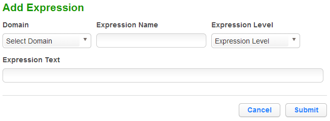
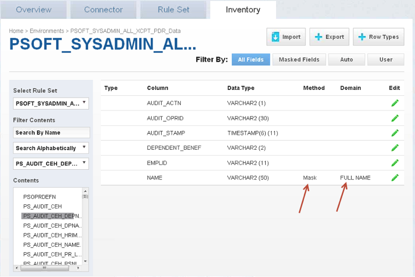

# Configuring Profiling Settings

You can add regular expressions and profiler sets to the Profiler
Settings. In addition to using the Masking settings to determine your
inventory of what to mask, a Profiling job uses expressions to identify
the data you are seeking.

The Profiler displays Domains along with their Expression Text,
Expression Name, and Expression Level.

## To add an expression

1.  Click **Add Expression** at the top of the Profiler tab.
    
      - A new expression will be created in-line.

2.  Select a domain from the **Domain**
dropdown.

3.  Enter the following information for that domain:
    
      - **Expression Name**—The field name used to select this
        expression as part of a profiler set.
    
      - **Expression Text**—The regular expression used to identify
        the location of the sensitive data.

4.  Select an **Expression Level** for the domain:
    
      - **Column Level**—To identify sensitive data based on column
        names.
    
      - **Data Level**—To identify sensitive data based on data
        values, not column names.

5.  When you are finished, click **Save**.

## To delete an expression

Click the **Delete** icon to the far right of the name.

## Adding or Editing a Profiler Set

You can define Profiler Sets in Delphix Masking Engine. A profiler set
is a grouping of expressions for a particular purpose. For instance,
First Name, Last Name, Address, Credit Card, SSN, and Bank Account
Number could constitute a Financial Profiler Set.

Masking Engine comes with two predefined profiler sets: Financial and
Healthcare vertical. A Delphix Masking Engine administrator (a user with
the appropriate role privileges) can create/add/update/delete these
profiler sets.

If you do not choose a profiler set as part of the Profiler job, the
Delphix Masking Engine profiles data based on all the expressions
defined on the Profiler Settings page.

If you want to edit or add a profiler set, click **Profiler Set** at the
top of the Profiler tab. The Profiler Set screen appears, listing the
profiler sets along with their Purpose and Date Created.

## To add a Profiler Set

1. click **Add Set**.
2. Enter a profile **Set Name**.
3. Optionally, enter a **Purpose** for this profile set.
4. Enter or select which **Domains** to include in this set.
5. When you are finished, cick **Submit**.

Click the **Edit** icon to the right of the Profiler Set name.

## To delete a Profiler Set

Click the **Delete** icon to the right of the Profiler Set name.

