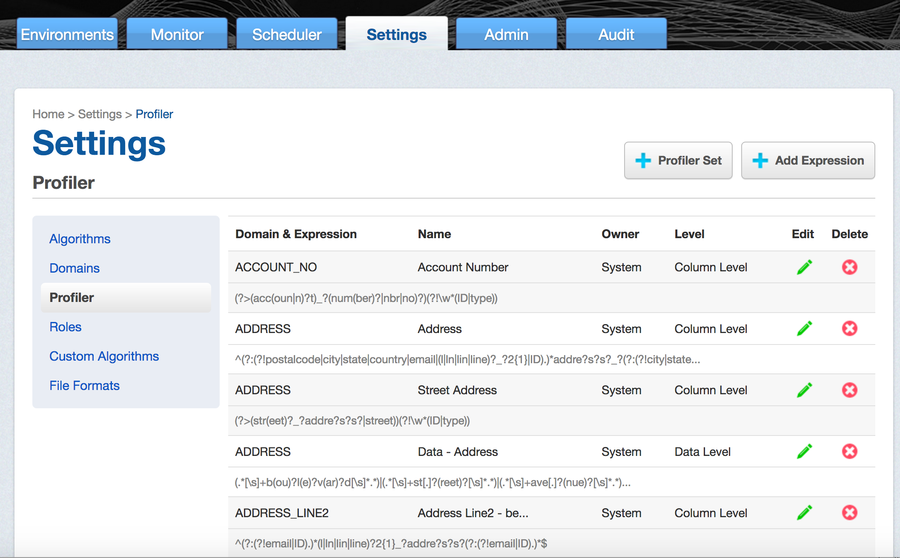
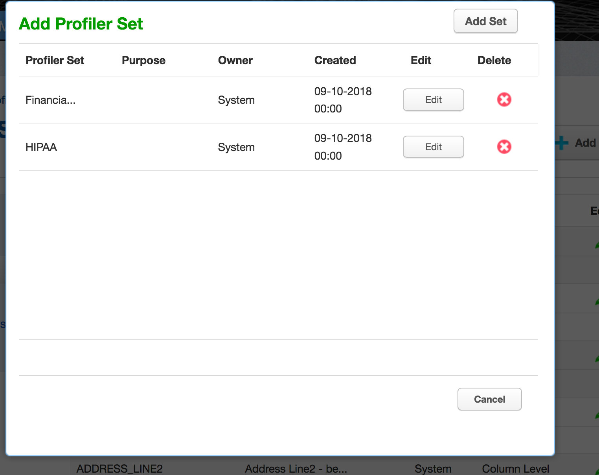

# Configuring Profiling Settings

In addition to using your Rule Set to determine the
inventory of what to profile, a Profiling job uses Expressions
to identify your sensitive data.  You can add regular expressions
to be used by Profiler Sets to the Profiler Settings.

To display the Profiler Settings, click on the **Settings** tab and
select **Profiler** on the left-hand side of the page. 

The **Profiler Settings** screen displays Expressions along with their **Domain**,
**Expression** text, Expression **Name**, **Owner**, and Expression profiling **Level**.

## To add an Expression

1.  Click **Add Expression** at the top of the Profiler screen.
    

2.  Select a Domain from the **Domain** dropdown. 
      - Domains are used by Profiling jobs to determine the masking Algorithm to apply
        to your sensitive data.  When an Expression is matched, the Profiling job will
        associate the specified Domain to the sensitive data. The Masking Engine comes 
        out of the box with over 30 pre-defined Domains. Domains can be added, edited,
        and deleted from the **Settings Domains** screen. 

3.  Enter the following information for the Expression:
    
      - **Expression Name**— The name used to select this
        expression as part of a Profiler Set.
    
      - **Expression Text**— The regular expression used to identify
        the sensitive data.

4.  Select an **Expression Level** for the Expression:
    
      - **Column Level**— To identify sensitive data based on column
        names.
    
      - **Data Level**— To identify sensitive data based on data
        values, not column names.

5.  When you are finished, click **Save**.

To edit a saved Expression, click the **Edit** icon to the right of the 
Expression.

## To delete an Expression

Click the **Delete** icon to the far right of the name.

## Profiler Sets

Profiling jobs use Profiler Sets to determine the set of Expressions
to use in identifying sensitive data in an Inventory. A Profiler Set
is a grouping of Expressions for a particular purpose. For instance,
First Name, Last Name, Address, Credit Card, SSN, and Bank Account
Number Expressions could constitute a Financial Profiler Set.

The Masking Engine comes with two predefined Profiler Sets: Financial and
Healthcare vertical. A Delphix Masking Engine administrator (a user with
the appropriate role privileges) can create/add/update/delete these
Profiler Sets.

If you want to edit or add a Profiler set, click **Profiler Set** at the
top of the **Profiler Settings** screen. The Profiler Set dialog appears, 
listing the Profiler Sets along with their Purpose, Owner, and Date Created.

### To add a Profiler Set

1. Click **Add Set** at the top of dialog.
2. Enter a Profiler **Set Name**.
3. Optionally, enter a **Purpose** for this Profiler Set.
4. Enter or select which **Expressions** to include in this set.
5. When you are finished, cick **Submit**.

To edit an existing Profiler Set, click the **Edit** icon to the right of the
Profiler Set name.

### To delete a Profiler Set

Click the **Delete** icon to the right of the Profiler Set name.

