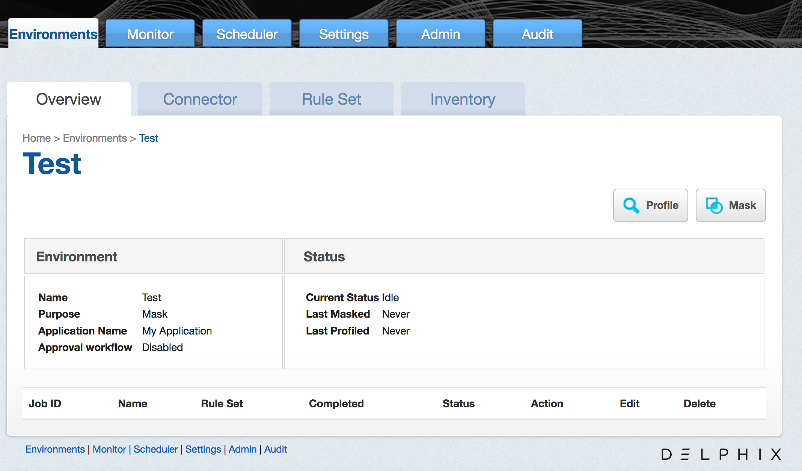
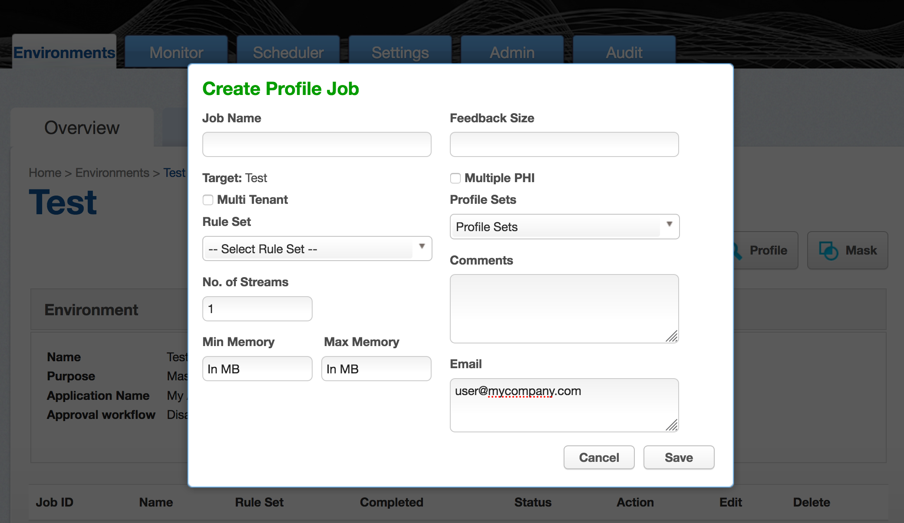

# Creating A Profiling Job

This section describes how users can create a Profiling job. You can
create Profiling jobs for databases, XML, copybooks, delimited files, and fixed-width.

The Profiler assigns each sensitive data element to a domain, with each domain
having a default masking algorithm. Then, in the inventory, masking
algorithms can be manually updated as needed to establish the
masking rulesets for your data sources.

Profiling Jobs are grouped within environments on the **Environment Overview** page
along with all masking jobs. In order to navigate to the **Overview** screen, click
on an environment and the **Overview** tab should automatically display.

## Creating a New Profiling Job

To create a new Profiling job:

1.  Click the **Profile** button on the upper side of the page.

2.  The **Create Profiling Job** window appears.

    

3.  You will be prompted for the following information:

       -  **Job Name** — A free-form name for the job you are creating.
        Must be unique.

       -  **Multi Tenant** — Check the box if the job is for a
        multi-tenant database. This option allows existing rulesets to
        be re-used to mask identical schemas via different connectors.
        The connector is selected at job execution time.

       -  **Rule Set** — Select the rule set that this job will profile.

       -  **No. of Streams** — The number of parallel streams to use
        when running the jobs. For example, you can select two streams
        to profile two tables in the ruleset concurrently in the job
        instead of one table at a time.

       -  **Min Memory (MB)** — (optional) Minimum amount of memory to
        allocate for the job, in megabytes.

       -  **Max Memory (MB)** — (optional) Maximum amount of memory to
        allocate for the job, in megabytes.

       -  **Feedback Size** — (optional) The number of rows to process
        before writing a message to the logs. Set this parameter to
        the appropriate level of detail required for monitoring your
        job. For example, if you set this number significantly higher
        than the actual number of rows in a job, the progress for that
        job will only show 0 or 100%.

       - **Multiple PHI** - Check the box if the job should run all Profile
         Expressions against the result set instead of finding the first
         matching Profile Expression. With this option, the Profiler report
         will indicate all matching Profile expressions, and if multiple Profile
         Expressions match, will assign the default Multiple PHI masking
         algorithm.

       - **Profile Sets** — The name of the Profile Set to use.
        A Profile Set is a set of Profile Expressions (for example, a set of
        financial expressions).

       - **Comments** — (optional) Add comments related to this job.

       - **Email** — (optional) Add e-mail address(es) to which to send
        status messages. Separate addresses with a comma (,).

5.  When you are finished, click **Save**.
