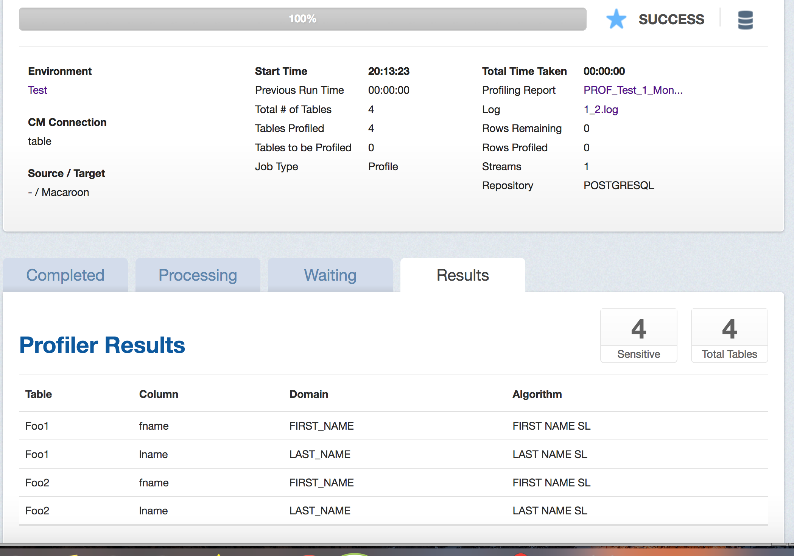
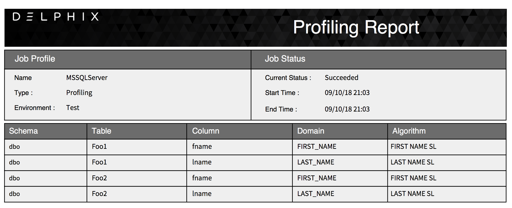
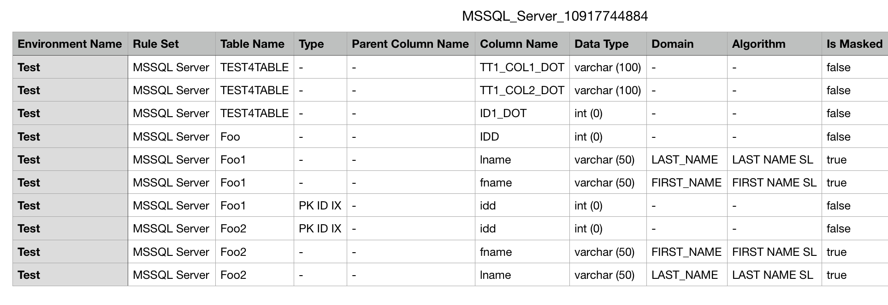

# Reporting Profiling Results

This section describes the different ways of sharing/exploring the
results of a Profiling job.

After a Job has been started from the Environment **Overview** screen,
clicking on the Job Name will result in the display of the Profiling
job from the **Monitor** tab. Clicking on the **Results** tab in the
middle of the screen after the job has completed will display
the sensitive data findings on a table-column by table-column or
file-field by file-field basis.

To retrieve a PDF report of the **Results** tab, click on the
**Profiling Report** link near the top of the page.

Alternatively, after a job completes successfully, the profiling results
can be displayed through the **Inventory** screen by examining the assigned
**Domain** and masking algorithm **Method**s for tables/files in
the Rule Set.

To get a spreadsheet capturing the Profiling results for the inventory, click
on **Export** near the top of the page and a CSV file will be created.

The spreadsheet can then be shared and manually modified to correct
the sensitive data findings by:

1. Changing the **Is Masked**, **Algorithm**, and/or **Domains** fields for
   the respective Table/Column or File/Field in the CSV file accordingly.
2. Importing the modified spreadsheet by clicking on **Import** near the
   top of the **Inventory** screen and specifying the modified CSV file
   name.
