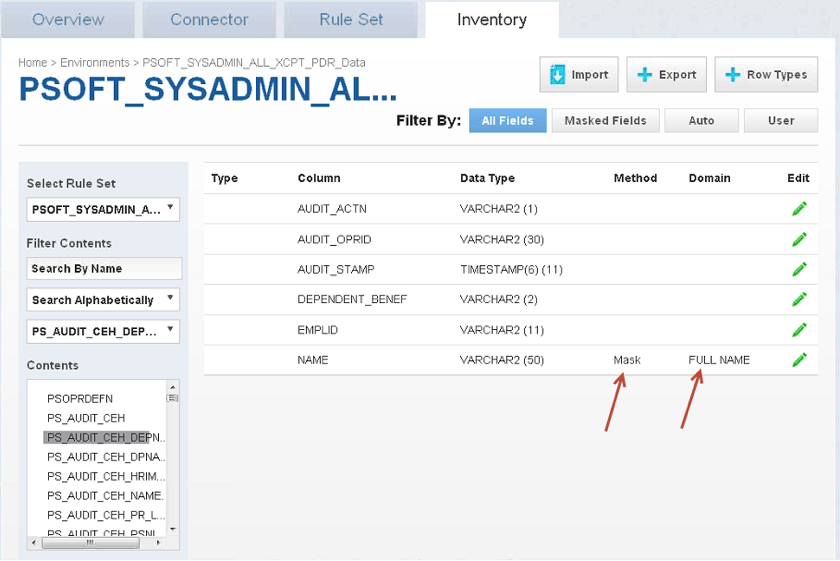

# Running A Profiling Job

This section describes how users can run a profiling job.

To run or rerun a job from the **Environment Overview** screen:

  - Click the **Run** icon (play icon) in the Action column for the
    desired job.

  - The **Run** icon changes to a **Stop** icon while the job is
    running.

  - When the job is complete, the **Status** changes.

To stop a running job from the **Environment Overview** screen:

1.  Locate the job you want to stop.

2.  In the job's **Action** column, click the **Stop** icon.

3.  A popup appears asking, "Are you sure you want to stop job?" Click
    **OK**.

    When the job has been stopped, its status changes.

4.  After the job completes successfully, return to the **Inventory**
    and check that the **Domain** and **Method** populated
    automatically for sensitive data. Sample screenshot below.

