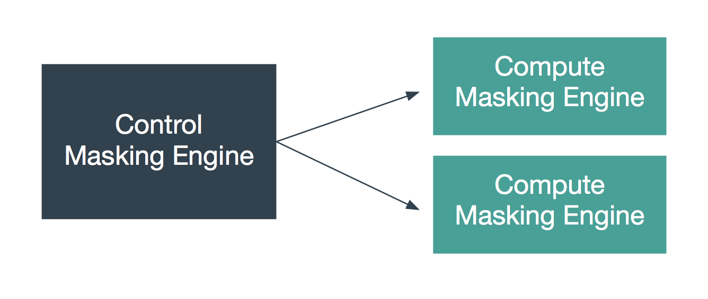

One important piece of data used by many masking algorithms is the key,
which determines the masked outcome of some value. Changing the key
changes the output of these algorithms. For example, if the FIRST NAME
algorithm masks “Michelle” to “Rachael,” changing the key might cause it
to mask “Michelle” to “Ben”. There are two types of keys that the
algorithms can depend on: either 1) global key or 2) individual key.

## Global key

The following algorithm types depend on the global key for consistent
masked results:

Custom Algorithm\* (MAPPLET)

!!! note
    A Custom Algorithm does not depend on the global key by nature. However, most mapplets currently used are implemented to use the global key.

A user with Administrator privileges can change the key by clicking the
**Generate New Key** button in the **Admin**
tab.

!!! tip
    Other actions are not allowed during the key generation process. Wait for the **Generate New Key** process to complete and a success dialogue to display in the user interface before performing additional actions on the Masking Engine (e.g., running a masking job).



### Synchronizing the Global Key between Multiple Engines

In order for Custom Algorithms to behave the same way across several
engines, all of those engines must have the same global key. Changing an
engine’s global key alters the behavior of all of the algorithms that
depend on the global key.

You may want to change the key from time to time as a security
management practice. If so, change it on all of the engines at the same
time. That is, generate a new key on one engine, export that key, and
import it to all of the other engines in the deployment.

Keys can be imported and exported independently of algorithms. To export
the key from an engine, login to the engine through the login endpoint
and then call export with the body shown below. Like all objects, you
can encrypt the payload by supplying a passphrase header.

``` json
[{
"objectIdentifier": {
"keyId": "global"},
"objectType": "KEY"
}]
```

The API will return a JSON payload containing an encoded form of the key
that you can install on other engines through the import endpoint. Like
all exported objects, it is encoded in an opaque blob.

## Individual Key

The following algorithm types have their own key that determines the
masked results:

BINARYLOOKUP

DATE_SHIFT (only applies to DateShiftDiscrete)

LOOKUP

TOKENIZATION

The keys for each algorithm gets exported and imported with the
algorithm itself, not separately. These individually associated keys can
be randomized with an endpoint.

```
PUT http://masking-engine-A:8282/masking/api/algorithms/{algorithmName}/randomize-key
```
