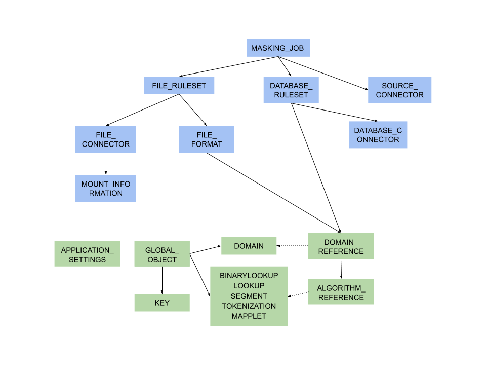
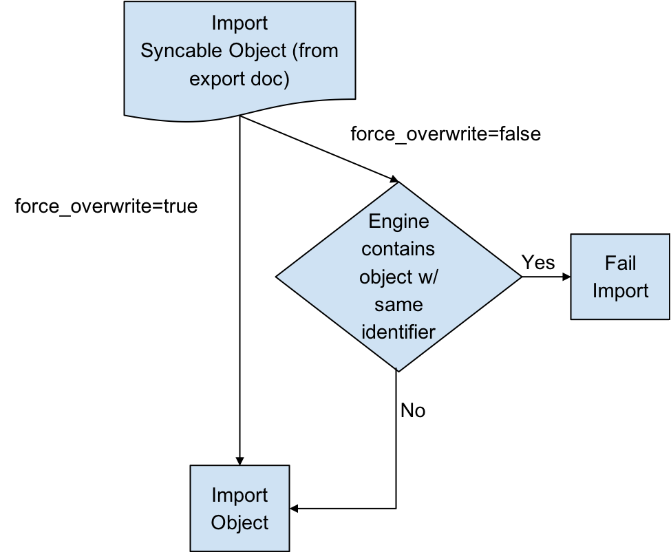

# Masking API Call Concepts

## Syncable object

Syncable objects are external representations of objects within the
masking engine that can be exported from one engine and imported into
another. EngineSync currently supports exporting a subset of algorithms,
the encryption key and all the objects necessary for a masking job.
Note: We do not currently support Mainframe masking jobs.

## Object Identifiers and Types

EngineSync uses object identifiers to name unique objects within the
engine. The follow object types are currently supported:

  - DATABASE_CONNECTOR
  - DATABASE_RULESET
  - DOMAIN
  - FILE_CONNECTOR
  - FILE_FORMAT
  - FILE_RULESET
  - GLOBAL_OBJECT
  - KEY
  - Certain algorithms:
    - BINARYLOOKUP
    - CLEANSING
    - DATE_SHIFT
    - LOOKUP
    - MIN_MAX
    - REDACTION
    - SEGMENT
    - TOKENIZATION
    - MAPPLET
  - MASKING_JOB
  - PROFILE_EXPRESSION
  - PROFILE_JOB
  - PROFILE_SET

The following lists the object types that are simply for the purpose of
referencing a particular state of the exported object. These are not
meant to be exported by request. The functions of these are further
explained in the latter sections.

  - ALGORITHM_REFERENCE
  - DOMAIN_REFERENCE
  - PROFILE_EXPRESSION_REFERENCE
  - PROFILE_SET_REFERENCE
  - SOURCE_DATABASE_CONNECTOR
  - SOURCE_FILE_CONNECTOR

## Dependencies

Most objects within the Masking Engine are compositional. In order to
properly capture the behavior of a syncable object, you must export its
dependencies along with the object itself. Fortunately, all the
necessary dependencies are exported along with the object you request;
thus, it is not something you need to keep track of and worry about.

*Syncable Object dependencies relationship*

Note: Green represents global objects (objects that are central to the
entire engine), and blue represents objects that need to be a part of an
environment



## Object Revision Tracking

The revision hash is used to help you determine whether the behavior of a syncable object is the
same between engines. Because objects within the Masking Engine are
compositional, the behavior of an object is influenced by all of its
dependencies. When a syncable object is listed or exported, the
Masking Engine computes a revision\_hash, which uniquely identifies the
object’s behavior.

The revision\_hash is a SHA1 hash that represents that object’s state,
as well as the state of all objects it depends on. If two objects have
the same revision hash, it is safe to assume that the behavior the
objects is the same. However, it is possible for two objects to have the
same behavior but have divergent revision hashes. For example, you could
have two lookup algorithms with the same name, lookup file, and key, and
they do not necessarily guaranteed to have the same revision hash.

!!! note
    The revision\_hash does not change when the password or the ssh key for either the FILE\_CONNECTOR or DATABASE\_CONNECTOR is updated. This is intentionally done because we do not export the password or the ssh key for security purposes. This allows users to update the password after import without changing the revision\_hash. If a user is **overriding** a connector that already has a password set, the import **does not** reset the password and will leave the current, pre-import value.

!!! Note
    The revision\_hash may change from version to version, and the hash comparison should be done only if both the source engine and the target engine are on the same version of the product. It is also not guaranteed to be the same between two engines at the same version if they are synced from an engine at some other version. E.g. There are three engines as follows

    | Engine | Version |
    | ------ | ------- |
    | A      | 5.3.2.0 |
    | B      | 5.3.3.0 |
    | C      | 5.3.3.0 |

    If B and C are synced from A, then the revision\_hash is not guaranteed to be same between B and C.

    **Best Practice:** A -> B -> C.

## Export Document

You can export one or more syncable objects that are listed in the
*/syncable-objects* endpoint. The export document will include the set
of objects that you requested for export and all of their dependencies that are
required to properly import those objects into another engine.

The export document is exported as an opaque blob. Do not edit it
outside of the Masking Engine.

## Export Document Encryption

You can request that the export document be encrypted using a
passphrase. Once the document is encrypted with the passphrase, the
engine forgets the passphrase. You will need to provide the same
passphrase during import to decrypt the document.

## Digital Signature

In order to detect accidental or malicious modification of the export
document, each document is digitally signed. If the export document does
not match its expected digital signature, a Masking Engine will not
import the document.

## Overwrite

When an object to be imported has the same name as a currently existing
object, importing it will cause the other object to be changed. Since
this might not be intended, we offer a flag called force\_overwrite. If
force\_overwrite is set to false and doing the import will change an
existing object on the masking engine, we fail the import. This workflow
is shown below.



#### Attempting to Import Identical Objects

The Masking Engine checks for the existence of the same object contents
during the import of an object. If it is determined that the engine and
the document being imported contain the same content, a result of
SUCCESS will be returned without repeating the work of a full import.
For example, importing an entire ruleset with hundreds of thousands of
tables can be quite time consuming, and this should not be repeated if
the same object already exists. If the object content matches and we
skip the full import we note this in the application log.

Below is an example log statement when an identical database connector
was imported:

```
2017-07-19 10:17:06,075 [http-nio-8282-exec-4] INFO
c.d.s.marshallers.SyncableMarshaller - Skipping import process for
{
"objectType": "DATABASE_CONNECTOR",
"id": {
"@type": "type.googleapis.com/IntegerIdentifier",
"id": 1
}
}, due to no discrepancy between the existing and importing object
```

####

Depending on the object type, some define an object by a String (name)
and some by an Integer (object id). Objects that can have the same name
in multiple environments, such as connectors, rulesets, and masking
jobs, are exported based on a unique id associated with them. Global
objects, which do not have overlapping names, are exported and
identified based on their names. Something to note here is that objects
exported based on their ids will overwrite the object with the *same
name* rather than the same id. This means that for all importing
objects, we define the identity of an object to be based on the name in
the same environment.

For example, if I export a database connector named *testConnector* with
the following export object metadata:

``` json
{
"objectIdentifier": {
"id": 5
},
"objectType": "DATABASE_CONNECTOR",
"revisionHash": "68eaffef400e426520a5fcbb683419db3be53317"
}
```

And then I import this object into some engine’s environment with the
following list of connectors:

| id  | connector name | more information |
| --- | -------------- | ---------------- |
| 1   | testConnector  | ...              |
| 5   | otherConnector | ...              |

*testConnector* of id 1 will be overwritten, instead of
*otherConnector*.

### Overwrite of the Encryption Key

The global encryption key is somewhat special in that it always exists.
Specifying *force\_overwrite=false* will always fail to import the
encryption key unless the encryption key has been previously
synchronized using *force\_overwrite=true*.

Specifying *force\_overwrite=true* will always overwrite the engine’s
encryption key with the contents of the encryption key in the export
document.

## Error handling

Export documents often have multiple objects to be imported at once. For
example, when exporting a database ruleset, you will export both the
database ruleset and the database connector since a ruleset depends on a
connector.

The engine will import one object at a time, where the dependencies are
imported first. If there is an error importing an object, the import
process will abort and all objects that have successfully been imported
during this request will get rolled back. For example, say you are
importing objects A, B, and C. Import successfully imports A. During the
import of B, the engine encounters an error. The import of A will roll
back, and import of C will never execute. This will leave the engine in
a state identical to the one it was in prior to the failed import.

## Concurrent Sync Operations

To prevent race conditions with concurrent imports and jobs running, we
currently do not allow concurrent import operations. We also do not
allow imports while masking jobs or exports are running. It is best to
do imports when a machine is not running jobs or other exports in order
to guarantee that the final state of each of those operations is as
expected. If they are done at the same time, the operations will fail
with relevant error messages.

## Global Objects

GLOBAL\_OBJECT is a syncable object type that is a collection of all
syncable algorithms, DOMAIN(s), PROFILE\_SET(s), PROFILE\_EXPRESSION(s)
and KEY (global key). This represents
objects in the Masking Engine that are available across all
environments, and are not a part of any specific environment. When a
user requests to export GLOBAL\_OBJECT, every syncable algorithm, profile
set, profile expression and
domain on the engine will be exported as the bundle. If a DOMAIN,
PROFILE\_SET, or PROFILE\_EXPRESSION has a
dependency on a non-syncable algorithm, such as Mapping, it will not be
exported.

This separation was added because global objects 1) containing large
lookup files are projected to be time consuming and 2) are expected to
be synchronized much less frequently than any masking job related metadata.
Examples on how to use it will be available in the **Example User
Workflow** section.

## References Objects

As mentioned in the *Global Objects* section, we expect the users to
synchronize global objects and masking jobs at different frequencies. To
avoid any unnecessary export of large algorithms, any objects
(MASKING\_JOB, PROFILE\_JOB, DATABASE\_RULESET, FILE\_FORMAT and FILE\_RULESET) that
have dependencies on algorithms will export just the references to the
objects by default. This way we check whether the necessary dependency
exists on the importing engine by comparing the references; if not, we
fail the import execution with an appropriate message. Domains, profile
sets, and profile expressions are the
exception to this. Exporting any of these objects will also export the full
algorithm.

## On-The-Fly Masking Jobs

By definition, On-The-Fly (OTF) masking jobs work with a source
environment/connector and a target environment/connector, masking the
data from the source connector into that of the target connector. With
masking jobs, a target *environment\_id* is always required to specify
which environment to import the job and its target connector. In
addition to the target *environment\_id,* OTF masking jobs require the
specification of a *source\_environment\_id* into which to import the
source connector. The source connector is copied into the specified
source environment (*source\_environment\_id* ), and is represented by
the SOURCE\_DATABASE\_CONNECTOR or

SOURCE\_FILE\_CONNECTOR for database and file masking jobs respectively
in the export document. These source connectors are virtually identical
to their DATABASE\_CONNECTOR and FILE\_CONNECTOR counterparts, but are
represented differently in the OTF jobs to distinguish them from the
target connector (i.e., DATABASE\_CONNECTOR or FILE\_CONNECTOR).

## Circular Dependencies

It is possible to have a set of objects that end up depending
on each other. This would be the case if a PROFILE\_SET depended on a
PROFILE\_EXPRESSION that depended on a DOMAIN that depended on a REDACTION
algorithm that depended on the original PROFILE\_SET. The masking application
will detect such scenarios on export and refuse to export such configurations.

This can be worked around by creating a second PROFILE\_SET that contains
PROFILE\_EXPRESSIONS that do not depend on a DOMAIN that depends on a REDACTION
algorithm. Simply ensure that the regular expressions are the same in the newly
created PROFILE\_EXPRESSIONs and assign the REDACTION algorithm to the new
PROFILE\_SET instead. The REDACTION algorithm will function the same but the
dependency loop will have been broken.
