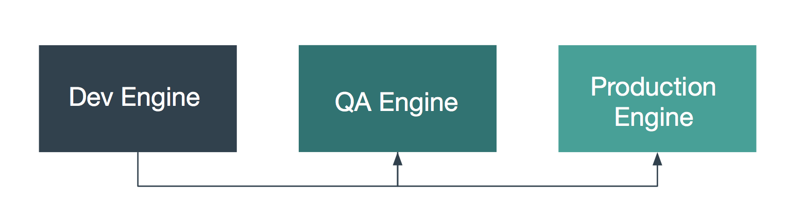
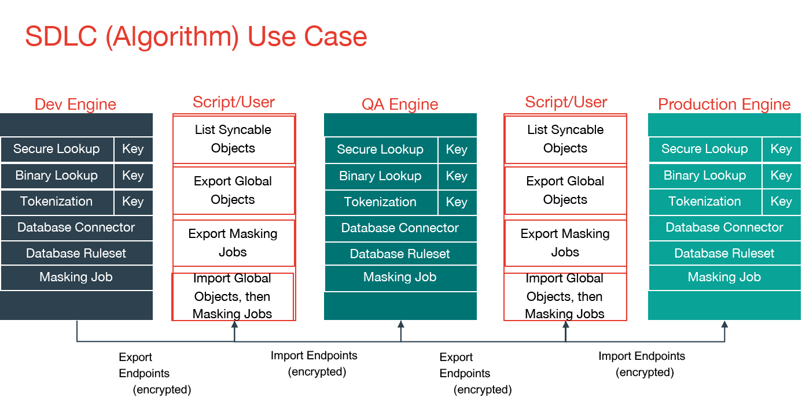
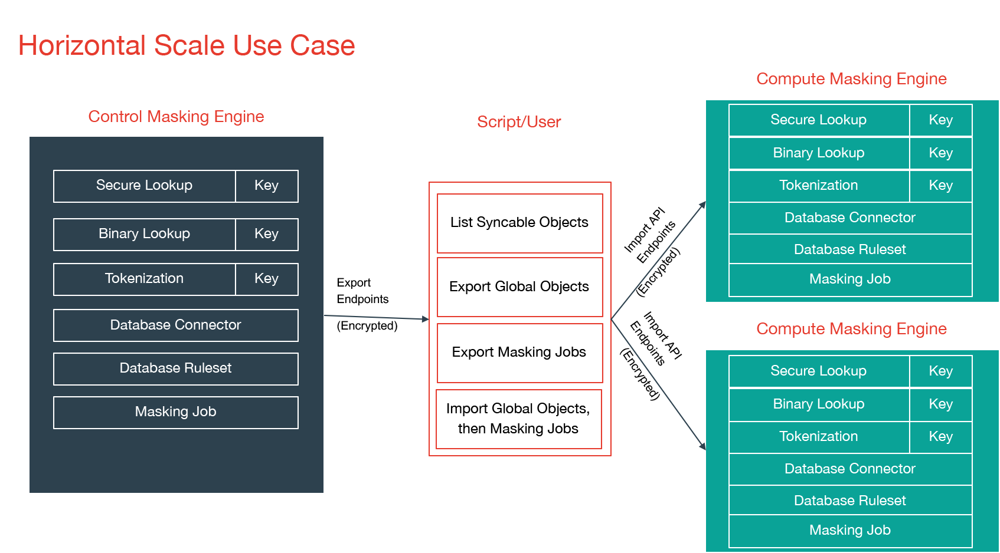

# Introduction

Your organization may have more than one masking engine, and in certain
circumstances, it may want to coordinate the operation of those engines.
In particular, there are two specific scenarios in which an organization
could benefit from some level of interaction and orchestration between multiple
masking engines.

## Software Development Life Cycle (SDLC)

Using an SDLC process often requires setting up multiple masking
engines, each for a different part of the cycle (Development, QA,
Production).

## Horizontal Scale

For many organizations, the size of the profiling and masking workloads
requires more than one production masking engine. These masking engines
can be identical in configuration or be partially equivalent depending
on the organization's needs.

## Best Practice Guide and Example Architectures for Synchronizing

Both of these use cases require various objects to be moved between masking engines, such as Connectors, Rule Sets, and more. Engine synchronization provides a general and flexible way to move the objects necessary to run an identical job on another engine. The following sections describe how to use the Masking APIs to accomplish this.

It is recommended that the syncable objects move in **only
one direction**. That is, objects should be exported from one engine and
imported into others but should not go in the other direction. This
recommendation is primarily to simplify management of which objects
exist on which engine.

For each of the scenarios above, an example architecture is described 
below. Note that the two architectures could be combined by having 
multiple production engines instead of a single one.

#### SDLC

The first architecture addresses the desire to author algorithms on one
engine, to test and certify them on another, and finally to deploy them
to a production engine. Here, algorithms are authored on the first
engine, labeled “Dev Engine” in the diagram below. When the developer is
satisfied, the algorithms are exported from the Dev Engine and imported
to the QA Engine where they can be tested and certified. Finally, they
are exported from the QA engine and imported to the production engine.

#### Horizontal Scale

The second architecture aims to address the problem of horizontal scale
-- that is, achieving consistent masking across a large data estate by
deploying multiple masking engines. In this architecture, syncable
objects are authored on one engine, labeled “Control Masking Engine” in
the diagram below. Those objects are then distributed to “Compute
Masking Engines” using the engine synchronization APIs. The synchronized
algorithms and masking jobs will produce the same masked output on all
of the engines, thus enabling large data estates to be masked
consistently.

