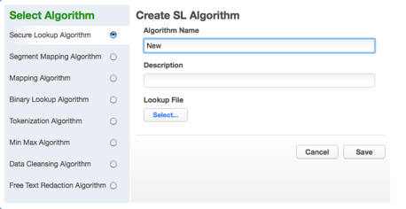
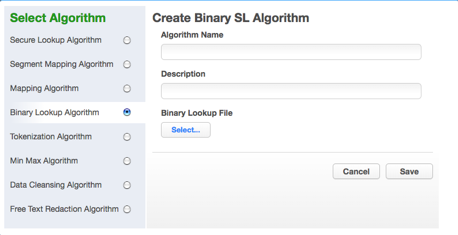

# Configuring Your Own Algorithms

This section describes how users can configure their own algorithms
using Delphix’s built in algorithm frameworks.

## Algorithm Settings

The **Algorithm** tab displays algorithm Names along with Type and
Description. This is where you add (or create) new algorithms. The
default algorithms and any algorithms you have defined appear on this tab.

At the top of the page, **If Nonconforming data is encountered** is
displayed to specify how all algorithms should behave if they encounter data values
in an unexpected format. **Mark job as Failed** instructs algorithms to throw
an exception that will result in the job failing. **Mark job as Succeeded** instructs
algorithms to ignore the nonconforming data and not throw an exception. Note that **Mark
job as Succeeded** will result in the nonconforming data not being masked should
the job succeed, but the **Monitor** page will display a warning that can be used to report
the nonconforming data events.

## Creating New Algorithms

If none of the default algorithms meet your needs, you might want to
create a new algorithm.

Algorithm Frameworks give you the ability to quickly and easily define the
algorithms you want, directly on the Settings page. Then, you can immediately
propagate them. Anyone in your organization who has the Delphix Masking Engine
can then access the information.

Administrators can update **system**-defined algorithms. User-defined
algorithms can be accessed by all users and updated by the owner/user
who created the algorithm.

To add an algorithm:

1.  In the upper right-hand corner of the **Algorithm** settings tab,
    click **Add Algorithm**.

    

2. Select an algorithm type.

3. Complete the form to the right to name and describe your new
algorithm.

4. Click **Save.**

## Choosing an Algorithm Framework

See Out Of The Box Secure Methods/Algorithms for detailed description on each
Algorithm Framework. The algorithm framework you choose will depend on the
format of the data and your internal data security guidelines.

### Secure Lookup Algorithm Framework

To add a secure lookup algorithm:

1.  In the upper right-hand corner of the **Algorithm** tab, click
    **Add Algorithm**.

2.  Choose **Secure Lookup Algorithm**. The Create SL Algorithm pane
    appears.

    

3.  Enter an **Algorithm Name**.

    !!! info
        This MUST be unique.

4.  Enter a **Description**.

5.  Specify a **Lookup File**.

    This file is a single list of values. It does not require a header.
    Make sure there are no spaces or returns at the end of the last line
    in the file. The following is sample file content:

        Smallville
        Clarkville
        Farmville
        Townville
        Cityname
        Citytown
        Towneaster

6.  When you are finished, click **Save**.

7.  Before you can use the algorithm in a profiling job, you must add it to a domain.

!!! info
    The masking engine supports lookup files saved in ASCII or UTF-8 format only. If the lookup file contains foreign alphabet characters, the file must be saved in UTF-8 format with no BOM (Byte Order Marker) for Masking Engine to read the Unicode text correctly. Some applications, e.g. Notepad on Windows, write a BOM (Byte Order Marker) at the beginning of Unicode files which irritates the masking engine and will lead to SQL update or insert errors when trying to run a masking job that applies a Secure Lookup algorithm that has been created based on a UTF-8 file that included a BOM.

### Segmented Mapping Algorithm Framework

1.  In the upper right-hand region of the **Algorithm** tab, click
    **Add Algorithm**.

2.  Select **Segment Mapping Algorithm**. The Create Segment Mapping
    Algorithm pane appears.

    

3.  Enter an **Algorithm Name**.

    !!! info
        This MUST be unique.

4.  Enter a **Description.**

5.  From the **No. of Segment** drop-down menu, select how many
    segments you want to mask.

    !!! note "NOTE"
        This number does NOT include the values you want to preserve.

    The minimum number of segments is 2; the maximum is 9. A box appears
    for each segment.

6.  For each segment, choose the **Type** of segment from the
    dropdown: **Numeric** or
**Alphanumeric**.

    !!! info
        **Numeric** segments are masked as whole segments. **Alphanumeric** segments are masked by individual character.

7.  For each segment, select its **Length** (number of characters)
    from the drop-down menu. The maximum is 4.

8.  Optionally, for each segment, specify range values. You might need
    to specify range values to satisfy particular application
    requirements, for example. See details below.

9.  **Preserve Original Values** by entering **Starting position** and
    **length** values. (Position starts at 1.) For example, to
    preserve the second, third, and fourth values, enter Starting
    position **2** and length **3**.

    If you need additional value fields, click **Add**.

10. To override the behavior of the segment mapping algorithm when it encounters data values in an
    unexpected format, you can change the selection under **If Nonconforming data is encountered**.
    By default, the segment mapping algorithm will **Use global setting** as specified on the **Algorithm Settings**
    page. Selecting **Mark job as Failed** will instruct the segment mapping algorithm to throw
    an exception that will result in the job failing. Selecting **Mark job as Succeeded** will instruct
    the segment mapping algorithm to ignore the nonconforming data and not throw an exception.
    Note that **Mark job as Succeeded** will result in the nonconforming data not being masked should
    the job succeed, but the **Monitor** page will display a warning that can be used to report the nonconforming
    data events.

11. When you are finished, click **Save**.

12. Before you can use the algorithm in a profiling job,
    you must add it to a domain. If you are not using
    the Masking Engine Profiler to create your inventory, you do not
    need to associate the algorithm with a domain.

#### Specifying Range Values

You can specify ranges for **Real Values** and **Mask Values**. With
Real Values ranges, you can specify all the possible real values to map
to the ranges of masked values. Any values NOT listed in the Real Values
ranges would then mask to themselves.

Specifying range values is optional. If you need unique values (for
example, masking a unique key column), you MUST leave the range values
blank. If you plan to certify your data, you must specify range values.

When determining a numeric or alphanumeric range, remember that a narrow
range will likely generate duplicate values, which will cause your job
to fail.

1.  To ignore specific characters, enter one or more characters in the
    **Ignore Character List** box. Separate values with a comma.

2.  To ignore the comma character (,), select the **Ignore comma (,)**
    check box.

3.  To ignore control characters, select **Add Control Characters**.
    The **Add Control Characters** window appears.

    

4.  Select the individual control characters that you would like to
    ignore, or choose **Select All** or **Select None**.

5.  When you are finished, click **Save**.

6.  You are returned to the Segment Mapping pane.

#### Numeric segment type

  - **Min\#** — A number; the first value in the range. Value can be 1
    digit or up to the length of the segment. For example, for a
    3-digit segment, you can specify 1, 2, or 3 digits. Acceptable
    characters: 0-9.

  - **Max\#** — A number; the last value in the range. Value should be
    the same length as the segment. For example, for a 3-digit
    segment, you should specify 3 digits. Acceptable characters: 0-9.

  - **Range\#** — A range of numbers; separate values in this field
    with a comma (,). Value should be the same length as the segment.
    For example, for a 3-digit segment, you should specify 3 digits.
    Acceptable characters:
0-9.

!!! info
    If you do not specify a range, the Masking Engine uses the full range. For example, for a 4-digit segment, the Masking Engine uses 0-9999.

#### Alphanumeric segment type

  - **Min\#** — A number from 0 to 9; the first value in the range.

  - **Max\#** — A number from 0 to 9; the last value in the range.

  - **MinChar** — A letter from A to Z; the first value in the range.

  - **MaxChar** — A letter from A to Z; the last value in the range.

  - **Range\#** — A range of alphanumeric characters; separate values
    in this field with a comma (,). Individual values can be a number
    from 0 to 9 or an uppercase letter from A to Z. (For example,
    B,C,J,K,Y,Z or AB,DE.)

!!! info
    If you do not specify a range, the Masking Engine uses the full range (A-Z, 0-9). If you do not know the format of the input, leave the range fields empty. If you know the format of the input (for example, always alphanumeric followed by numeric), you can enter range values such as A2 and S9.

!!! warning
    The Segment Mapping pattern and sub-patterns need to match the data in order for it to be masked. If the data is longer than the defined pattern it will be passed through unmasked. To avoid this unwanted behavior - patterns (segments), Ignore Characters, and Preserve Original Values should be set to match the data.

### Mapping Algorithm Framework

**To add a mapping algorithm:**

1.  In the upper right-hand corner of the **Algorithm** tab, click
    **Add Algorithm**.

2.  Select **Mapping Algorithm**.

3.  The **Create Mapping Algorithm** pane appears.

    

4.  Enter an **Algorithm Name**.

    !!! info
        This MUST be unique.

5.  Enter a **Description**.

6.  Specify a **Lookup File**.

7.  The value file must have NO header. Make sure there are no spaces
    or returns at the end of the last line in the file. The following
    is sample file content. Notice that there is no header and only a
    list of values.

        Smallville
        Clarkville
        Farmville
        Townville
        Cityname
        Citytown
        Towneaster

8.  To ignore specific characters, enter one or more characters in the
    **Ignore Character List** box. Separate values with a comma.

9.  To ignore the comma character (,), select the **Ignore comma (,)**
    check box.

10. When you are finished, click **Save**.

Before you can use the algorithm by specifying it in a profiling
job, you must add it to a domain. If you are not using the
Masking Engine Profiler to create your inventory, you do not need to
associate the algorithm with a domain.

### Masking Binary Lookup Algorithm Framework

**To add a binary lookup algorithm:**

1.  At the top right of the **Algorithm** tab, click **Add
    Algorithm**.

2.  Select **Binary Lookup Algorithm**. The Create Binary SL Algorithm pane
    appears.

    

3.  Enter an **Algorithm Name**.

    !!! info
        This MUST be unique.

4.  Enter a **Description**.

5.  Select a **Binary Lookup File** on your filesystem.

6.  Click **Save**.

### Tokenization Algorithm Framework

**To add a Tokenization algorithm:**

1.  At the top right of the **Algorithm** tab, click **Add
    Algorithm**.

2.  Select **Tokenization Algorithm**. The Create Tokenization
    Algorithm pane appears.

    

3.  Enter an **Algorithm Name**.

    !!! info
        This MUST be unique.

4.  Enter a **Description**.

5.  Click **Save**.

Once you have created an algorithm, you will need to associate it with a
domain.

1.  Navigate to the **Home\>Settings\>Domains** page and click **Add
    Domain**.

2.  Enter a domain name.

3.  From the **Tokenization Algorithm Name** drop-down menu, select
    your algorithm.

Next, create a Tokenization Environment:

1.  On the home page, click **Environments**.

2.  Click **Add Environment**.

    

3.  For **Purpose**, select **Tokenize/Re-Identify**.

4.  Click
**Save**.

    !!! info
        This environment will be used to re-identify your data when required.

5.  Set up a Tokenize job using tokenization method. Execute the job.

    

Here is a snapshot of the data before and after Tokenization to give you
an idea of what the it will look like.

**Before Tokenization**

**After Tokenization**

### MIN Max Algorithm Framework                                                                                                                                 
The Delphix Masking Engine provides a "Min Max Algorithm" to normalize
data within a range – for example, 10 to 400. Values that are extremely
high or low in certain categories allow viewers to infer someone’s
identity, even if their name has been masked. For example, a salary of
$1 suggests a company’s CEO, and some age ranges suggest higher
insurance risk. You can use a min max algorithm to move all values of
this kind into the midrange. This algorithm allows you to make sure that
all the values in the database are within a specified range.

If the **Out of range Replacement Values** checkbox is selected, a
default value is used when the input cannot be evaluated.

1.  Enter the **Algorithm Name**.

    !!! info
        This MUST be unique.

2.  Enter a **Description**.

3.  Enter **Min Value** and **Max Value**.

4.  Click **Out of range Replacement Values**.

5.  Click **Save**.

Example: Age less than 18 years - enter Min Value 0 and Max Value 18.

### Data Cleansing Algorithm Framework

A data cleansing algorithm does not perform any masking. Instead, it
standardizes varied spellings, misspellings, and abbreviations for the
same name. For example, “Ariz,” “Az,” and “Arizona” can all be cleansed
to “AZ.” Use this algorithm if the target data needs to be in a standard
format prior to masking.

1.  Enter an **Algorithm Name**.

    !!! info
        This MUST be unique.

2.  Enter a **Description**.

3.  Select **Lookup File** location.

4.  Specify a **Delimiter** (key and value separator). The default delimiter is =. You can
    change this to match the lookup file.

5.  Click **Save**.

Below is an example of a lookup input file. It does not require a
header. Make sure there are no spaces or returns at the end of the last
line in the file. The following is sample file content:

    NYC=NY
    NY City=NY
    New York=NY
    Manhattan=NY

### Free Text Algorithm Framework

To add a free text redaction algorithm:

1.  Enter an **Algorithm Name**.

2.  Enter a **Description**.

3.  Select the **Black List** or **White List** radio button.

4.  Select **Lookup File** and enter **Redaction Value** OR/AND

5.  Select **Profiler Sets** from the drop-down menu and enter
    **Redaction Value**.

6.  Click **Save**.

#### Free Text Redaction Example

1.  Create Input File.

2.  Create input file using notepad. Enter the following text:

        The customer Bob Jones is satisfied with the terms of the sales
        agreement. Please call to confirm at 718-223-7896.

3.  Save file as txt.

4.  Create lookup file.

    1.  Create a lookup file.

    2.  Use notepad to create a txt file and save the file as a TXT.
        Be sure to hit return after each field. The lookup flat file
        contains the following data:

            Bob
            Jones
            Agreement

##### Create an Algorithm

You will be prompted for the following information:

1.  For **Algorithm Name**, enter **Blacklist\_Test1**.

2.  For **Description**, enter **Blacklist Test**.

3.  Select the **Black List** radio button.

4.  Select **LookUp File**.

5.  Enter redaction value **XXXX**.

6.  Click **Save**.

##### Create Rule Set

1.  From the job page go to Rule Set and Click **Create Rule Set**.

    

2.  For **Rule Set Name**, enter **Free\_ Text\_RS**.

3.  From the **Connector** drop-down menu, select **Free Text**.

4.  Select the **Input File** by clicking the box next to your input
    file

5.  Click **Save**.

##### Create Masking Job

1.  Use Free\_Text Rule Set

2.  Execute Masking job.

The results of the masking job will show the following:

    The customer xxxx xxxx is satisfied with the terms
    of the sales xxxx. Please call to confirm at 718-223-7896.

"Bob," "Jones," and "agreement" are redacted.
