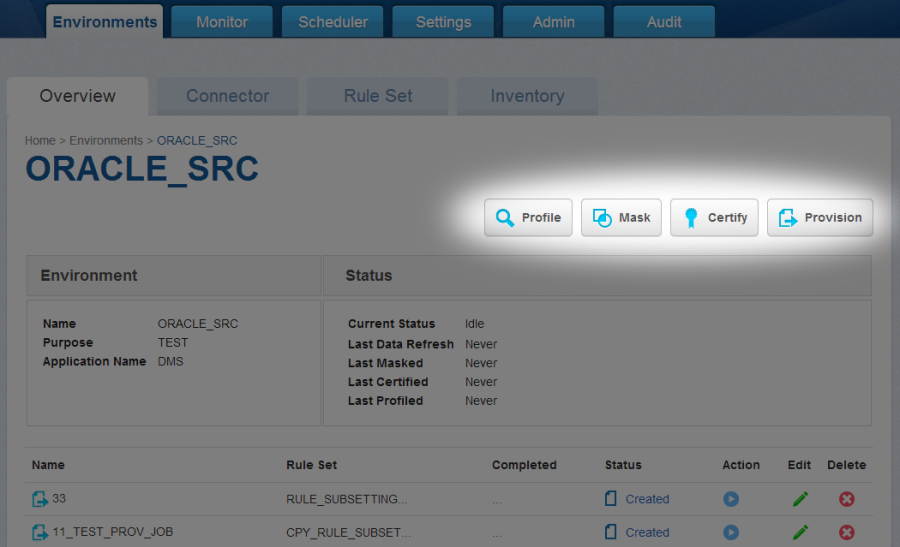
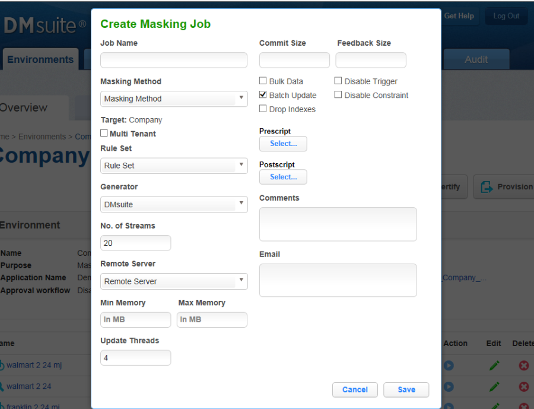
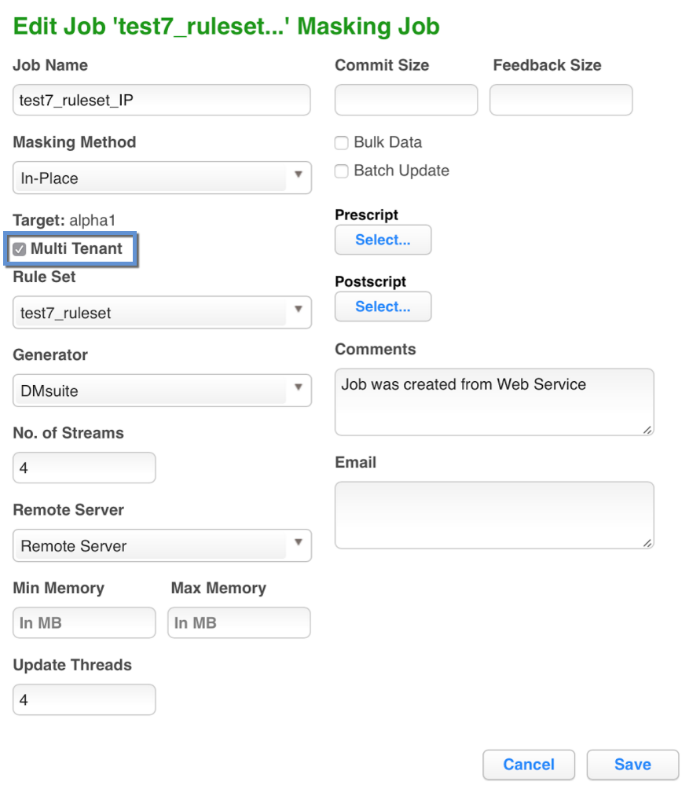
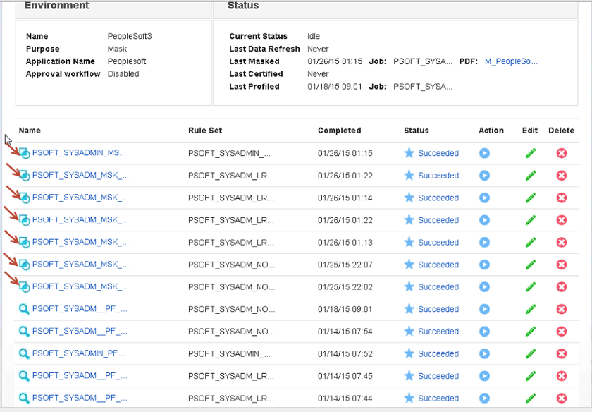

# Creating Masking Job

This section describes how users can create a masking job.

## Creating New Jobs

In the **Environment Overview** screen, select one of the jobs icons to
create the corresponding job:

  - Profile

  - Mask

  

# Creating a New Masking Job

To create a new masking job:

1.  Click **Mask**. The **Create Masking Job** window appears.

    

2.  You will be prompted for the following information:
    
    1.  **Job Name** — A free-form name for the job you are creating.
        Must be unique across the entire application.
    
    2.  **Masking Method** — Select either **In-Place** or
        **On-The-Fly**. For more information on masking type, see Mask
        Data. \[Need to create this link\]
    
    3.  **Multi Tenant** — Check box if the job is for a multi-tenant
        database.

        !!! info "INFO: Provisioning Masked VDBs."
            A job must be Multi Tenant to use it when creating a masked virtual database (VDB).
            

4.  **Rule Set** — Select a rule set that this job will execute
    against.

5.  or:

6.  **Generator** — The default value is **Delphix**.

7.  **Repository Folder name** — The folder name in the repository
    where the objects should be imported.

8.  **Parameter File Path** — (optional) If checked, this tells
    Delphix to configure the sessions and workflows to use a parameter
    file that contains the source and target connection information.
    If unchecked, the Delphix Engine will generate sessions/workflows
    that use the connector names as defined within the Delphix Engine,
    which will require connections with the same names defined within
    the repository.

9.  **Import Mapplet** — (optional) if checked, this tells the Delphix
    Engine to import mapplets that are assigned to columns in the
    inventory along with the mappings/sessions/workflows. If
    unchecked, Delphix will not attempt to import any mapplets that
    are assigned in the inventory.

10. **Mask Method** — Choose either of the following:
    
    1.  **No. of Streams**—The number of parallel streams to use when
        running the jobs. For example, you can select two streams to
        run two tables in the Rule Set concurrently in the job instead
        of one table at a time.
    
    2.  **Import** — When you click the Run icon, creates the mappings
        but does not execute the workflow. You later run the job.
    
    3.  **Import and Run** — When you click the Run icon, creates the
        mappings and executes the workflow.

11. **Remote Server** — (optional) The remote server that will execute
    the jobs. This option lets you choose to execute jobs on a remote
    server, rather than on the local Delphix instance. Note: This is
    an optional feature for Delphix.

12. **Min Memory (MB)** — (optional) Minimum amount of memory to
    allocate for the job, in megabytes.

13. **Max Memory (MB)** — (optional) Maximum amount of memory to
    allocate for the job, in megabytes.

14. **Update Threads** — The number of update threads to run in
    parallel to update the target
database.

    !!! info
        Multiple threads should not be used if the masking job contains any table without an index. Multi-threaded masking jobs can lead to deadlocks on the database engine.
        
        Multiple threads can cause database engine deadlocks for databases using T-SQL If masking jobs fail and a deadlock error exists on the database engine, then reduce the number of threads.

15. **Commit Size** — (optional) The number of rows to process before
    issuing a commit to the database.

16. **Feedback Size** — (optional) The number of rows to process
    before writing a message to the logs. Set this parameter to the
    appropriate level of detail required for monitoring your job. For
    example, if you set this number significantly higher than the
    actual number of rows in a job, the progress for that job will
    only show 0 or 100%.

17. **Bulk Data** — (optional) For In-Place masking only. The default
    is for this check box to be clear. If you are masking very large
    tables in-place and require performance improvements, check this
    box. Delphix will mask data to a flat file, and then use inserts
    instead of updates to bulk load the target table.

18. **Disable Constraint** — (optional) Whether to automatically
    disable database constraints. The default is for this check box to
    be clear and therefore not perform automatic disabling of
    constraints. For more information about database constraints, see
    [Enabling and Disabling Database
    Constraints](https://docs.delphix.com/display/DOCSDEV/.Scheduler+Tab+vJocacean#id-.SchedulerTabvJocacean-EnablingDisablingDatabaseConstraints).

19. **Batch Update** — (optional) Enable or disable use of a batch for
    updates. A job's statements can either be executed individually,
    or can be put in a batch file and executed at once, which is
    faster.

20. **Disable Trigger** — (optional) Whether to automatically disable
    database triggers. The default is for this check box to be clear
    and therefore not perform automatic disabling of triggers.

21. **Drop Index** — (optional) Whether to automatically drop indexes
    on columns which are being masked and automatically re-create the
    index when the masking job is completed. The default is for this
    check box to be clear and therefore not perform automatic dropping
    of indexes.

22. **Prescript** — (optional) Specify the full pathname of a file
    that contains SQL statements to be run before the job starts, or
    click **Browse** to specify a file. If you are editing the job and
    a prescript file is already specified, you can click the
    **Delete** button to remove the file. (The Delete button only
    appears if a prescript file was already specified.) For
    information about creating your own prescript files, see
    [Creating SQL Statements to Run Before and
    After
    Jobs](https://docs.delphix.com/display/DOCSDEV/.Scheduler+Tab+vJocacean#id-.SchedulerTabvJocacean-creatingsqlstatementstorunbeforeandafter).

23. **Postscript** — (optional) Specify the full pathname of a file
    that contains SQL statements to be run after the job finishes, or
    click **Browse** to specify a file. If you are editing the job and
    a postscript file is already specified, you can click the
    **Delete** button to remove the file. (The Delete button only
    appears if a postscript file was already specified.) For
    information about creating your own postscript files, see
    [Creating SQL Statements to Run Before and
    After
    Jobs](https://docs.delphix.com/display/DOCSDEV/.Scheduler+Tab+vJocacean#id-.SchedulerTabvJocacean-creatingsqlstatementstorunbeforeandafter).

24. **Comments** — (optional) Add comments related to this masking
    job.

25. **Email** — (optional) Add e-mail address(es) to which to send
    status messages.

3.  When you are finished, click **Save**.

    
