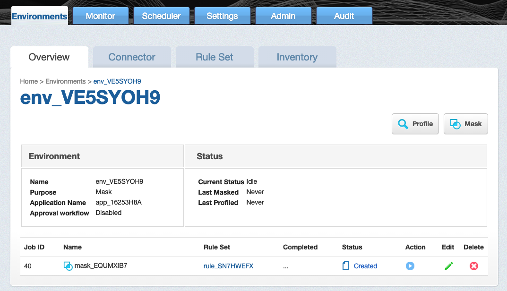
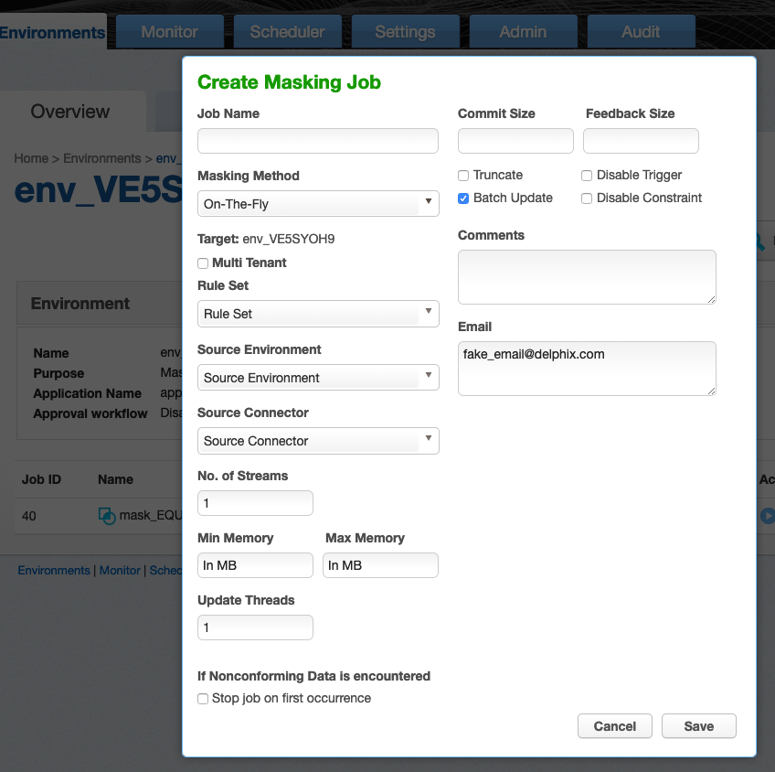

# Creating Masking Job

This section describes how users can create a masking job.

## Creating New Jobs

In the **Environment Overview** screen, select one of the jobs icons to
create the corresponding job:

  - Profile

  - Mask

  

# Creating a New Masking Job

To create a new masking job:

1.  Click **Mask**. The **Create Masking Job** window appears.

    

2.  You will be prompted for the following information:

    1.  **Job Name** — A free-form name for the job you are creating.
        Must be unique across the entire application.

    2.  **Masking Method** — Select either **In-Place** (to update with the masked value in the source environment) or
        **On-The-Fly** (to save the masked value in the target environemnt).

    3.  **Multi Tenant** — Check box if the job is for a multi-tenant
        database.

        !!! info "INFO: Provisioning Masked VDBs."
            A job must be Multi-Tenant to use it when creating a masked virtual database (VDB).  This option allows existing rulesets to be reused to mask identical schemas via different connectors. The connector can be selected at job execution time.

    4.  **Rule Set** — Select a rule set that this job will execute
        against.

    5.  **Source Environment** (only for On-The-Fly Masking Method) - Select the Source Environment that this job will get the data from.

    6.  **Source Connector** (only for On-The-Fly Masking Method) - Select the Source Connector that provides the connection to chosen Source Environment.

    6. **No. of Streams**—The number of parallel streams to use when
            running the jobs. For example, you can select two streams to
            run two tables in the Rule Set concurrently in the job instead
            of one table at a time.

    7. **Min Memory (MB)** — (optional) Minimum amount of memory to
        allocate for the job, in megabytes.

    8. **Max Memory (MB)** — (optional) Maximum amount of memory to
        allocate for the job, in megabytes.

    9. **Update Threads** — The number of update threads to run in
        parallel to update the target database.

        !!! info
            Multiple threads should not be used if the masking job contains any table without an index. Multi-threaded masking jobs can lead to deadlocks on the database engine.
            Multiple threads can cause database engine deadlocks for databases using T-SQL If masking jobs fail and a deadlock error exists on the database engine, then reduce the number of threads.

    10. **If Nonconforming Data is encountered**

        * **Stop job on first occurrence** - (optional) To abort a job on first occurrence of nonconforming data. The default is for this check box to be clear.

        !!! info
            The job behavior depends on the setting specified in the **If Nonconforming data is encountered** field on the **Algorithm Settings** page.
            If **Mark job as Failed** is selected then the job would be aborted on first occurrence of nonconforming data.
            If **Mark job as Succeeded** is selected then the job will not be aborted.

    11. **Commit Size** — (optional) The number of rows to process before
        issuing a commit to the database.

    12. **Feedback Size** — (optional) The number of rows to process
        before writing a message to the logs. Set this parameter to the
        appropriate level of detail required for monitoring your job. For
        example, if you set this number significantly higher than the
        actual number of rows in a job, the progress for that job will
        only show 0 or 100%.

    14. **Disable Constraint** — (optional) Whether to automatically
        disable database constraints. The default is for this check box to
        be clear and therefore not perform automatic disabling of
        constraints. For more information about database constraints.

    15. **Batch Update** — (optional) Enable or disable use of a batch for
        updates. A job's statements can either be executed individually,
        or can be put in a batch file and executed at once, which is
        faster.

    16. **Disable Trigger** — (optional) Whether to automatically disable
        database triggers. The default is for this check box to be clear
        and therefore not perform automatic disabling of triggers.

    17. **Drop Indexes** — (optional) Whether to automatically drop indexes
        on columns which are being masked and automatically re-create the
        index when the masking job is completed. The default is for this
        check box to be clear and therefore not perform automatic dropping
        of indexes.

    18. **Prescript** — (optional) Specify the full pathname of a file
        that contains SQL statements to be run before the job starts, or
        click **Browse** to specify a file. If you are editing the job and
        a prescript file is already specified, you can click the
        **Delete** button to remove the file. (The Delete button only
        appears if a prescript file was already specified.) For
        information about creating your own prescript files.

    19. **Postscript** — (optional) Specify the full pathname of a file
        that contains SQL statements to be run after the job finishes, or
        click **Browse** to specify a file. If you are editing the job and
        a postscript file is already specified, you can click the
        **Delete** button to remove the file. (The Delete button only
        appears if a postscript file was already specified.) For
        information about creating your own postscript files.

    20. **Comments** — (optional) Add comments related to this masking
        job.

    21. **Email** — (optional) Add e-mail address(es) to which to send
        status messages.

3.  When you are finished, click **Save**.

    
