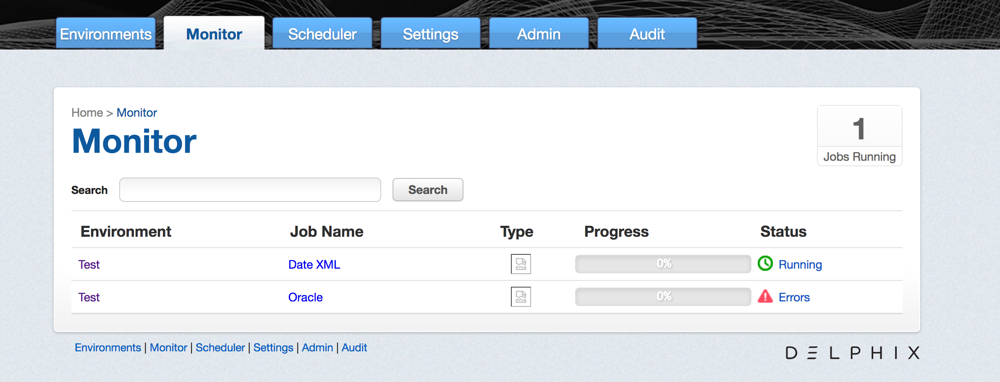
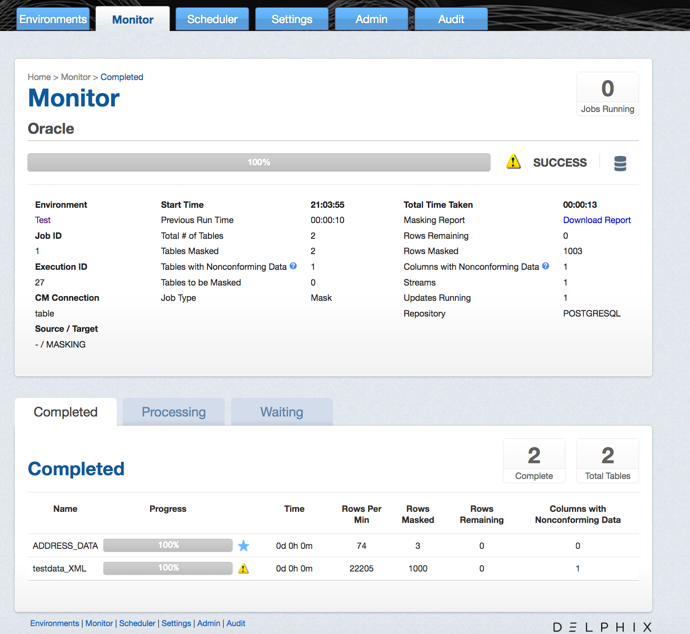
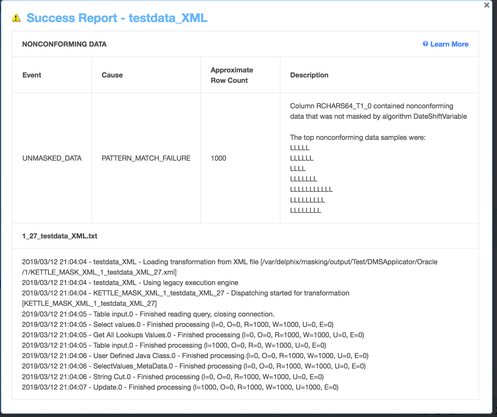

# Monitoring Masking Job

This section describes how users can monitor the progress of a masking
job.

## Monitoring your Masking Jobs

Once a masking job has been created and started, you can monitor its progress by navigating to the Monitor tab or by clicking on the name of the masking job on any screen. The monitoring tab shows you a list of executed masking jobs, their progress as well as their current status. To get even more detail on the progress of an individual masking job, click on the Job Name.

  

### Status

Status for a masking job refers to the job completion state. There are four statuses for a job:

- **Created:** means that a user has configured this masking job but it has never been executed.
- **Success**: means that the job has completed running as the user has defined. If the job encountered nonconformant data patterns while applying the specified masking algorithms
to the ruleset, the Success icon will appear as a warning triangle. See "Displaying Nonconformant Data" for more information.
- **Failure or Errors:** means that the job failed before completion and that not all designated data was masked.  
- **Running:** means that the masking job is currently in the process of being executed.

!!! info "Periodic Auditing of Masked Data"
    Please note that Success does not necessarily mean that all data has been masked (for example, if nonconformant data was encountered or if the user misconfigured the masking job and used the wrong algorithm). It is very important that an audit of the resulting masking data is periodically performed.

### Progress

Progress refers to how much of the job as configured has been successfully completed. Progress is measured with a range of 0% to 100%. Please note that there are several known bugs in the progress bar that results in lags or an inaccurate %. We recommend not using the progress bar as a measure of whether or not a job has been completed but instead relying on the Job Status.  

## Monitoring a Single Job

In addition to viewing high level stats about the status/progress of all you jobs, you can also deep dive into each job to get more details. By clicking the name of the masking job, you will be redirected to a screen with more granular information including; environment name, connector name, job start time, previous run time, number of tables defined in the job, number of jobs tables masked, number of tables to be masked, the type of job, total time the job has taken, rows remaining to mask, rows masked, number of streams, etc.  

In addition to seeing this additional information about each masking job, you can look into the status/progress of each table/file defined in the masking job. Each table/file will be separated into 1 of 3 tabs:

- **Completed:** The Completed tab shows which tables or files the job has completed and includes information such as the rows masked per minute, rows masked and rows remaining.
- **Processing:** The Processing tab will include information on the tables or files the job is currently processing.
- **Waiting:** The Waiting tab shows us which table or files are waiting to be processed.

## Displaying Nonconformant Data
When nonconformant data is encountered by a masking job, the job will either Fail or Succeed with a warning, depending on how the algorithms associated with the ruleset for the job are configured.
As depicted in the screen shot, the nonconformant data can be accessed via the **Completed** tab on the Monitor page for the job, which can be accessed by clicking on the Job name from the Environment
Overview page. In the main body of the Monitor page, a summary of the **Tables with Nonconforming Data** and **Columns with Nonconforming Data** is reported. Further details on the nonconformant data
encountered can be accessed by clicking the Success or Fail icon next to each table or file listed in the **Completed** tab.

Clicking the icon will bring up the masking report for the associated table or file, where the nonconforming data events are displayed followed by the masking log for the table or file. If there were
not any nonconformant data event, "None" is displayed under **NONCONFORMING DATA**. Otherwise for each type of nonconforming data, a row will be displayed reporting the:

- **Event type**: either JOB_ABORTED or UNMASKED_DATA if the job was not aborted.
- **Cause**: always PATTERN_MATCH_FAILURE.
- **Approximate Row Count**: approximate number of rows with nonconformant data (at least within an order of magnitude).
- **Description**: details the name of the column or field with nonconformant data and the associated algorithm name along with samples of the top nonconforming data patterns.
