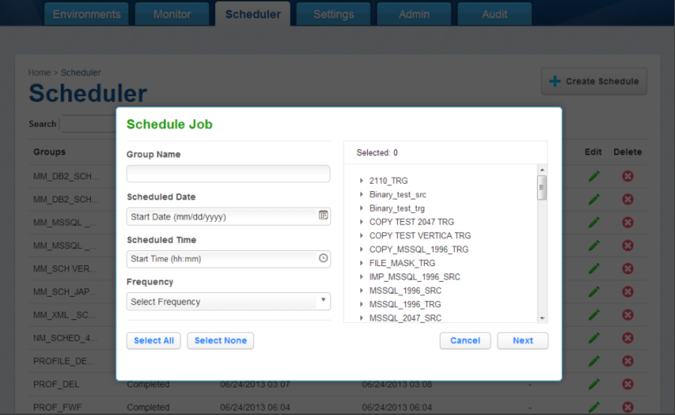

# Scheduler Tab

Click the **Scheduler** tab at the top of the screen to display the list of
jobs scheduled to run. This screen provides an overview of scheduled jobs
and lets the user configure job schedules.

The following columns appear on the **Scheduler** screen:

- Groups
- Status
- Start
- End
- Frequency
- Edit
- Delete

**To search for a job group:**

1. Enter a job group name in the **Search** field.
2. Click ** Search**.

## Scheduling Job(s) to Run

To schedule new jobs:

In the upper right-hand corner of the screen, click **Create Schedule**.

   

   You will be prompted for the following information:

   - **Group Name** — A free-form name for this job schedule.
   - **Scheduled Date** — Enter the date when you want to run the job group, in the form mm/dd/yyyy.
   - **Scheduled Time** — Enter the time when you want to run the job group, in the form hh:mm.
   - **Frequency** — (Optional) Select the frequency at which you want to run this job group: Daily, Weekly, Monthly, Yearly. Default is daily if none is chosen.
   - **Jobs** — Jobs are grouped by their Environment. Expand Environments and use the check boxes to add jobs to this group.

When you are finished, click **Save**.

All of the jobs you specified for this job group will be run, serially, beginning at the appointed time.

!!! note
    Jobs will run serially (one after the other). If you want to run jobs simultaneously, create two schedules with the start time separated by a minute (do not start them at the exact same time).

Upon completion of each job, an e-mail message that contains job start and end times, along with the completion status, is sent to the user whose e-mail address is specified in the E mail field (in the Edit Job window).

**To edit a schedule**

From the **Scheduler** tab, click the **Edit** icon to the right of the schedule you want.

**To delete a schedule**

From the **Scheduler** tab, click the **Delete** icon to the right of the schedule you want.
