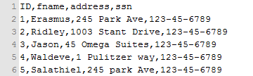
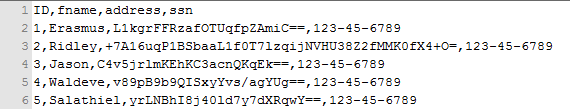
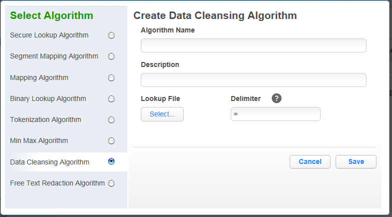
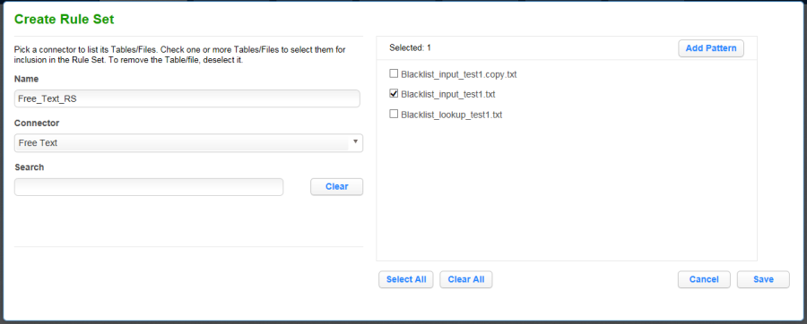

# Configuring Your Own Algorithms

This section describes how users can configure their own algorithms
using Delphix’s built in security methods.

An integral part of the data masking process is to use algorithms to
mask each data element. You specify which algorithm to use on each
individual data element (domain) on the Masking's tab. There, you define
a unique domain for each element and then associate the classification
and algorithm you want to use for each domain. Use the Algorithm
settings tab to create or delete algorithms.

## Algorithm Settings Tab

The **Algorithm** tab displays algorithm Names along with Type and
Description. This is where you add (or create) new algorithms. The
default Delphix Masking Engine algorithms and any algorithms you have
defined appear on this tab.

  - All algorithm values are stored encrypted. These values are only
    decrypted during the masking process.


## Adding New Delphix Masking Engine Algorithms

If none of the default Delphix Masking Engine algorithms meet your
needs, you might want to create a new algorithm.

The Delphix Masking Engine Algorithm Frameworks give you the ability to
quickly and easily define the algorithms you want, directly on the
Settings page. Then, you can immediately propagate them. Anyone in your
organization who has the Delphix Masking Engine can then access the
information.

Administrators can update **system**-defined algorithms. User-defined
algorithms can be accessed by all users and updated by the owner/user
who created the algorithm.

To add an algorithm:

1.  In the upper right-hand corner of the **Algorithm** settings tab,
    click **Add Algorithm**.

    

2. Select an algorithm type.

3. Complete the form to the right to name and describe your new
algorithm.

4. Click **Save.**

## Choosing an Algorithm Type

### Masking Secure Lookup Algorithm

Secure lookup is the most commonly used type of algorithm. It is easy to
generate and works with different languages. When this algorithm
replaces real, sensitive data with fictional data, it is possible that
it will create repeating data patterns, known as “collisions.” For
example, the names “Tom” and “Peter” could both be masked as “Matt.”
Because names and addresses naturally recur in real data, this mimics an
actual data set. However, if you want the masking engine to mask all
data into unique outputs, you should use segment mapping.

To add a secure lookup algorithm:

1.  In the upper right-hand corner of the **Algorithm** tab, click
    **Add Algorithm**.

2.  Choose **Secure Lookup Algorithm**. The Create SL Algorithm pane
    appears.

    

3.  Enter a **Algorithm Name**.

    !!! info
        This MUST be unique.

4.  Enter a **Description**.

5.  Specify a **Lookup File**.

    This file is a single list of values. It does not require a header.
    Make sure there are no spaces or returns at the end of the last line
    in the file. The following is sample file content:

    | **Code Block: Example Lookup File**             |
    | -------------------- |
    | Smallville |
    | Clarkville |
    | Farmville |
    | Townville |
    | Cityname |
    | Citytown |
    | Towneaster |

6.  When you are finished, click **Save**.

7.  Before you can use the algorithm (specify it in a profiling or
    masking job), you must add it to a
domain.

!!! info
    The masking engine supports lookup files saved in ASCII or UTF-8 format only. If the lookup file contains foreign alphabet characters, the file must be saved in UTF-8 format with no BOM (Byte Order Marker) for Masking Engine to read the Unicode text correctly. Some applications, e.g. Notepad on Windows, write a BOM (Byte Order Marker) at the beginning of Unicode files which irritates the masking engine and will lead to SQL update or insert errors when trying to run a masking job that applies a Secure Lookup algorithm that has been created based on a UTF-8 file that included a BOM.

### Masking Segmented Mapping 

1.  In the upper right-hand region of the **Algorithm** tab, click
    **Add Algorithm**.

2.  Select **Segment Mapping Algorithm**. The Create Segment Mapping
    Algorithm pane appears.

    

3.  Enter a **Rule Name**.

4.  Enter a **Description.**

5.  From the **No. of Segment** drop-down menu, select how many
    segments you want to mask.

    !!! note "NOTE"
        This number does NOT include the values you want to preserve.

    The minimum number of segments is 2; the maximum is 9. A box appears
    for each segment.

6.  For each segment, choose the **Type** of segment from the
    dropdown: **Numeric** or
**Alphanumeric**.

    !!! info
        **Numeric** segments are masked as whole segments. **Alphanumeric** segments are masked by individual character.

7.  For each segment, select its **Length** (number of characters)
    from the drop-down menu. The maximum is 4.

8.  Optionally, for each segment, specify range values. You might need
    to specify range values to satisfy particular application
    requirements, for example. See details below.

9.  **Preserve Original Values** by entering **Starting position** and
    **length** values. (Position starts at 1.) For example, to
    preserve the second, third, and fourth values, enter Starting
    position **2** and length **3**.

    If you need additional value fields, click **Add**.

10. When you are finished, click **Save**.

11. Before you can use the algorithm (specify it in a profiling or
    masking job), you must add it to a domain. If you are not using
    the Masking Engine Profiler to create your inventory, you do not
    need to associate the algorithm with a domain.

### **Specifying Range Values**

You can specify ranges for **Real Values** and **Mask Values**. With
Real Values ranges, you can specify all the possible real values to map
to the ranges of masked values. Any values NOT listed in the Real Values
ranges would then mask to themselves.

Specifying range values is optional. If you need unique values (for
example, masking a unique key column), you MUST leave the range values
blank. If you plan to certify your data, you must specify range values.

When determining a numeric or alphanumeric range, remember that a narrow
range will likely generate duplicate values, which will cause your job
to fail.

1.  To ignore specific characters, enter one or more characters in the
    **Ignore Character List** box. Separate values with a comma.

2.  To ignore the comma character (,), select the **Ignore comma (,)**
    check box.

3.  To ignore control characters, select **Add Control Characters**.
    The **Add Control Characters** window appears.

    

4.  Select the individual control characters that you would like to
    ignore, or choose **Select All** or **Select None**.

5.  When you are finished, click **Save**.

6.  You are returned to the Segment Mapping pane.

#### Numeric segment type

  - **Min\#** — A number; the first value in the range. Value can be 1
    digit or up to the length of the segment. For example, for a
    3-digit segment, you can specify 1, 2, or 3 digits. Acceptable
    characters: 0-9.

  - **Max\#** — A number; the last value in the range. Value should be
    the same length as the segment. For example, for a 3-digit
    segment, you should specify 3 digits. Acceptable characters: 0-9.

  - **Range\#** — A range of numbers; separate values in this field
    with a comma (,). Value should be the same length as the segment.
    For example, for a 3-digit segment, you should specify 3 digits.
    Acceptable characters:
0-9.

!!! info
    If you do not specify a range, the Masking Engine uses the full range. For example, for a 4-digit segment, the Masking Engine uses 0-9999.

#### Alphanumeric segment type

  - **Min\#** — A number from 0 to 9; the first value in the range.

  - **Max\#** — A number from 0 to 9; the last value in the range.

  - **MinChar** — A letter from A to Z; the first value in the range.

  - **MaxChar** — A letter from A to Z; the last value in the range.

  - **Range\#** — A range of alphanumeric characters; separate values
    in this field with a comma (,). Individual values can be a number
    from 0 to 9 or an uppercase letter from A to Z. (For example,
    B,C,J,K,Y,Z or AB,DE.)

!!! info
    If you do not specify a range, the Masking Engine uses the full range (A-Z, 0-9). If you do not know the format of the input, leave the range fields empty. If you know the format of the input (for example, always alphanumeric followed by numeric), you can enter range values such as A2 and S9.

### Using the Mapping Algorithm

A mapping algorithm allows you to state what values will replace the
original data. It sequentially maps original data values to masked
values that are pre-populated to a lookup table through the Masking
Engine user interface. There will be no collisions in the masked data,
because it always matches the same input to the same output. For example
“David” will always become “Ragu,” and “Melissa” will always become
“Jasmine.” The algorithm checks whether an input has already been
mapped; if so, the algorithm changes the data to its designated output.

You can use a mapping algorithm on any set of values, of any length, but
you must know how many values you plan to mask. You must supply AT
MINIMUM the same number of values as the number of unique values you are
masking; more is acceptable. For example, if there are 10,000 unique
values in the column you are masking you must give the mapping algorithm
AT LEAST 10,000
values.

!!! info
    When you use a mapping algorithm, you cannot mask more than one table at a time. You must mask tables serially

### **To add a mapping algorithm:**

1.  In the upper right-hand corner of the **Algorithm** tab, click
    **Add Algorithm**.

2.  Select **Mapping Algorithm**.

3.  The **Create Mapping Algorithm** pane appears.

    

4.  Enter a **Rule Name**. This name MUST be unique.

5.  Enter a **Description**.

6.  Specify a **Lookup File (**.txt){\*}.

7.  The value file must have NO header. Make sure there are no spaces
    or returns at the end of the last line in the file. The following
    is sample file content. Notice that there is no header and only a
    list of values.

    ```
    Smallville
    Clarkville
    Farmville
    Townville
    Cityname
    Citytown
    Towneaster
    ```

8.  To ignore specific characters, enter one or more characters in the
    **Ignore Character List** box. Separate values with a comma.

9.  To ignore the comma character (,), select the **Ignore comma (,)**
    check box.

10. When you are finished, click **Save**.

Before you can use the algorithm by specifying it in a profiling or
masking job, you must add it to a domain. If you are not using the
Masking Engine Profiler to create your inventory, you do not need to
associate the algorithm with a domain.

See [<span class="underline">Adding New
Domains</span>](https://docs.delphix.com/display/DOCSDEV/.Managing+Domain+Settings+vJocacean#id-.ManagingDomainSettingsvJocacean-_Adding_New_Domains).
(Do we need this link?)

### Masking Binary Lookup Algorithm

A Binary Lookup Algorithm is much like the Secure Lookup Algorithm, but
is used when entire files are stored in a specific column. This
algorithm replaces objects that appear in object columns. For example,
if a bank has an object column that stores images of checks, you can use
a binary lookup algorithm to mask those images. The Delphix Engine
cannot change data within images themselves, such as the names on X-rays
or driver’s licenses. However, you can replace all such images with a
new, fictional image. This fictional image is provided by the owner of
the original data.

### **To add a binary lookup algorithm:**

1.  At the top right of the **Algorithm** tab, click **Add
    Algorithm**.

2.  Select **Binary Lookup Algorithm**. The Binary SL Rule pane
    appears.

    

3.  Enter a **Rule Name**.

4.  Enter a **Description**.

5.  Select a **Binary Lookup File** on your filesystem.

6.  Click **Save**.

### Tokenization Algorithm

A tokenization algorithm is the only type of algorithm that allows you
to reverse its masking. For example, you can use a tokenization
algorithm to mask data before you send it to an external vendor for
analysis. The vendor can then identify accounts that need attention
without having any access to the original, sensitive data. Once you have
the vendor’s feedback, you can reverse the masking and take action on
the appropriate accounts.

Like mapping, a tokenization algorithm creates a unique token for each
input such as “David” or “Melissa.” The actual data (for example, names
and addresses) are converted into tokens that have similar properties to
the original data – such as text and length – but no longer convey any
meaning. The Delphix Masking Engine stores both the token and the
original so that you can reverse masking later.

To add a Tokenization algorithm:

1.  Enter algorithm **Name**.

2.  Enter a **Description**.

3.  Click **Save**.

Once you have created an algorithm, you will need to associate it with a
domain.

1.  Navigate to the **Home\>Settings\>Domains** page and click **Add
    Domain**. You will see the popup below:

2.  Enter a domain name.

3.  From the **Tokenization Algorithm Name** drop-down menu, select
    your algorithm.

**Create a Tokenization Environment**

1.  On the home page, click **Environments**.

2.  Click **Add Environment**.

    

3.  For **Purpose**, select **Tokenize/Re-Identify**.

4.  Click
**Save**.

    !!! info
        This environment will be used to re-identify your data when required.

5.  Set up a Tokenize job using tokenization method. Execute the job.

    

Here is a snapshot of the data before and after Tokenization to give you
an idea of what the it will look like.

**Before Tokenization**



**After Tokenization**



### Masking MIN Max Algorithm

The Delphix Masking Engine provides a "Min Max Algorithm" to normalize
data within a range – for example, 10 to 400. Values that are extremely
high or low in certain categories allow viewers to infer someone’s
identity, even if their name has been masked. For example, a salary of
$1 suggests a company’s CEO, and some age ranges suggest higher
insurance risk. You can use a min max algorithm to move all values of
this kind into the midrange. This algorithm allows you to make sure that
all the values in the database are within a specified range.

If the **Out of range Replacement Values** checkbox is selected, a
default value is used when the input cannot be evaluated.


1.  Enter the **Algorithm Name**.

2.  Enter a **Description**.

3.  Enter **Min Value** and **Max Value**.

4.  Click **Out of range Replacement Values**.

5.  Click **Save**.

Example: Age less than 18 years - enter Min Value 0 and Max Value 18.

### Data Cleansing Algorithm

A data cleansing algorithm does not perform any masking. Instead, it
standardizes varied spellings, misspellings, and abbreviations for the
same name. For example, “Ariz,” “Az,” and “Arizona” can all be cleansed
to “AZ.” Use this algorithm if the target data needs to be in a standard
format prior to masking.



1.  Enter Algorithm **Name**.

2.  Enter a **Description**.

3.  Select **Lookup File** location.

4.  Enter default **Delimiter**. Key and Value separator is =. You can
    change this to match the lookup file.

5.  Click **Save**.

Below is an example of a lookup input file. It does not require a
header. Make sure there are no spaces or returns at the end of the last
line in the file. The following is sample file content:

|Example Lookup File|
|-------------------|
|NYC=NY|
|NY City=NY|
|New York=NY|
|Manhattan=NY|

### Free Text Algorithm

A free text redaction algorithm helps you remove sensitive data that
appears in free-text columns such as “Notes.” This type of algorithm
requires some expertise to use, because you must set it to recognize
sensitive data within a block of text.

One challenge is that individual words might not be sensitive on their
own, but together they can be. The algorithm uses profiler sets to
determine what information it needs to mask. You can decide which
expressions the algorithm uses to search for material such as addresses.
For example, you can set the algorithm to look for “St,” “Cir,” “Blvd,”
and other words that suggest an address. You can also use pattern
matching to identify potentially sensitive information. For example, a
number that takes the form 123-45-6789 is likely to be a Social Security
Number.

You can use a free text redaction algorithm to show or hide information
by displaying either a “black list” or a “white list.”

**Blacklist** – Designated material will be redacted (removed). For
example, you can set a black list to hide patient names and addresses.
The blacklist feature will match the data in the lookup file to the
input file.

**Whitelist** – ONLY designated material will be visible. For example,
if a drug company wants to assess how often a particular drug is being
prescribed, you can use a white list so that only the name of the drug
will appear in the notes. The whitelist feature enables you to mask data
using both the lookup file and a profile set.

For either option, a list of words can be imported from an external text
file or alternatively, you can use Profiler Sets to match words based on
regular expressions, defined within Profiler Expressions. You can also
specify the redaction value that will replace the masked words. Regular
expressions defined using Profiler Sets will match individual words
within the input text, rather than phrases.


1.  Enter **Algorithm Name**.

2.  Enter a **Description**.

3.  Select the **Black List** or **White List** radio button.

4.  Select **Lookup File** and enter **Redaction Value** OR/AND

5.  Select **Profiler Sets** from the drop-down menu and enter
    **Redaction Value**.

6.  Click **Save**.

#### Free Text Redaction Example

1.  Create Input File.

2.  Create input file using notepad. Enter the following text:

3.  "The customer Bob Jones is satisfied with the terms of the sales
    agreement. Please call to confirm at 718-223-7896."

4.  Save file as txt.

5.  Create lookup file.
    
    1.  Create a lookup file.
    
    2.  Use notepad to create a txt file and save the file as a TXT.
        Be sure to hit return after each field. The lookup flat file
        contains the following data:
    
        ```
        Bob
        Jones
        Agreement
        ```

##### Create an Algorithm

You will be prompted for the following information:

1.  For **Algorithm Name**, enter **Blacklist\_Test1**.

2.  For **Description**, enter **Blacklist Test**.

3.  Select the **Black List** radio button.

4.  Select **LookUp File**.

5.  Enter redaction value **XXXX**.

6.  Click **Save**.

##### Create Rule Set

1.  From the job page go to Rule Set and Click **Create Rule Set**.

    

2.  For **Rule Set Name**, enter **Free\_ Text\_RS**.

3.  From the **Connector** drop-down menu, select **Free Text**.

4.  Select the **Input File** by clicking the box next to your input
    file

5.  Click **Save**.

##### Create Masking Job

1.  Use Free\_Text Rule Set

2.  Execute Masking job.

The results of the masking job will show the following:

Redacted Input File: The customer xxxx xxxx is satisfied with the terms
of the sales xxxx. Please call to confirm at 718-223-7896.

"Bob," "Jones," and "agreement" are redacted.
