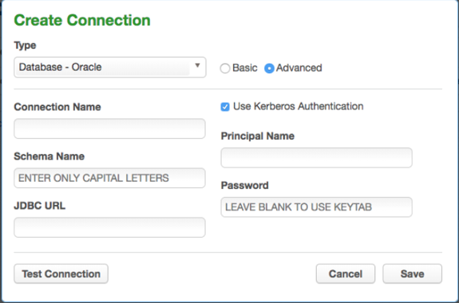

# What's New for Masking
## Synchronizing Masking Jobs and Universal Settings Across Engines
In 5.2 we introduced the ability to synchronize Masking Algorithms between engines to ensure consistent masking, regardless of the engine executing the masking. In 5.3 are expanding the list of syncable objects to include:

- Masking Jobs
- Connectors
- Rulesets
- Domains
- File Formats
- Mount Information

The sync of objects is possible through improvements to several sync API endpoints, including:

- GET /syncable-objects[?object_type=<type>]
- POST /export
- POST /export-async
- POST /import
- POST/import-async

This expansion of syncable objects ensures that users can sync their Masking Jobs and all the objects necessary for that masking job to execute successfully - regardless of the masking engine it lives on, allowing for easier scaling of Delphix Masking across the enterprise. Please see [Managing Multiple Masking Engines](/Managing_Multiple_Engines_for_Masking/Working_with_Multiple_Masking_Engines/)  for more details.

## Support for Kerberized Connections
In 5.2.4 we added support for Kerberos for our Oracle Masking Connector. In 5.3 we have expanded the list of connectors that support Kerberos to:

- SQL Server
- Sybase

To enable Kerberized connectors your engine must be configured properly and you must configure your masking Connectors for Kerberos. Kerberos can be enabled by going to the Advanced mode on Oracle, SQL Server and Sybase. Please see [Managing Connectors](/Connecting_Data/Managing_Connectors/) for more details.

## New API Endpoints
In 5.2 we released an all-new set of API endpoints allowing for the automation of many masking workflows. In 5.3 we have expanded this list of API endpoints around Algorithms, Users, Roles, File Upload, System Information, Login, Rulesets, and Connector. Below are the net new API endpoints:

| **Group** | **Endpoints**      | **Description**       |
| ----------- | -----------      | ------------          |
| Algorithms  | POST /algorithms | Create algorithm      |
|             | DELETE /algorithms/{algorithmName}| Delete algorithm by name   |
|             | GET /algorithms/{algorithmName}        | Get algorithm by name     |
|             | PUT /algorithms/{algorithmName}                 | Update algorithm by name  |
|             | PUT /algorithms/{algorithmName}/randomize-key                 | Randomize key by name      |
| Users | GET /users | Get all users      |
|  | POST /users| Create user   |
|     | DELETE /users/{userId}   | Delete user by ID     |
|     |    GET /users/{userId}         | Get user by ID |
|     | PUT /users/{userId} | Update user by ID|
| Roles  | GET /roles | Get all roles|
| | POST /roles | Create role|
| | DELETE /roles/{roleId}| Delete role by ID|
|  | GET /roles/{roleId}| Get role by ID|
|  | PUT /roles/{roleId} |Update role by ID|
| Rulesets| PUT /database-rulesets/{databaseRulesetId}/bulk-table-update|Update the rule set’s tables|
| | PUT /database-rulesets/{databaseRulesetId}/refresh| Refresh the rule set|
|Connectors|POST /database-connectors/{databaseConnectorId}/test|Test a database connector|
| | POST /database-connectors/test|Test an unsaved database connector|
|  |POST /file-connectors/{fileConnectorId}/test|Test a file connector|
|  | POST /file-connectors/test|Test an unsaved file connector|
|Async Tasks|GET /async-tasks|Get all asyncTasks|
|  |GET /async-tasks/{asyncTaskId}|Get asyncTask by ID|
|  |PUT /async-tasks/{asyncTaskId}/cancel|Cancel asyncTask by ID|
|File Upload/Download|DELETE /file-uploads|Delete all file uploads|
|  | POST /file-uploads | Upload file|
|  | GET /file-downloads/{fileDownloadId}|Download file|
|System Information|GET /system-information | Get version, etc.|
|Login/Logout|PUT /logout | User logout|
|Executions|GET /execution-components | Status for a table, file, or Mainframe data set|
|Mount Filesystem|GET /mount-filesystem | Get all mounts |
||POST /mount-filesystem | Create a mount |
||GET /mount-filesystem/{mountId} | Get a mount by ID |
||DELETE /mount-filesystem/{mountId} | Delete a mount by ID |
||PUT /mount-filesystem/{mountId} | Update a mount by ID |
||PUT /mount-filesystem/{mountId}/connect | Connect a mount by ID |
||PUT /mount-filesystem/{mountId}/disconnect | Disconnect a mount by ID |
||PUT /mount-filesystem/{mountId}/remount | Remount a mount by ID |

In addition to the net new API endpoints, we have improved pre-existing API endpoints. Some of the improvements include:

- Addition of DB2 iSeries and Mainframe to connector endpoints.
- Addition of Kerberos configuration on Oracle, SQL Server and Sybase connectors
- Ability to have ruleset refresh drop tables
- Support for XML file types
- Addition of dataType to column metadata
- Addition of mountName in the ConnectionInfo of a file connector and a mainframe dataset connector to use a filesystem mount point.
For more information please on Delphix Masking APIs please see [API documentation](https://maskingdocs.delphix.com/Delphix_Masking_APIs/Masking_Client/Masking_API_Client/).  Please note that the previous generation of Masking APIs (commonly referred to as V4) is EOL and no longer supported in this release. All users are encouraged to migrate to the V5 APIs.
