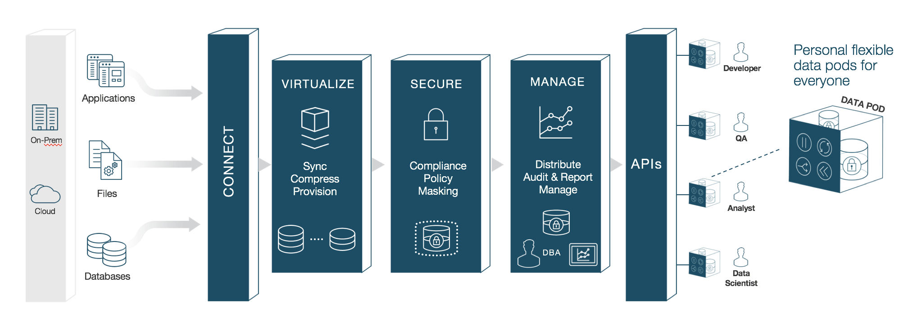

# Introduction to Delphix Masking

## Challenge

With data breach incidents regularly making the news and increasing
pressure from regulatory bodies and consumers alike, organizations must
protect sensitive data across the enterprise. Contending with insider
and outsider threats while staying compliant with mandates such as
HIPAA, PCI, and GDPR is no easy task—especially as teams simultaneously
try to make their organizations more agile.

To tackle the problem of protecting sensitive information, companies are
increasingly scrutinizing the tools they’ve deployed. Instead of
reactive perimeter defenses, security minded organizations must focus on
proactively protecting the interior of their systems: their data.
Moreover, while mainstay approaches such as encryption may be effective
for securing data-in-motion or data resident in hard drives, they are
ill-suited for protecting non-production environments for development,
testing, and reporting.

## Solution

The masking capability of the Delphix Dynamic Data Platform represents
an automated approach to protecting non-production environments,
replacing confidential information such as social security numbers,
patient records, and credit card information with fictitious, yet
realistic data.

Unlike encryption measures that can be bypassed through schemes to
obtain user credentials, masking irreversibly protects data in
downstream environments. Consistent masking of data while maintaining
referential integrity across heterogeneous data sources enables Delphix
masking to provide superior coverage compared to other solutions—all
without the need for programming expertise. Moreover, the Delphix
platform seamlessly integrates masking with data delivery capabilities,
ensuring the security of sensitive data before it is made available for
development and testing, or sent to an offsite data center or the public
cloud.

Delphix Masking is a multi-user, browser-based web application that
provides complete, secure, and scalable software for your sensitive data
discovery, masking and tokenization needs, while meeting
enterprise-class infrastructure requirements. The Delphix Dynamic Data
Platform has several key characteristics to enable your organization to
successfully protect sensitive data across the enterprise:

  - **End-to-End Masking** — The Delphix platform automatically detects
    confidential information, irreversibly masks data values, then
    generates reports and alerts to ensure that all sensitive data has
    been masked.

  - **Realistic Data** — Data masked with the Delphix platform is
    production-like in quality. Masked application data in
    non-production environments remains fully functional and realistic,
    enabling the development of higher-quality code.

  - **Masking Integrated with Virtualization** — Most masking solutions
    fail due to the need for repeated, lengthy batch jobs for extracting
    and masking data and lack delivery capabilities for downstream
    environments. The Delphix Dynamic Data Platform seamlessly
    integrates data masking with [data
    virtualization](https://docs.delphix.com/display/DOCS524/Database+Virtualization+with+Delphix),
    allowing teams to quickly deliver masked, virtual data copies on
    premises or into private, public, and hybrid cloud environments.

  - **Referential Integrity** — Delphix masks consistently across
    heterogeneous data sources. To do so, metadata and data is scanned
    to identify and preserve the primary/foreign key relationships
    between elements so that data is masked the same way across
    different tables and databases.

  - **Algorithms/Frameworks** — Seven out-of-the-box algorithms help
    businesses mask everything from names and social security numbers to
    images and text fields. Algorithms can be configured or customized
    to match specific security policies. Moreover, the Delphix platform
    includes prepackaged masking framework sets for healthcare and
    financial information, as well as the ability to perform
    tokenization: a process that can be used to obfuscate data sent for
    processing, then reversed when the processed data set is returned.

  - **Ease of Use** — With a single solution, Delphix customers can mask
    data across a variety of platforms. Moreover, businesses are not
    required to program their own masking algorithms or rely on
    extensive administrator involvement. Our web-based UI enables
    masking with a few mouse clicks and little training.

<!-- end list -->

  - **Automated discovery of sensitive data** — The Delphix Profiler
    automatically identifies sensitive data across databases and files,
    the time-consuming work associated with a data masking project is
    reduced significantly.

# High Level Platform Architecture 

The Delphix Dynamic Data Platform is made up of 4 main services each of
which play a very important part in delivering fresh secure data to
anybody that needs it. These include:

  - **Virtualize —** Delphix compresses the data that it gathers to
    one-third of the original size. From that compressed data footprint,
    Delphix virtualizes the data and allows operators to create
    lightweight, virtual data copies. Virtual copies are fully
    readable/writable and independent. They can be spun up or torn down
    in just minutes. And they take up a fraction of the storage space of
    physical copies -- 10 virtual copies can fit into the space of one
    physical copy.

  - **Secure —** The Delphix platform continuously protects sensitive
    information with integrated data masking. Masking secures
    confidential data -- names, email addresses, patient records, SSNs
    -- by replacing sensitive values with fictitious, yet realistic
    equivalents. Delphix automatically identifies sensitive values then
    applies custom or predefined masking algorithms. By seamlessly
    integrating data masking and provisioning into a single platform,
    Delphix ensures that secure data delivery is effortless and
    repeatable

  - **Manage —** Data operators can now quickly provision secure data
    copies -- in minutes -- to users in their target environments. The
    Delphix platform serves as a single point of control to manage those
    copies. Data operators maintain full control and visibility into
    downstream environments. They can easily audit, monitor, and report
    against access and usage.

  - **Self Service** **—** Provides developers, testers, analysts, data
    scientists, or other users with controls to manipulate data at-will.
    Users can refresh data to reflect the latest state of production,
    rewind environments to a prior point in time, bookmark data copies
    for later use, branch data copies to work across multiple releases,
    or easily share data with other users.

# How Delphix Discovers Sensitive Data 

Our platform helps you quickly discover your organization’s sensitive
data. This sensitive data discovery is done using two different methods,
column level profiling and data level profiling.

**Column Level Profiling**

Column level profiling uses REGEX expressions to scan the column names
(metadata) of the select data sources. There are several dozen
pre-configured profile expressions (like the one below) designed to
identify common sensitive data types (SSN, Name, Addresses, etc). You
also have the ability to write/import your own profile expressions.

**Data Level Profiling**

Data level profiling also uses REGEX expressions, but to scan the actual
data instead of the metadata. Similar to column level profiling, there
are sefveral dozen pre-configured expressions (like the one below) and
you can write/import your own.

For both column and data level profiling, when data is identified as
sensitive, Delphix recommends/assigns particular algorithms to be used
when securing the data. The platform comes with several dozen
pre-configured algorithms which are recommended when the profiler finds
certain sensitive data.

# How Delphix Secures Your Sensitive Data

Delphix strives to make available multiple methods for securing your
data, depending on your needs. The two secure methods delphix currently
supports are masking (anonymization) and tokenization
(pseudonymization).

**Masking**

Data masking secures your data by replacing values with realistic yet
fictitious data. Seven out-of-the-box algorithm frameworks help
businesses mask everything from names and social security numbers to
images and text fields. Algorithms can also be configured or customized
to match specific security policies.

**Tokenization**

Tokenization uses reversible algorithms so that the data can be returned
to its original state. Tokenization is a form of encryption where the
actual data – such as names and addresses – are converted into tokens
that have similar properties to the original data (text, length, etc.)
but no longer convey any meaning.

